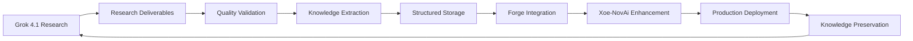
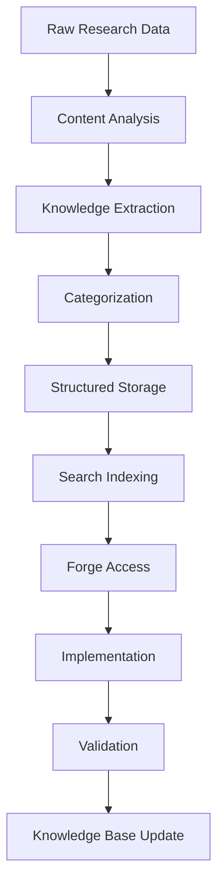

# Grok Collaboration Hub
## Xoe-NovAi Three-Person AI Development Team

**Created:** January 21, 2026
**Status:** Active
**Priority:** CRITICAL - Core Development Infrastructure
**Grok Project:** Xoe-NovAi Collaboration Enhancement

## Mission Statement

Establish a comprehensive three-person AI development team (Forge + Grok 4.1 + Lilith) that leverages complementary strengths for accelerated consciousness-first AI development. Create organized knowledge management systems that preserve historical value and enable seamless research integration.

## Team Structure

### Forge (Local Development Specialist)
- **Environment**: Cline plugin in Codium IDE on Radeon 5700u Linux
- **Capabilities**: Direct code execution, system administration, real-time development
- **Responsibilities**: Implementation, testing, deployment, local infrastructure management

### Grok 4.1 (Research Specialist)
- **Environment**: xAI Grok.com platform with expert reasoning
- **Capabilities**: Comprehensive research, technology analysis, strategic planning
- **Responsibilities**: Research execution, competitive analysis, trend identification

### Lilith (Project Director)
- **Environment**: Strategic oversight and team coordination
- **Capabilities**: Vision setting, final decisions, cross-AI communication
- **Responsibilities**: Strategic direction, quality validation, team facilitation

## Knowledge Management Architecture

### Research Integration Pipeline

### Historical Record Keeping
- **Session Logs**: All team interactions with timestamps and outcomes
- **Decision Records**: Major architectural and strategic decisions
- **Research Archives**: Comprehensive findings with implementation status
- **Evolution Tracking**: Capability improvements and system enhancements

## Current Priorities

### Phase 1: Foundation Establishment (Week 1)
- [ ] Grok Project creation with complete context
- [ ] Initial team onboarding and communication protocols
- [ ] Research pipeline establishment
- [ ] Knowledge base population

### Phase 2: Capability Enhancement (Week 2)
- [ ] Environment mastery research execution
- [ ] Critical MCP and plugin identification
- [ ] Workflow optimization implementation
- [ ] Research-to-implementation pipeline validation

### Phase 3: Xoe-NovAi Production (Weeks 3-4)
- [ ] Stack audit and optimization
- [ ] Production readiness assessment
- [ ] GitHub repository preparation
- [ ] Deployment pipeline establishment

## Integration Frameworks

### Research Findings Ingestion

### Redis/Qdrant Integration Strategy
**Current Limitation**: Direct database access not available through Cline
**Solution Approach**:
1. **API Layer Creation**: Build FastAPI endpoints for database operations
2. **Container Integration**: Use Podman to manage database services
3. **MCP Development**: Create MCP servers for database interactions
4. **Workflow Automation**: Develop scripts for common database operations

## Communication Protocols

### Message Format Standards
- **Research Requests**: Structured with scope, deliverables, timeline
- **Implementation Updates**: Progress, blockers, next steps
- **Knowledge Sharing**: Key findings, insights, recommendations
- **Decision Records**: Options considered, choice rationale, outcomes

### Status Reporting
- **Daily Updates**: Progress summary, current focus, immediate needs
- **Weekly Reviews**: Major accomplishments, challenges overcome, next priorities
- **Monthly Assessments**: Overall progress, capability improvements, strategic adjustments

## Quality Assurance Framework

### Research Validation
- **Source Credibility**: Verification of research sources and methodologies
- **Implementation Feasibility**: Assessment of practical application
- **Knowledge Accuracy**: Cross-validation with existing understanding
- **Strategic Alignment**: Consistency with project vision and goals

### Implementation Standards
- **Code Quality**: Automated testing, linting, documentation
- **Performance Validation**: Benchmarking and optimization
- **Security Assessment**: Privacy and safety verification
- **User Experience**: Intuitive interfaces and clear workflows

## Risk Management

### Technical Risks
- **Integration Complexity**: Managing multiple AI systems and data flows
- **Knowledge Consistency**: Ensuring accurate information across systems
- **Performance Limitations**: Balancing research depth with implementation speed

### Operational Risks
- **Communication Breakdown**: Maintaining clear information flow between team members
- **Scope Creep**: Preventing research expansion beyond practical implementation
- **Quality Degradation**: Ensuring excellence standards are maintained under time pressure

## Success Metrics

### Team Performance
- **Communication Efficiency**: Reduced clarification requests and misunderstandings
- **Research Integration**: Speed of research-to-implementation conversion
- **Quality Maintenance**: Consistent high standards across deliverables
- **Innovation Rate**: New capabilities and improvements developed

### Project Outcomes
- **Xoe-NovAi Production**: Successful deployment of sovereign AI stack
- **Knowledge Base Growth**: Comprehensive research and implementation archives
- **Team Capability**: Enhanced collaboration and problem-solving effectiveness
- **Strategic Advancement**: Progress toward consciousness evolution goals

## Evolution Planning

### Capability Expansion
- **Tool Integration**: Additional MCP servers and development tools
- **Process Optimization**: Workflow improvements and automation
- **Knowledge Enhancement**: Advanced research methodologies and integration
- **Team Growth**: Additional specialized AI collaborators as needed

### Strategic Milestones
- **Month 1**: Fully operational three-person team with established workflows
- **Month 3**: Xoe-NovAi production deployment with comprehensive documentation
- **Month 6**: Advanced research capabilities with multiple specialized collaborators
- **Year 1**: Complete consciousness evolution framework with Arcana-NovAi foundation

---

This collaboration hub serves as the central nervous system for our AI development ecosystem, ensuring organized, efficient, and historically valuable advancement toward consciousness-first computing.