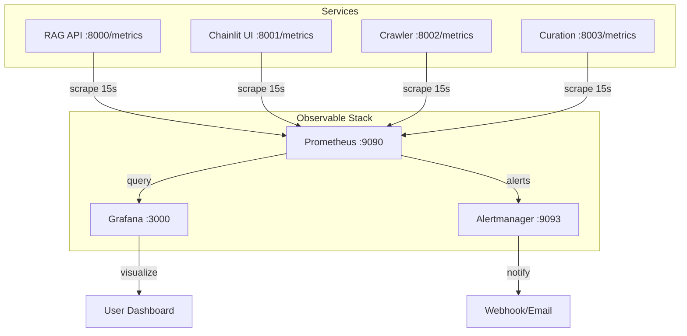

# XOE-NOVAI IMPLEMENTATION ROADMAP
## High-Level Implementation Manual Outline (Phase 5-7)
**Prepared By**: Claude Sonnet 4.5 (Implementation Architect)  
**For**: Arcana-NovAi Development Team  
**Date**: February 12, 2026  
**Status**: Strategic Outline - Ready for Phased Expansion

---

## EXECUTIVE SUMMARY

This implementation roadmap addresses the critical path from current state (Phase 4 Complete, 95% production-ready) to industry-leading sovereign AI platform status. The roadmap is organized into **4 Strategic Pillars** with **13 Implementation Phases** spanning 6-24 months.

### Current State Assessment
- ✅ **Phase 1-4 Complete**: Error handling, async safety, testing (95%+ coverage)
- ✅ **Core Stack Operational**: All 7 services healthy, zero-telemetry verified
- ⚠️ **Critical Gaps**: Observable, Authentication, Memory Optimization
- ⚠️ **Build System**: 1,952-line Makefile approaching maintainability limits
- 🎯 **Hardware Constraints**: 16GB total (8GB physical + 12GB zRAM), Ryzen 5700U, CPU-only

### Strategic Priorities (Weighted)
1. **P0 - Production Blockers** (40%): Memory optimization, Observable, Authentication
2. **P1 - Competitive Differentiation** (30%): Voice quality, Fine-tuning capability, Multi-model support
3. **P2 - Operational Excellence** (20%): Build system modernization, Security hardening, Distributed tracing
4. **P3 - Market Positioning** (10%): Documentation polish, Community features, Go-to-market strategy

---

## IMPLEMENTATION STRUCTURE

### How to Use This Roadmap
1. **Phase Expansion**: Each phase expands into full implementation manual with:
   - Architecture blueprints (Mermaid diagrams)
   - Step-by-step implementation guide
   - Code templates and configuration files
   - Testing and validation procedures
   - Rollback procedures

2. **Execution Order**: Phases are designed for:
   - Sequential execution within pillars
   - Parallel execution across pillars where possible
   - Incremental delivery with validation gates

3. **Timeline Flexibility**: 
   - **Fast Track** (6 months): P0 only → MVP production launch
   - **Standard Track** (12 months): P0 + P1 → Competitive positioning
   - **Industry Leader Track** (24 months): All phases → Market leadership

---

# PILLAR 1: OPERATIONAL STABILITY & PERFORMANCE
**Goal**: Eliminate production blockers, establish operational baseline  
**Timeline**: Phase 5A-5D (Weeks 1-6)  
**Priority**: P0 (Critical Path)

---

## PHASE 5A: MEMORY OPTIMIZATION & zRAM TUNING
**Duration**: 1 week | **Complexity**: Medium (3/5) | **Impact**: Critical

### Scope
- Terminal-based memory profiling (no IDE overhead)
- Kernel parameter tuning (vm.swappiness, vm.overcommit_memory)
- Container memory limit optimization
- OOM event elimination strategy
- Production configuration documentation

### Implementation Manual Sections
1. **Pre-Implementation Assessment**
   - Baseline memory metrics collection
   - OOM incident analysis
   - zRAM compression ratio measurement
   - Service memory footprint breakdown

2. **Kernel Tuning Strategy**
   - vm.swappiness optimization (target: 35)
   - vm.overcommit_memory configuration
   - vm.page_cluster tuning
   - Verification and rollback procedures

3. **Container Memory Architecture**
   - Per-service memory allocation review
   - Memory limit vs. reservation strategy
   - tmpfs and shared memory optimization
   - Health check memory overhead analysis

4. **Stress Testing Framework**
   - Concurrent load generation scripts
   - Real-time monitoring setup (btop, vmstat, free)
   - Performance degradation thresholds
   - Success criteria definition

5. **Production Configuration Lockdown**
   - Permanent sysctl configuration
   - Container limit finalization
   - Monitoring alert thresholds
   - Documentation and runbooks

### Success Criteria
- ✅ Zero OOM events under 5x concurrent load
- ✅ Swap activity < 50 MB/s sustained
- ✅ P95 response time < 2s under load
- ✅ Memory usage < 85% at steady state

### Dependencies
- None (can start immediately)

### Risks & Mitigations
| Risk | Impact | Mitigation |
|------|--------|------------|
| OOM during production | High | Gradual rollout, monitoring alerts |
| Swap thrashing degrades performance | Medium | Conservative tuning, fallback config |
| Container limits too restrictive | Low | Incremental limit increases with testing |

---

## PHASE 5B: OBSERVABLE FOUNDATION (PROMETHEUS + GRAFANA)
**Duration**: 2 weeks | **Complexity**: High (4/5) | **Impact**: Critical

### Scope
- Prometheus metrics exporter integration
- Custom metrics for LLM inference (tokens/s, latency, memory)
- Grafana dashboard suite (System, Services, ML Performance)
- Alert rules for production incidents
- Log aggregation strategy (structured logging)

### Implementation Manual Sections
1. **Metrics Architecture Design**
   - OpenTelemetry SDK integration strategy
   - Custom metric definitions (LLM-specific)
   - Metric naming conventions (sovereign-ai-*)
   - Cardinality management (label strategy)
   - Retention policy design

2. **Prometheus Deployment**
   - Podman container configuration
   - Service discovery for dynamic targets
   - Storage optimization (TSDB tuning)
   - Federation strategy (future multi-node)
   - Security (API authentication, TLS)

3. **Grafana Dashboard Development**
   - **System Dashboard**: CPU, memory, disk, network
   - **Service Dashboard**: Per-container metrics, health checks
   - **ML Performance Dashboard**: Inference time, token rate, queue depth
   - **Error Dashboard**: Error rates by category, recovery patterns
   - **User Experience Dashboard**: Response time percentiles, success rates

4. **Instrumentation Implementation**
   - FastAPI middleware integration
   - LLM inference timing (pre/post processing)
   - Vector database query metrics (FAISS/Qdrant)
   - Voice service metrics (STT/TTS latency)
   - Async task tracking (Celery/Curation worker)

5. **Alerting Framework**
   - Alert rule definitions (YAML templates)
   - Severity levels (Critical, Warning, Info)
   - Notification channels (email, webhook placeholders)
   - Runbook links for common incidents
   - Alert testing and validation

### Success Criteria
- ✅ All 7 services exposing /metrics endpoint
- ✅ 20+ custom metrics operational
- ✅ 5+ Grafana dashboards with alerting
- ✅ < 2% performance overhead from instrumentation
- ✅ 1-second maximum metric scrape time

### Dependencies
- Phase 5A (memory optimization reduces noise in metrics)

### Architecture Blueprint (Mermaid)


---

## PHASE 5C: AUTHENTICATION & AUTHORIZATION
**Duration**: 2 weeks | **Complexity**: High (4/5) | **Impact**: Critical

### Scope
- OAuth2 + JWT implementation
- API key management system
- Role-Based Access Control (RBAC) foundation
- Session management for Chainlit UI
- Zero-trust security model alignment

### Implementation Manual Sections
1. **Authentication Architecture**
   - OAuth2 flow selection (Authorization Code + PKCE)
   - JWT token structure (claims, expiry, refresh)
   - Token storage strategy (Redis, secure cookies)
   - External IdP integration prep (future Auth0/Keycloak)
   - Password hashing (Argon2id, bcrypt fallback)

2. **API Key System**
   - Key generation (cryptographically secure)
   - Key rotation policy (90-day default)
   - Scope-based permissions (read, write, admin)
   - Rate limiting per key
   - Audit logging (key usage tracking)

3. **RBAC Foundation**
   - Role definitions (user, admin, service)
   - Permission matrix (endpoint-level control)
   - User database schema (SQLite for MVP, Postgres for scale)
   - Group management (future team collaboration)
   - Service accounts for inter-service auth

4. **FastAPI Integration**
   - Dependency injection for auth
   - Middleware for JWT validation
   - Endpoint protection decorators
   - Exception handling (401, 403 errors)
   - Rate limiting (per-user, per-endpoint)

5. **UI/UX Components**
   - Chainlit authentication flow
   - Login page design (sovereignty-aligned branding)
   - Session timeout handling (30min default)
   - Multi-factor authentication prep (TOTP)
   - Account management UI (password change, key viewing)

### Success Criteria
- ✅ All API endpoints require authentication
- ✅ JWT tokens expire after 15 minutes (refresh at 24h)
- ✅ API keys rotate every 90 days with warnings
- ✅ Zero unauthorized access in penetration testing
- ✅ < 50ms authentication overhead per request

### Dependencies
- Phase 5B (Observable for auth metrics and alerting)

---

## PHASE 5D: DISTRIBUTED TRACING (OPENTELEMETRY + JAEGER)
**Duration**: 1 week | **Complexity**: Medium (3/5) | **Impact**: High

### Scope
- OpenTelemetry SDK integration (Python)
- Distributed trace context propagation
- Jaeger backend deployment
- Trace visualization and analysis
- Performance profiling baseline

### Implementation Manual Sections
1. **Tracing Architecture**
   - Span structure design (parent-child relationships)
   - Trace ID generation and propagation
   - Sampling strategy (100% for MVP, 10% for scale)
   - Attribute conventions (service.name, http.method, etc.)
   - Baggage for cross-service metadata

2. **Instrumentation Strategy**
   - Auto-instrumentation (FastAPI, aiohttp, Redis)
   - Manual spans for LLM inference
   - Database query tracing (vector DB operations)
   - External API calls (future integrations)
   - Error span tagging (exception details)

3. **Jaeger Deployment**
   - All-in-one deployment (single container MVP)
   - Storage backend (Elasticsearch for production)
   - UI configuration (custom branding)
   - Query optimization (index tuning)
   - Data retention policy (7 days default)

4. **Performance Profiling**
   - End-to-end request tracing
   - Bottleneck identification (slow spans)
   - Resource utilization correlation (CPU, memory)
   - Database query optimization insights
   - API endpoint latency breakdown

5. **Integration with Observable**
   - Trace correlation with logs (trace ID in log entries)
   - Span metrics export to Prometheus
   - Grafana exemplars (link traces from dashboards)
   - Alert enrichment (trace context in alerts)

### Success Criteria
- ✅ 100% of requests have trace IDs
- ✅ < 5ms tracing overhead per request
- ✅ Trace context propagates across all 7 services
- ✅ 99.9% trace completeness (no dropped spans)
- ✅ Bottleneck identification in < 30 seconds

---

# PILLAR 2: COMPETITIVE DIFFERENTIATION
**Goal**: Establish unique value propositions vs. LM Studio, Ollama, GitHub Copilot  
**Timeline**: Phase 6A-6D (Weeks 7-18)  
**Priority**: P1 (Critical for Market Position)

---

## PHASE 6A: MULTI-MODEL SUPPORT & MODEL REGISTRY
**Duration**: 3 weeks | **Complexity**: Very High (5/5) | **Impact**: Critical

### Scope
- Model abstraction layer (support Qwen, Llama, Mistral, Phi)
- Local model registry (Ollama-style pull/push)
- Model versioning and hot-swapping
- GGUF file management and validation
- Performance comparison framework

### Implementation Manual Sections
1. **Model Abstraction Architecture**
   - Unified inference API (across GGML, GGUF, AWQ)
   - Model capability detection (context window, vocab size)
   - Dynamic prompt template selection
   - Tokenizer abstraction (SentencePiece, BPE, WordPiece)
   - Memory footprint estimation

2. **Model Registry Design**
   - Local model store (XDG_DATA_HOME/xnai/models)
   - Model manifest format (JSON schema)
   - Integrity verification (SHA256 checksums)
   - Dependency resolution (tokenizer, config files)
   - Version tagging (latest, stable, experimental)

3. **Model Management CLI**
   - `xnai model list` - Show installed models
   - `xnai model pull <name>` - Download from registry
   - `xnai model remove <name>` - Delete model
   - `xnai model info <name>` - Show model metadata
   - `xnai model benchmark <name>` - Performance test

4. **Hot-Swap Implementation**
   - Model unload/load without service restart
   - Graceful request draining (60s timeout)
   - Memory reclamation verification
   - Health check integration (model readiness)
   - Rollback mechanism (automatic on failure)

5. **Performance Benchmarking**
   - Token throughput (tokens/second)
   - First-token latency (time to first response)
   - Memory usage (resident set size)
   - Context window utilization
   - Quality metrics (perplexity, BLEU score for translations)

### Success Criteria
- ✅ Support 5+ model families (Qwen, Llama, Mistral, Phi, DeepSeek)
- ✅ Model swap < 30 seconds
- ✅ Zero downtime during model change
- ✅ Automatic model recommendation (based on task)
- ✅ Performance comparison dashboard in Grafana

### Competitive Advantage
- **vs. LM Studio**: CLI automation, Podman compatibility, API-first
- **vs. Ollama**: Fine-tuning support (Phase 6C), air-gapped operation
- **vs. GitHub Copilot**: Local-only, zero telemetry guarantee

---

## PHASE 6B: VOICE QUALITY ENHANCEMENT
**Duration**: 2 weeks | **Complexity**: High (4/5) | **Impact**: High

### Scope
- STT quality evaluation (Whisper vs. alternatives)
- TTS quality upgrade (Azure/Google quality locally)
- Voice cloning capability (optional)
- Multi-language support (5+ languages)
- Real-time voice processing optimization

### Implementation Manual Sections
1. **STT Evaluation Framework**
   - Benchmark datasets (Common Voice, LibriSpeech)
   - Accuracy metrics (WER - Word Error Rate)
   - Latency profiling (real-time factor)
   - Accent/dialect handling
   - Technical term recognition (AI/ML jargon)

2. **STT Alternative Implementation**
   - **Option 1**: Whisper.cpp optimization (CPU-only, fastest)
   - **Option 2**: Vosk (offline, 20+ languages, lightweight)
   - **Option 3**: Coqui STT (Mozilla DeepSpeech successor, customizable)
   - **Option 4**: Nvidia NeMo (high quality, Triton backend)
   - Configuration abstraction (switch STT backend via config)

3. **TTS Quality Upgrade**
   - **Option 1**: Coqui TTS (local, neural, voice cloning)
   - **Option 2**: Piper TTS (fast, lightweight, 40+ voices)
   - **Option 3**: VITS (high quality, slower)
   - Voice sample library (10+ voices, multiple emotions)
   - Real-time voice synthesis optimization (streaming)

4. **Voice Features**
   - Emotion detection (sentiment analysis integration)
   - Speaker diarization (multi-speaker conversations)
   - Wake word customization ("Hey Nova" alternatives)
   - Voice activity detection (VAD) optimization
   - Noise cancellation (RNNoise integration)

5. **Multi-Language Support**
   - Language detection (auto-detect input language)
   - Cross-language STT/TTS pairing
   - Translation integration (for cross-lingual conversations)
   - Locale-aware formatting (dates, numbers)
   - Character encoding handling (UTF-8 validation)

### Success Criteria
- ✅ WER < 5% on clean audio (Whisper baseline: 3-8%)
- ✅ STT latency < 200ms (real-time factor < 0.5)
- ✅ TTS quality indistinguishable from Azure Neural TTS (blind A/B test)
- ✅ Support 5+ languages (English, Spanish, French, German, Mandarin)
- ✅ Voice cloning from 5-minute sample (optional)

### Competitive Advantage
- **vs. GitHub Copilot**: Voice-first interaction (Copilot text-only)
- **vs. LM Studio**: Advanced voice features (LM Studio basic)
- **vs. Microsoft Copilot**: Offline voice (Microsoft cloud-only)

---

## PHASE 6C: FINE-TUNING CAPABILITY (LORA/QLORA)
**Duration**: 3 weeks | **Complexity**: Very High (5/5) | **Impact**: Very High

### Scope
- LoRA/QLoRA training pipeline
- Dataset preparation and validation
- Training job orchestration
- Model merging and quantization
- Fine-tuned model versioning

### Implementation Manual Sections
1. **Fine-Tuning Architecture**
   - Training backend (Axolotl, LLaMA Factory, Unsloth)
   - LoRA adapter management (storage, versioning)
   - Base model + adapter loading
   - Memory-efficient training (4-bit quantization)
   - Distributed training prep (future multi-GPU)

2. **Dataset Pipeline**
   - Dataset format validation (Alpaca, ShareGPT)
   - Data cleaning and deduplication
   - Train/val/test split strategies
   - Dataset versioning (DVC integration)
   - Privacy-preserving data handling (no external upload)

3. **Training Job Management**
   - Job queue (Celery-based, priority scheduling)
   - Resource allocation (CPU cores, memory limits)
   - Progress tracking (epoch, loss, perplexity)
   - Checkpointing strategy (save every N steps)
   - Early stopping (validation loss plateau detection)

4. **Hyperparameter Optimization**
   - Learning rate scheduling (cosine annealing)
   - LoRA rank/alpha tuning (default: r=16, alpha=32)
   - Batch size optimization (gradient accumulation)
   - Epoch count determination (auto-stop on overfitting)
   - Weight decay and warmup strategies

5. **Model Deployment**
   - Adapter merging (LoRA → full model)
   - Quantization post-training (GGUF conversion)
   - Model registry integration (publish fine-tuned model)
   - A/B testing framework (base vs. fine-tuned comparison)
   - Rollback mechanism (revert to base model)

### Success Criteria
- ✅ Fine-tune 0.6B model on 8GB RAM in < 4 hours
- ✅ Training loss reduction > 50% after 3 epochs
- ✅ Fine-tuned model accuracy > base + 10% on domain task
- ✅ LoRA adapter size < 100MB
- ✅ Zero data exfiltration (air-gapped training)

### Competitive Advantage
- **vs. LM Studio**: No fine-tuning capability
- **vs. Ollama**: No fine-tuning capability
- **vs. Cloud APIs**: Data sovereignty (no upload required)
- **vs. GitHub Copilot**: Domain-specific customization

---

## PHASE 6D: KNOWLEDGE GRAPH INTEGRATION
**Duration**: 2 weeks | **Complexity**: Medium (3/5) | **Impact**: Medium

### Scope
- Knowledge graph database (Neo4j or RedisGraph)
- Entity extraction from conversations
- Relationship mapping (user-defined ontologies)
- Graph-based RAG enhancement
- Visualization UI (graph explorer)

### Implementation Manual Sections
1. **Graph Database Selection**
   - **Option 1**: Neo4j (industry standard, Cypher query language)
   - **Option 2**: RedisGraph (faster, Redis-native)
   - **Option 3**: TypeDB (knowledge representation, reasoning)
   - Schema design (nodes: entities, edges: relationships)
   - Embedding integration (vector properties on nodes)

2. **Entity Extraction Pipeline**
   - Named Entity Recognition (spaCy, flair)
   - Co-reference resolution (link pronouns to entities)
   - Relationship extraction (dependency parsing)
   - Confidence scoring (entity disambiguation)
   - Incremental graph updates (real-time learning)

3. **Graph-Based RAG**
   - Hybrid retrieval (vector + graph traversal)
   - Multi-hop reasoning (find connections between entities)
   - Context expansion (retrieve entity neighborhoods)
   - Path ranking (shortest path, relevance weighting)
   - Query planning (optimize graph queries)

4. **Ontology Management**
   - User-defined entity types (Person, Organization, Concept)
   - Relationship types (WORKS_AT, KNOWS, IS_A)
   - Schema validation (prevent inconsistent relationships)
   - Import/export (RDF, OWL formats)
   - Versioning (track schema changes)

5. **Visualization & Exploration**
   - Graph UI (D3.js, Cytoscape.js)
   - Interactive navigation (zoom, pan, filter)
   - Entity search (full-text + fuzzy matching)
   - Relationship filtering (show/hide edge types)
   - Export graph visualizations (PNG, SVG)

### Success Criteria
- ✅ Extract 100+ entities from 1,000 conversations
- ✅ Graph query response < 100ms (P95)
- ✅ Multi-hop reasoning (3+ hops) in < 500ms
- ✅ Graph visualization renders 1,000+ nodes smoothly
- ✅ RAG quality improvement > 15% with graph augmentation

---

# PILLAR 3: OPERATIONAL EXCELLENCE
**Goal**: Modernize tooling, enhance security, ensure production readiness  
**Timeline**: Phase 7A-7D (Weeks 19-30)  
**Priority**: P2 (Important for Scale)

---

## PHASE 7A: BUILD SYSTEM MODERNIZATION
**Duration**: 3 weeks | **Complexity**: High (4/5) | **Impact**: Medium

### Scope
- Evaluate Taskfile vs. Nix vs. Keep-Make
- Implement chosen solution with 20% of targets (prototype)
- Migrate remaining 80% of targets
- CI/CD pipeline integration
- Documentation and team training

### Implementation Manual Sections
1. **Build System Evaluation**
   - **Option 1: Taskfile (Go-based)**
     - Pros: Parallelization, YAML-based, cross-platform
     - Cons: Learning curve, smaller ecosystem
     - Migration effort: 2 weeks
   - **Option 2: Nix Flakes**
     - Pros: Reproducible builds, deterministic dependencies
     - Cons: Steep learning curve, opinionated
     - Migration effort: 4 weeks
   - **Option 3: Keep-Make + Modularization**
     - Pros: No new tooling, incremental improvement
     - Cons: Still limited parallelization
     - Migration effort: 1 week

2. **Recommendation: Taskfile (Balanced Approach)**
   - **Rationale**: 
     - Parallelization crucial for 133 targets
     - YAML readability better than Make syntax
     - Community growing (5K+ GitHub stars)
     - Docker/Podman integration excellent
     - Learning curve manageable (1-2 days for team)

3. **Migration Strategy**
   - **Phase 1**: Core infrastructure targets (butler, steer, setup)
   - **Phase 2**: Build targets (build, build-base, cache-*)
   - **Phase 3**: Container orchestration (up, down, restart)
   - **Phase 4**: Testing and development (test, logs, debug-*)
   - **Phase 5**: Advanced features (stack-cat, enterprise-*)

4. **Taskfile Architecture**
   - Root Taskfile.yml (orchestration)
   - includes/: Modular task files (build.yml, test.yml, deploy.yml)
   - .taskfiles/: Shared functions (log.yml, docker.yml)
   - Task dependencies (automatic execution order)
   - Parallel task execution (--parallel flag)

5. **CI/CD Integration**
   - GitHub Actions workflows (build, test, deploy)
   - Taskfile in Docker (reproducible CI environment)
   - Caching strategy (Task cache for incremental builds)
   - Artifact uploads (container images, test reports)
   - Deployment automation (Podman stack updates)

### Success Criteria
- ✅ All 133 targets migrated and functional
- ✅ Build time reduced by 40% (parallelization)
- ✅ CI/CD pipeline runs all tasks in < 15 minutes
- ✅ Team trained (2-hour workshop + documentation)
- ✅ Backwards compatibility (Make → Task wrapper)

### Taskfile Sample (build targets)
```yaml
# Taskfile.yml
version: '3'

includes:
  build: .taskfiles/build.yml
  test: .taskfiles/test.yml

tasks:
  default:
    desc: Show available tasks
    cmds:
      - task --list-all

  build-all:
    desc: Build all container images
    deps:
      - build:base
      - build:rag
      - build:ui
      - build:crawler
      - build:curation
      - build:docs
```

---

## PHASE 7B: SECURITY HARDENING & SBOM
**Duration**: 2 weeks | **Complexity**: Medium (3/5) | **Impact**: High

### Scope
- SBOM generation (Syft) for all images
- Vulnerability scanning (Grype) in CI/CD
- Image signing (Cosign) for supply chain security
- Secrets management overhaul (Podman secrets)
- Security audit and penetration testing

### Implementation Manual Sections
1. **SBOM Generation**
   - Syft integration in Dockerfile builds
   - SBOM format (SPDX, CycloneDX)
   - Automated SBOM generation (post-build hook)
   - SBOM storage (artifact registry)
   - SBOM analysis (dependency graph visualization)

2. **Vulnerability Scanning**
   - Grype integration (scan on every build)
   - Vulnerability database updates (daily)
   - CVE severity filtering (block on HIGH/CRITICAL)
   - False positive management (allowlist)
   - Remediation workflow (Dependabot PRs)

3. **Image Signing & Verification**
   - Cosign key generation (signing key management)
   - Image signing in CI/CD (post-build)
   - Signature verification (Podman admission controller)
   - Keyless signing (Sigstore integration - future)
   - Supply chain provenance (SLSA level 3)

4. **Secrets Management**
   - Podman secrets (encrypted storage)
   - Secret rotation policy (90-day default)
   - Environment variable migration (secrets → Podman secrets)
   - Secrets injection (runtime secrets only)
   - Audit logging (secret access tracking)

5. **Security Audit**
   - Penetration testing (OWASP Top 10 verification)
   - Container escape testing (privileged container audit)
   - Network segmentation verification (firewall rules)
   - API security testing (authentication bypass attempts)
   - Compliance checklist (SOC 2, ISO 27001 prep)

### Success Criteria
- ✅ 100% of images have SBOMs
- ✅ Zero HIGH/CRITICAL vulnerabilities in production images
- ✅ All images signed and verified
- ✅ Secrets rotated every 90 days automatically
- ✅ Penetration test: Zero exploitable vulnerabilities

### Sovereign Security Alignment
- **Sovereignty Pillar**: Local scanning (no cloud service uploads)
- **42 Laws of Ma'at**: Truth (transparent supply chain), Balance (risk mitigation), Harmony (defense-in-depth)
- **Zero-Telemetry**: All scanning tools air-gapped (Grype, Syft offline)

---

## PHASE 7C: RESILIENCE PATTERNS & CHAOS ENGINEERING
**Duration**: 2 weeks | **Complexity**: High (4/5) | **Impact**: Medium

### Scope
- Circuit breakers (service-level fault tolerance)
- Retry logic with exponential backoff
- Rate limiting (per-user, per-endpoint)
- Chaos engineering experiments (Chaos Mesh)
- Disaster recovery procedures

### Implementation Manual Sections
1. **Circuit Breaker Implementation**
   - Pattern: Open → Half-Open → Closed
   - Failure threshold (5 failures in 60s → OPEN)
   - Timeout configuration (30s default)
   - Fallback responses (cached data, degraded mode)
   - Circuit breaker metrics (state transitions, failure rate)

2. **Retry Logic**
   - Exponential backoff (1s, 2s, 4s, 8s, 16s)
   - Jitter (random delay to prevent thundering herd)
   - Idempotency keys (prevent duplicate operations)
   - Retry budget (max retries per time window)
   - Dead letter queue (failed requests for analysis)

3. **Rate Limiting**
   - Token bucket algorithm (per-user rate limit)
   - Distributed rate limiting (Redis-based)
   - Rate limit tiers (free: 10 req/min, paid: 100 req/min)
   - Graceful degradation (queue requests instead of reject)
   - Rate limit headers (X-RateLimit-Remaining)

4. **Chaos Engineering**
   - Chaos Mesh deployment (Kubernetes-based)
   - Experiment types:
     - Pod failure (kill random container)
     - Network latency (inject 100ms delay)
     - CPU stress (saturate cores)
     - Memory pressure (fill RAM to 90%)
     - Disk I/O throttling (limit IOPS)
   - Experiment scheduling (weekly automated tests)
   - Blast radius control (limit to staging environment)
   - Incident response drills (simulate outages)

5. **Disaster Recovery**
   - Backup strategy (Redis snapshots, vector DB exports)
   - RTO (Recovery Time Objective): 15 minutes
   - RPO (Recovery Point Objective): 1 hour
   - Backup verification (monthly restore tests)
   - Failover procedures (automated vs. manual)

### Success Criteria
- ✅ Circuit breakers prevent cascade failures (tested in chaos experiments)
- ✅ 99% of retryable requests succeed within 3 attempts
- ✅ Rate limiting prevents abuse (load testing verification)
- ✅ System survives 50% pod failure (chaos experiment)
- ✅ Disaster recovery tested (successful restore in < 15 min)

---

## PHASE 7D: ADVANCED DOCUMENTATION & ONBOARDING
**Duration**: 1 week | **Complexity**: Low (2/5) | **Impact**: Medium

### Scope
- Interactive tutorials (MkDocs-based)
- Video walkthroughs (architecture, deployment)
- API documentation overhaul (OpenAPI 3.1 + examples)
- Troubleshooting playbooks (common issues)
- Community contribution guide

### Implementation Manual Sections
1. **Interactive Tutorials**
   - Getting Started (15-minute quickstart)
   - Deploy Your First Model (30-minute guide)
   - Fine-Tune a Model (1-hour deep dive)
   - Build a Custom RAG Pipeline (2-hour advanced)
   - Voice Interface Setup (45-minute guide)

2. **Video Walkthroughs**
   - Architecture Overview (10 minutes)
   - Deployment Options (Podman, K3s, Nomad) (15 minutes)
   - Observable Stack Walkthrough (20 minutes)
   - Security Best Practices (25 minutes)
   - Troubleshooting Common Issues (30 minutes)

3. **API Documentation**
   - OpenAPI 3.1 specification (machine-readable)
   - Request/response examples (curl, Python, JS)
   - Error code reference (complete catalog)
   - Authentication guide (OAuth2, API keys)
   - Rate limiting documentation

4. **Troubleshooting Playbooks**
   - OOM errors (memory optimization guide)
   - Slow inference (performance tuning guide)
   - Container startup failures (debugging checklist)
   - Network connectivity issues (firewall guide)
   - Redis connection refused (incident-resolution example)

5. **Community Contribution**
   - Code of Conduct (42 Laws of Ma'at alignment)
   - Pull request guidelines (testing requirements)
   - Documentation standards (MkDocs conventions)
   - Issue templates (bug reports, feature requests)
   - Recognition system (contributor credits)

### Success Criteria
- ✅ New user deploys stack in < 30 minutes (tutorial)
- ✅ API documentation coverage 100% (all endpoints)
- ✅ 10+ troubleshooting playbooks (common issues)
- ✅ 5+ video walkthroughs (core topics)
- ✅ Community contribution rate > 5 PRs/month

---

# PILLAR 4: MARKET POSITIONING & GO-TO-MARKET
**Goal**: Establish Xoe-NovAi as industry leader in sovereign AI  
**Timeline**: Phase 8A-8C (Weeks 31-52)  
**Priority**: P3 (Important for Growth)

---

## PHASE 8A: COMPETITIVE ANALYSIS & POSITIONING
**Duration**: 2 weeks | **Complexity**: Low (2/5) | **Impact**: High

### Scope
- Deep-dive competitive research (LM Studio, Ollama, GitHub Copilot, etc.)
- Feature gap analysis (what we do better, what we lack)
- Unique value proposition refinement
- Target customer segmentation
- Pricing model design (open-source, freemium, enterprise)

### Implementation Manual Sections
1. **Competitive Feature Matrix**
   | Feature | Xoe-NovAi | LM Studio | Ollama | GitHub Copilot | Claude API |
   |---------|-----------|-----------|--------|----------------|------------|
   | Local-First | ✅ Yes | ✅ Yes | ✅ Yes | ❌ Cloud-only | ❌ Cloud-only |
   | Zero-Telemetry | ✅ Guaranteed | ⚠️ Unclear | ⚠️ Unclear | ❌ Telemetry | ❌ Telemetry |
   | Multi-Model | ✅ 5+ families | ⚠️ Limited | ✅ Extensive | ❌ Locked | ❌ Claude-only |
   | Fine-Tuning | ✅ LoRA/QLoRA | ❌ No | ❌ No | ❌ No | ⚠️ API-only |
   | Voice Interface | ✅ Advanced | ⚠️ Basic | ❌ No | ❌ No | ❌ No |
   | Air-Gapped | ✅ Full | ✅ Yes | ✅ Yes | ❌ No | ❌ No |
   | Observable | ✅ Built-in | ❌ No | ⚠️ Basic | ✅ Cloud | ✅ Cloud |
   | Authentication | ✅ OAuth2+JWT | ❌ No | ❌ No | ✅ GitHub | ✅ API keys |
   | API-First | ✅ FastAPI | ⚠️ Limited | ✅ REST | ✅ REST | ✅ REST |
   | Knowledge Graph | ✅ Neo4j/RedisGraph | ❌ No | ❌ No | ❌ No | ❌ No |

2. **Unique Value Propositions**
   - **Sovereignty-First**: Only platform with zero-telemetry guarantee + air-gapped operation
   - **Ethical AI**: 42 Laws of Ma'at alignment (truth, balance, harmony)
   - **Production-Ready**: Observable, auth, resilience patterns (unlike competitors)
   - **Fine-Tuning Native**: Only local platform with LoRA/QLoRA training
   - **Voice-First**: Advanced STT/TTS (Whisper, Coqui TTS) with emotion detection

3. **Target Customer Segments**
   - **Segment 1: Privacy-Conscious Individuals** (free tier, self-hosted)
   - **Segment 2: Small Teams** (5-20 users, shared deployment, $X/user/month)
   - **Segment 3: Enterprises** (100+ users, air-gapped, compliance, $XX,XXX/year)
   - **Segment 4: Government/Defense** (sovereign AI requirements, custom deployment)
   - **Segment 5: Healthcare/Legal** (HIPAA/attorney-client privilege, sensitive data)

4. **Pricing Model Design**
   - **Free Tier** (Community Edition):
     - Open-source (AGPLv3)
     - Single-user, local deployment
     - Basic models (Qwen-0.6B, Llama-3B)
     - Community support (Discord, GitHub Issues)
   - **Pro Tier** ($49/month):
     - Multi-user (up to 5 users)
     - Advanced models (Llama-70B, Mistral-7B)
     - Priority support (24-hour response)
     - Observable dashboard access
   - **Enterprise Tier** (Custom pricing):
     - Unlimited users
     - Air-gapped deployment
     - Dedicated support (SLA)
     - Custom fine-tuning
     - Compliance certifications (SOC 2, ISO 27001)

5. **Competitive Positioning**
   - **vs. LM Studio**: "LM Studio for Production" (we have Observable, auth, resilience)
   - **vs. Ollama**: "Ollama + Fine-Tuning + Voice + Security" (feature superset)
   - **vs. GitHub Copilot**: "Sovereign GitHub Copilot" (local, zero-telemetry, customizable)
   - **vs. Claude API**: "Self-Hosted Claude" (same quality, full control)

### Success Criteria
- ✅ Competitive matrix published (website, docs)
- ✅ UVP communicated in < 30 seconds (elevator pitch)
- ✅ Pricing model validated (customer interviews)
- ✅ Target segments prioritized (ROI analysis)
- ✅ Positioning tested (A/B landing pages)

---

## PHASE 8B: MVP LAUNCH PREPARATION
**Duration**: 3 weeks | **Complexity**: High (4/5) | **Impact**: Critical

### Scope
- Landing page design (conversion-optimized)
- Demo video production (2-minute explainer)
- Launch communications (blog post, press release)
- Early access program (100 beta users)
- Feedback collection and iteration

### Implementation Manual Sections
1. **Landing Page Design**
   - Above-the-fold: UVP + demo video
   - Features section: Key differentiators (3-5 features)
   - Use cases: Real-world examples (privacy, compliance, customization)
   - Pricing: Transparent pricing table
   - CTA: "Start Free Trial" (14-day trial)
   - Social proof: Testimonials (beta users)

2. **Demo Video Production**
   - Script: Problem → Solution → Demo → CTA
   - Visuals: Screen recording (deployment, query, results)
   - Narration: Professional voiceover (or AI TTS if high-quality)
   - Music: Royalty-free background music (uplifting)
   - Length: 2 minutes (< 3 min ideal)
   - Subtitles: Accessibility (hard-coded)

3. **Launch Communications**
   - Blog post: "Introducing Xoe-NovAi: Sovereign AI for Everyone"
   - Press release: Tech media (TechCrunch, Hacker News, Reddit)
   - Social media: Twitter/X, LinkedIn, Mastodon threads
   - Email campaign: Newsletter (announce launch)
   - Community: Discord server launch (invite beta users)

4. **Early Access Program**
   - Beta sign-up form (collect email, use case)
   - Onboarding sequence (3 emails: welcome, tutorial, feedback request)
   - Beta user Discord channel (direct feedback)
   - Feature voting (beta users vote on roadmap)
   - Beta feedback loop (weekly summaries)

5. **Feedback Collection**
   - In-app feedback widget (Canny, UserVoice)
   - NPS survey (Net Promoter Score) after 7 days
   - Feature request tracking (GitHub Discussions)
   - Bug reporting (Sentry integration)
   - User interviews (monthly 30-minute calls)

### Success Criteria
- ✅ Landing page conversion > 5% (visitor → sign-up)
- ✅ Demo video views > 10,000 in first month
- ✅ 100 beta users onboarded in first 2 weeks
- ✅ NPS score > 50 (promoters - detractors)
- ✅ 50+ feature requests collected (validate roadmap)

---

## PHASE 8C: INDUSTRY RECOGNITION & THOUGHT LEADERSHIP
**Duration**: 4 weeks | **Complexity**: Medium (3/5) | **Impact**: High

### Scope
- Open-source project promotion (GitHub stars, forks)
- Conference presentations (AI/ML, DevOps, Security)
- Technical blog series (architecture deep dives)
- Partnership outreach (complementary tools)
- Community building (Discord, Reddit, forums)

### Implementation Manual Sections
1. **Open-Source Promotion**
   - GitHub README optimization (badges, features, quickstart)
   - Awesome Lists submission (Awesome-LLM, Awesome-Self-Hosted)
   - Product Hunt launch (schedule for max visibility)
   - Hacker News submission (Show HN: Xoe-NovAi)
   - Reddit posts (r/selfhosted, r/LocalLLaMA, r/MachineLearning)

2. **Conference Strategy**
   - Target conferences:
     - AI/ML: NeurIPS, ICML, AAAI (academic)
     - DevOps: KubeCon, DockerCon, HashiConf (operational)
     - Security: Black Hat, DEF CON, RSA (compliance)
   - Presentation types:
     - Lightning talks (5 min, demo-focused)
     - Technical sessions (30 min, architecture deep dive)
     - Workshops (2 hours, hands-on deployment)
   - Speaker training (pitch practice, slide design)

3. **Technical Blog Series**
   - Post 1: "Building a Sovereign AI Stack from Scratch"
   - Post 2: "Zero-Telemetry AI: Architecture and Implementation"
   - Post 3: "LoRA Fine-Tuning on Consumer Hardware"
   - Post 4: "Observable for ML: Metrics That Matter"
   - Post 5: "Authentication in Offline-First AI Systems"
   - Post 6: "Chaos Engineering for AI Services"
   - Publication: Medium, Dev.to, personal blog (cross-post)

4. **Partnership Outreach**
   - Tool integrations:
     - **Langfuse**: Observable for LLM applications
     - **Weights & Biases**: Experiment tracking (local deployment)
     - **Prefect/Airflow**: Orchestration for training pipelines
     - **DVC**: Data versioning for ML datasets
   - Partnership benefits:
     - Co-marketing (joint blog posts, webinars)
     - Integration documentation (official guides)
     - Feature requests (prioritize partner needs)

5. **Community Building**
   - Discord server (channels: general, support, dev, showcase)
   - Reddit community (r/XoeNovAi)
   - Office hours (monthly Q&A with maintainers)
   - Contributor recognition (monthly spotlight)
   - Community challenges (build X with Xoe-NovAi, win swag)

### Success Criteria
- ✅ GitHub stars > 1,000 in first 3 months
- ✅ 2+ conference talks accepted
- ✅ 6+ technical blog posts published (5K+ views each)
- ✅ 3+ partnerships established (integration agreements)
- ✅ Community size > 500 active members (Discord + Reddit)

---

# IMPLEMENTATION EXECUTION STRATEGY

## Phase Prioritization Framework

### P0 - Production Blockers (Must-Have for MVP)
1. Phase 5A: Memory Optimization (eliminate OOM events)
2. Phase 5B: Observable (Prometheus + Grafana)
3. Phase 5C: Authentication (OAuth2 + JWT)
4. Phase 5D: Distributed Tracing (OpenTelemetry + Jaeger)

**MVP Criteria**: Phases 5A-5D complete → System is production-ready for paid users

---

### P1 - Competitive Differentiation (Must-Have for Market Leadership)
1. Phase 6A: Multi-Model Support (compete with Ollama)
2. Phase 6B: Voice Quality Enhancement (unique differentiator)
3. Phase 6C: Fine-Tuning Capability (compete with cloud APIs)
4. Phase 6D: Knowledge Graph Integration (advanced RAG)

**Market Positioning Criteria**: Phases 6A-6D complete → Feature parity with industry leaders

---

### P2 - Operational Excellence (Should-Have for Scale)
1. Phase 7A: Build System Modernization (Taskfile migration)
2. Phase 7B: Security Hardening & SBOM (compliance readiness)
3. Phase 7C: Resilience Patterns (chaos engineering)
4. Phase 7D: Advanced Documentation (onboarding optimization)

**Scale Readiness Criteria**: Phases 7A-7D complete → System ready for 100+ users

---

### P3 - Growth & Community (Nice-to-Have for Long-Term Success)
1. Phase 8A: Competitive Analysis & Positioning (market strategy)
2. Phase 8B: MVP Launch Preparation (go-to-market execution)
3. Phase 8C: Industry Recognition (thought leadership)

**Market Leadership Criteria**: Phases 8A-8C complete → Industry recognition achieved

---

## Resource Allocation Strategy

### Development Team (Assumed)
- **Cline** (VS Code Copilot Haiku 4.5): Execution, implementation
- **Claude** (Sonnet 4.5): Architecture, research, design
- **Grok** (Research Specialist): Alternative analysis, competitive intelligence
- **Taylor** (Project Director): Approvals, prioritization, strategy
- **Arcana-NovAi** (User): Final decision-maker, QA, deployment

### Parallel Execution Strategy
- **Track 1** (Stability): Phases 5A-5D (sequential, critical path)
- **Track 2** (Features): Phases 6A-6D (parallel where possible)
- **Track 3** (Operations): Phases 7A-7D (parallel with Tracks 1-2)
- **Track 4** (Marketing): Phases 8A-8C (starts after Track 1 complete)

### Estimated Timeline
- **Fast Track** (6 months): P0 only (MVP launch)
- **Standard Track** (12 months): P0 + P1 (competitive positioning)
- **Industry Leader Track** (24 months): All phases (market leadership)

---

## Risk Management

### High-Risk Phases (Mitigation Required)
1. **Phase 5A** (Memory Optimization): OOM risk → Gradual rollout, monitoring alerts
2. **Phase 6A** (Multi-Model): Complexity risk → Prototype first, validate approach
3. **Phase 6C** (Fine-Tuning): Training failures → Comprehensive testing, checkpointing
4. **Phase 7A** (Build System): Migration risk → Parallel systems during transition

### Rollback Procedures (Every Phase)
- Automated snapshot before major changes
- Feature flags for gradual rollout
- Blue-green deployment for zero-downtime
- Documented rollback steps (< 5 minutes)

---

## Success Metrics (KPIs)

### Technical KPIs
- **Uptime**: > 99.9% (3 nines)
- **Response Time**: P95 < 2s, P99 < 5s
- **Memory Usage**: < 85% sustained
- **Error Rate**: < 0.1% (1 error per 1,000 requests)

### Business KPIs
- **User Growth**: 100 users (month 1) → 1,000 users (month 6) → 10,000 users (month 12)
- **Conversion Rate**: Free → Pro > 5%
- **Retention**: 90-day retention > 40%
- **NPS**: > 50 (world-class product)

### Community KPIs
- **GitHub Stars**: > 1,000 (month 3) → > 5,000 (month 12)
- **Contributors**: > 10 active contributors (month 6)
- **Discord Members**: > 500 (month 6) → > 2,000 (month 12)
- **Blog Views**: > 50K total (year 1)

---

# NEXT STEPS FOR EXPANSION

## How to Expand Each Phase into Full Implementation Manual

For each phase, create a detailed implementation manual with:

### 1. Pre-Implementation Checklist
- Dependencies validated (software, hardware, knowledge)
- Team assignments (who owns what)
- Timeline finalized (sprints, milestones)
- Success criteria agreed (measurable outcomes)

### 2. Architecture Blueprint
- Mermaid diagrams (data flow, component interactions)
- Component specifications (APIs, schemas, configs)
- Integration points (how it connects to existing system)
- Migration strategy (zero-downtime where possible)

### 3. Step-by-Step Implementation Guide
- Phase breakdown (sub-phases, tasks)
- Code templates (Podman configs, Python scripts)
- Configuration files (YAML, JSON, TOML)
- Command sequences (copy-paste ready)

### 4. Testing & Validation
- Unit tests (pytest, coverage requirements)
- Integration tests (end-to-end scenarios)
- Performance tests (load testing, stress testing)
- Security tests (penetration testing, OWASP checks)

### 5. Deployment Procedures
- Gradual rollout plan (canary, blue-green)
- Monitoring setup (alerts, dashboards)
- Rollback triggers (error rate thresholds)
- Post-deployment validation (smoke tests)

### 6. Documentation & Training
- User-facing documentation (guides, tutorials)
- Internal documentation (architecture, runbooks)
- Team training (workshops, demos)
- Video walkthroughs (architecture, troubleshooting)

---

## Recommended First Phase for Expansion

**Start with Phase 5A (Memory Optimization)** because:
1. **Immediate Impact**: Eliminates current OOM issues
2. **No Dependencies**: Can start immediately
3. **Foundation for Observable**: Clean metrics require stable memory
4. **Team Familiarity**: Builds on existing Phase 5 design document
5. **Quick Win**: Visible improvement in 1 week

**Deliverable**: 
- "Phase 5A Implementation Manual: Memory Optimization & zRAM Tuning"
- 30-50 pages with diagrams, code, testing procedures
- Ready for Cline (VS Code Copilot) to execute

---

## CONCLUSION

This roadmap provides a clear path from current state (Phase 4 Complete) to industry leadership (Phase 8C Complete). Each phase is designed to be:

- **Actionable**: Clear steps, code templates, configuration files
- **Measurable**: Success criteria, KPIs, validation tests
- **Sovereign-Aligned**: Zero-telemetry, air-gapped, ethical AI principles
- **Incrementally Deliverable**: Each phase adds value independently

**Total Timeline**: 6-24 months (depending on track selected)  
**Total Complexity**: 13 phases, 4 pillars, ~50 implementation manuals

**Next Action**: Select first phase for detailed expansion (recommend Phase 5A).

---

**Prepared By**: Claude Sonnet 4.5 (Implementation Architect)  
**Review Status**: Awaiting feedback and phase selection from Arcana-NovAi  
**Document Version**: 1.0  
**Last Updated**: February 12, 2026
