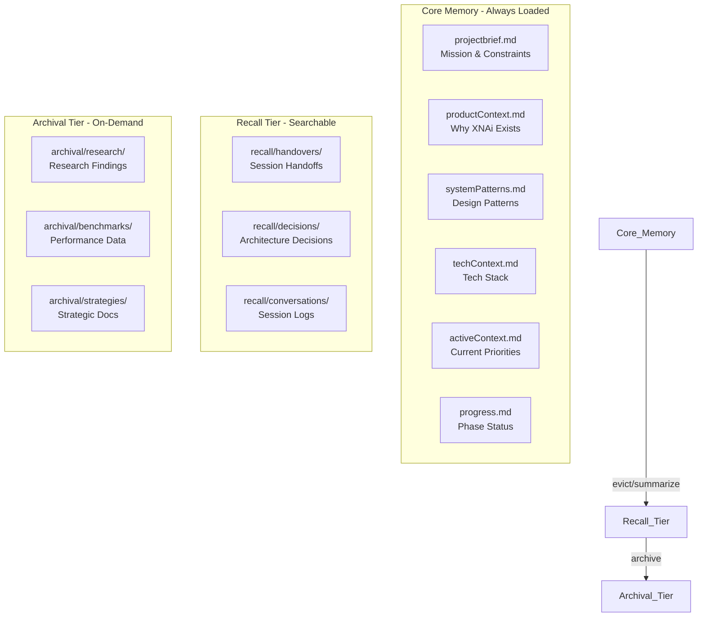
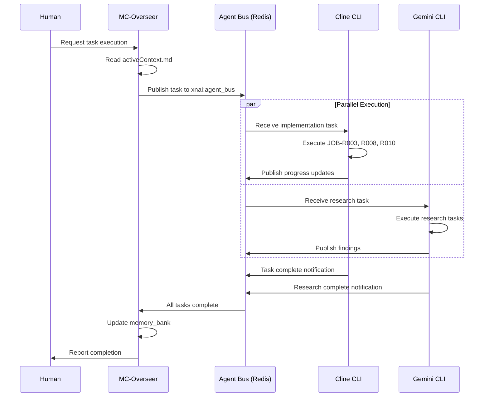
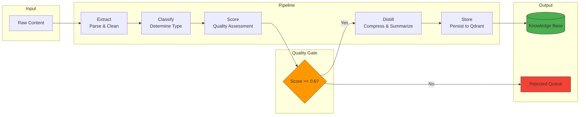
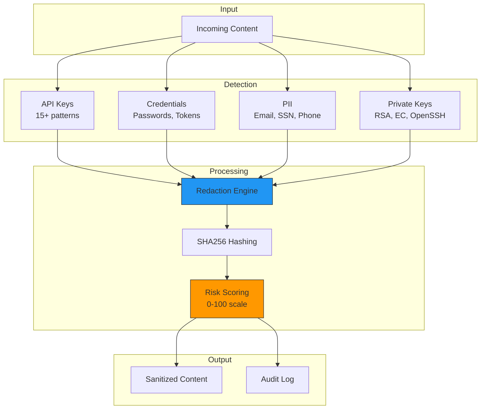
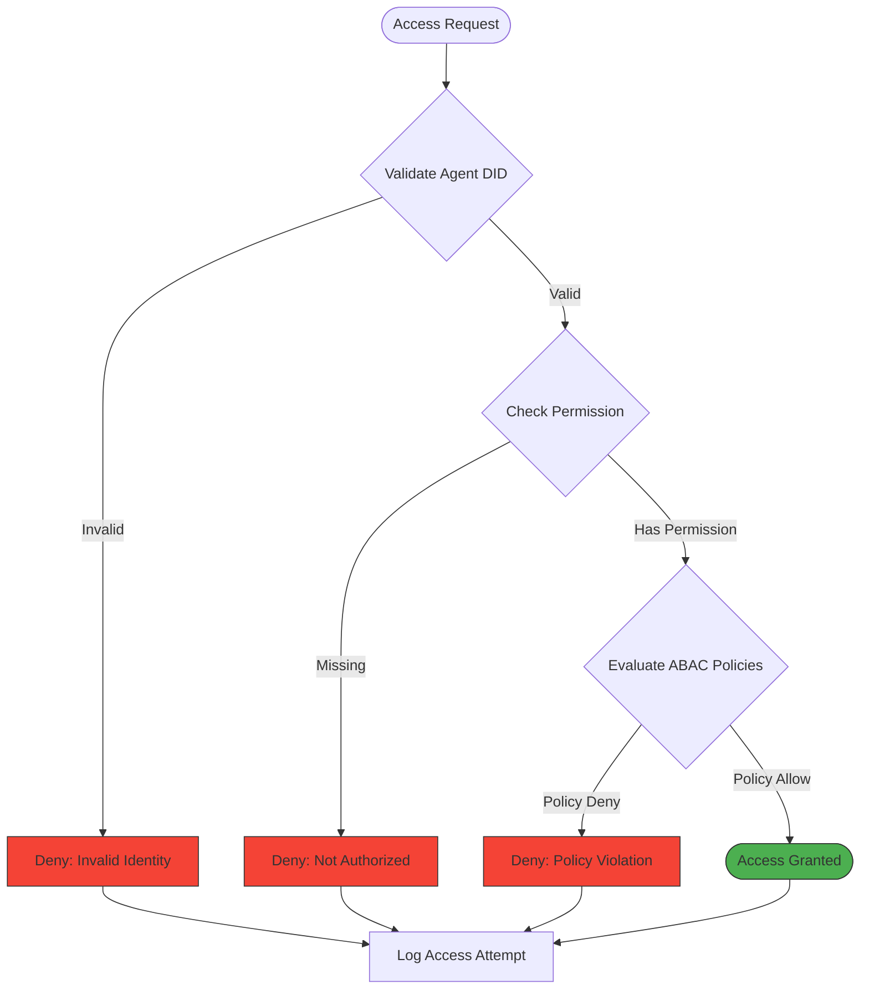
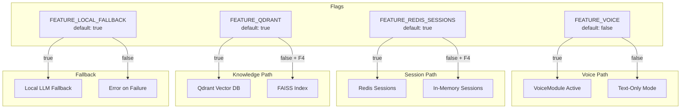
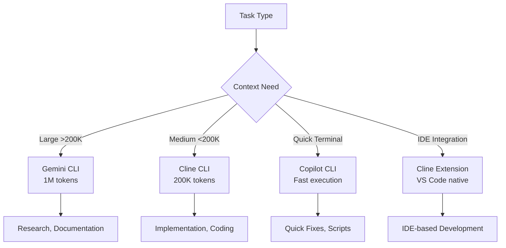

# XNAi Foundation System Architecture

> **Version**: 1.0.0  
> **Last Updated**: 2026-02-23  
> **Owner**: MC-Overseer Agent

---

## Overview

XNAi Foundation is a sovereign AI stack designed for local-first, privacy-preserving AI operations. This document provides a comprehensive architectural overview with visual diagrams.

---

## System Architecture Overview

```mermaid
graph TB
    subgraph "User Interface Layer"
        CHAINLIT[Chainlit Unified App]
        FASTAPI[FastAPI REST API]
        WS[WebSocket Endpoint]
    end
    
    subgraph "Core Services Layer"
        SESSION[SessionManager]
        KNOWLEDGE[KnowledgeClient]
        VOICE[VoiceModule]
        DISTILL[Knowledge Distillation]
    end
    
    subgraph "Security Layer"
        IAM[IAM Service]
        ACCESS[Knowledge Access Control]
        SANITIZE[Content Sanitizer]
        HANDSHAKE[Sovereign Handshake]
    end
    
    subgraph "Coordination Layer"
        AGENTBUS[Agent Bus]
        REDIS[(Redis)]
        CONSUL[Consul Service Discovery]
    end
    
    subgraph "Storage Layer"
        QDRANT[(Qdrant Vector DB)]
        FAISS[(FAISS Index)]
        MEMORY[Memory Bank]
    end
    
    subgraph "Agent Layer"
        CLINE[Cline CLI]
        GEMINI[Gemini CLI]
        OPENCODE[OpenCode CLI]
        COPILOT[Copilot CLI]
    end
    
    CHAINLIT --> SESSION
    CHAINLIT --> KNOWLEDGE
    CHAINLIT --> VOICE
    FASTAPI --> SESSION
    FASTAPI --> KNOWLEDGE
    WS --> AGENTBUS
    
    SESSION --> REDIS
    KNOWLEDGE --> QDRANT
    KNOWLEDGE --> FAISS
    
    ACCESS --> IAM
    ACCESS --> HANDSHAKE
    SANITIZE --> DISTILL
    
    AGENTBUS --> REDIS
    CONSUL --> AGENTBUS
    
    CLINE --> AGENTBUS
    GEMINI --> AGENTBUS
    OPENCODE --> AGENTBUS
    COPILOT --> AGENTBUS
    
    DISTILL --> QDRANT
    DISTILL --> SANITIZE
```



---

## Memory Bank Architecture



---

## Multi-Agent Coordination Flow



---

## Knowledge Distillation Pipeline



---

## Content Sanitization Flow



---

## Access Control Decision Flow



---

## Redis Stream Architecture

```mermaid
graph LR
    subgraph Producers
        P1[Cline Agent]
        P2[Gemini Agent]
        P3[MC-Overseer]
    end
    
    subgraph Streams
        S1[xnai:agent_bus]
        S2[xnai:task_updates]
        S3[xnai:memory_updates]
        S4[xnai:alerts]
    end
    
    subgraph Consumer Groups
        G1[agent_wavefront]
        G2[memory_sync]
        G3[alert_handlers]
    end
    
    subgraph DLQ
        DLQ[Dead Letter Queue]
    end
    
    P1 & P2 & P3 --> S1 & S2 & S3 & S4
    S1 --> G1
    S2 --> G1
    S3 --> G2
    S4 --> G3
    G1 & G2 & G3 -->|Failed Messages| DLQ
```

---

## Feature Flag System



---

## CLI Tool Selection Matrix



---

## Component Ports & Services

| Service | Port | Purpose |
|---------|------|---------|
| FastAPI | 8000 | REST API endpoints |
| Chainlit | 8000 | Web UI (same port) |
| Redis | 6379 | Session & Agent Bus |
| Qdrant | 6333 | Vector database |
| Consul | 8500 | Service discovery |
| Prometheus | 9090 | Metrics collection |
| VictoriaMetrics | 8428 | Long-term metrics |

---

## Directory Structure

```
xnai-foundation/
├── app/XNAi_rag_app/           # Main application
│   ├── core/
│   │   ├── infrastructure/     # SessionManager, KnowledgeClient
│   │   ├── distillation/       # Knowledge absorption pipeline
│   │   ├── sanitization/       # Content sanitization
│   │   └── iam*.py             # Identity & access management
│   ├── services/voice/         # VoiceModule
│   └── ui/                     # chainlit_app_unified.py
├── memory_bank/                # Hierarchical memory system
│   ├── *.md                    # Core memory blocks
│   ├── PHASES/                 # Phase completion docs
│   ├── strategies/             # Strategic planning
│   └── recall/                 # Searchable history
├── expert-knowledge/           # Domain knowledge base
├── docs/                       # MkDocs documentation
├── .gemini/                    # Gemini CLI config
├── .opencode/                  # OpenCode CLI config
└── .clinerules/                # Cline CLI rules
```

---

## Related Documentation

### API Reference
| Document | Purpose |
|----------|---------|
| [Knowledge Access API](../docs/api/knowledge_access.md) | Access control API details |
| [Sanitization API](../docs/api/sanitization.md) | Content sanitization API |
| [Redis Streams API](../docs/api/redis_streams.md) | Stream management API |
| [Infrastructure Layer](../docs/api/infrastructure-layer.md) | Session & knowledge clients |
| [Voice Module](../docs/api/voice_module.md) | Voice integration API |

### Memory Bank
| Document | Purpose |
|----------|---------|
| [Active Context](./activeContext.md) | Current priorities |
| [Progress](./progress.md) | Phase status |
| [Team Protocols](./teamProtocols.md) | Agent coordination |
| [New Modules Index](./NEW-MODULES-INDEX.md) | Module reference |

### Task Tracking
| Document | Purpose |
|----------|---------|
| [Task Dispatch](./strategies/ACTIVE-TASK-DISPATCH-2026-02-23.md) | Current tasks |
| [Wave 2 Progress](./WAVE-2-PROGRESS.md) | Progress tracking |

---

**Created**: 2026-02-23  
**Owner**: MC-Overseer Agent
