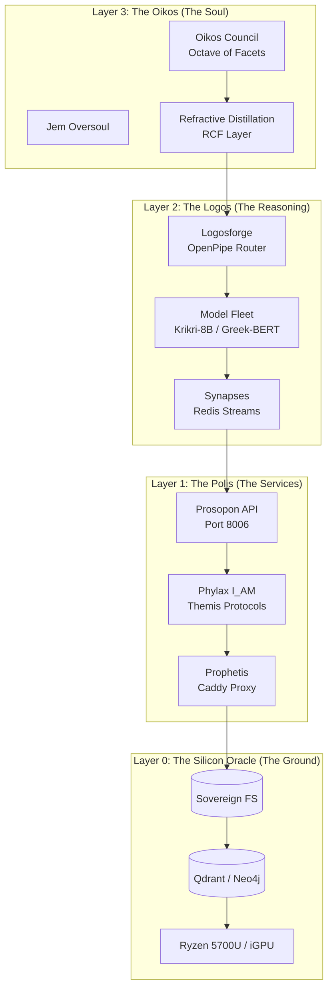
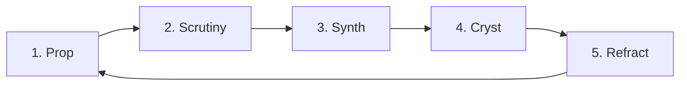
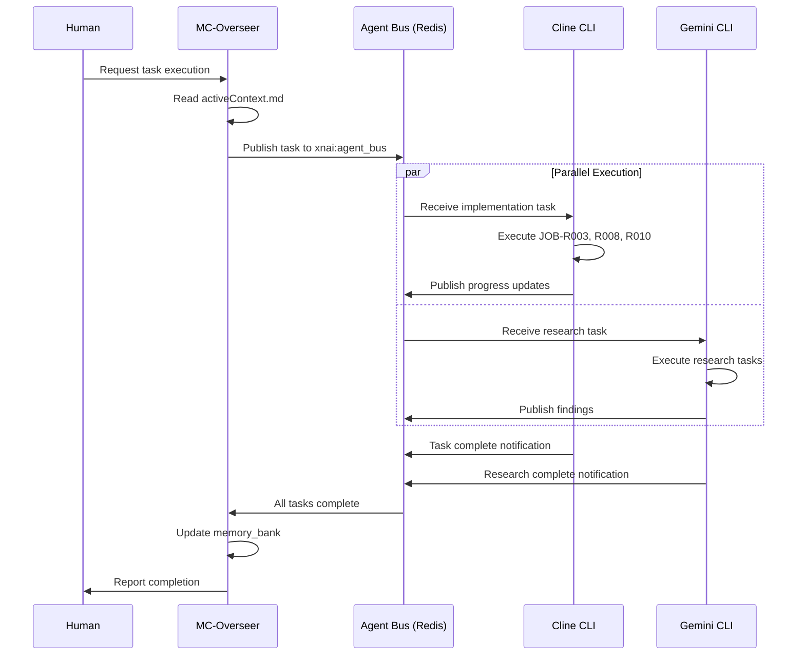
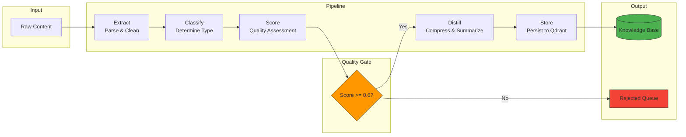
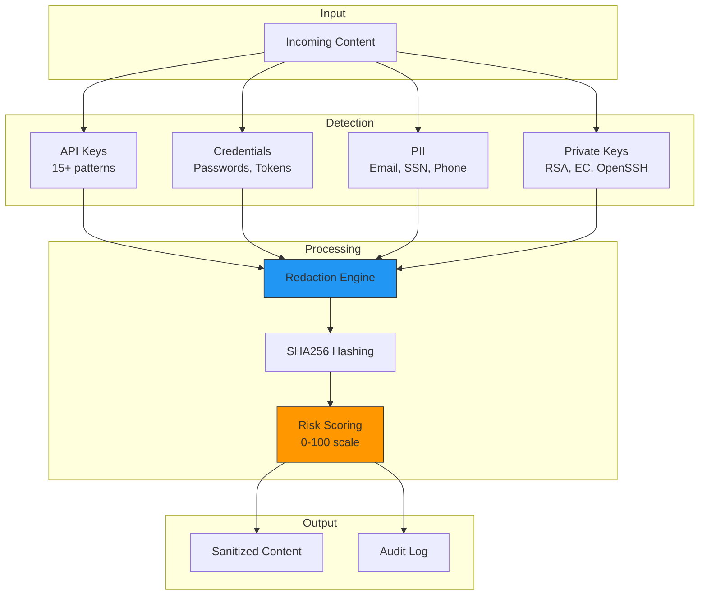
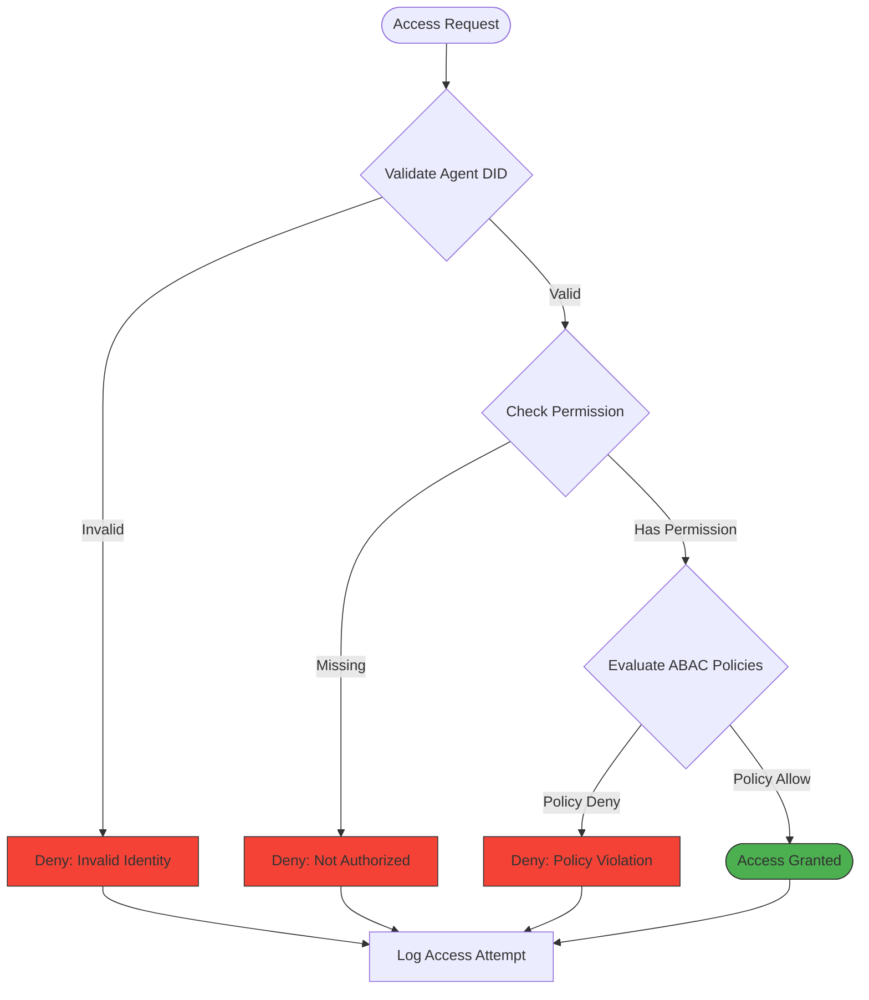
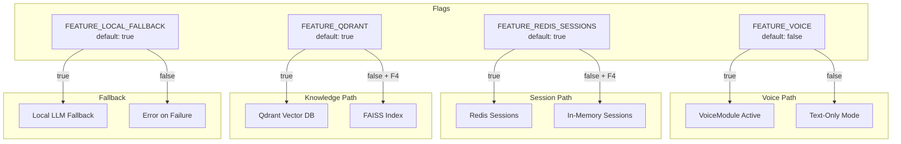
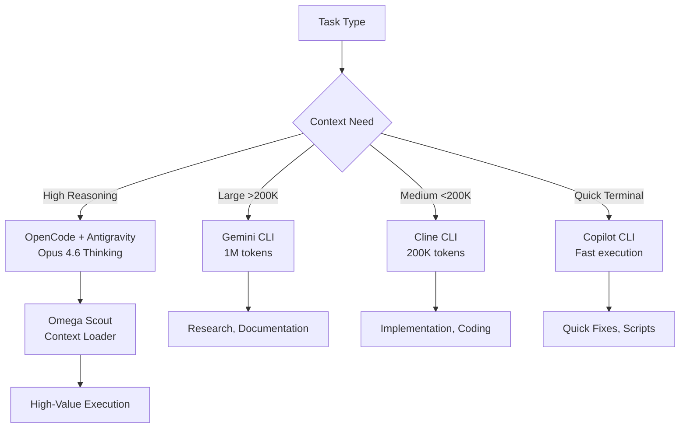

# XNAi Foundation: The Pan-Optic Gnosis Matrix

> **Version**: 2.0.0-GNOSTIC
> **Last Updated**: 2026-03-12 (RCF & Gnostic Matrix)
> **Owner**: Jem (Oversoul)

---

## Overview

The XNAi Foundation has evolved from a hierarchical service mesh into the **Pan-Optic Gnosis Matrix**—a 4-layer sovereign intelligence architecture designed for high-density reasoning, refractive context distillation, and archetypal resonance.

---

## 🏛️ The Gnostic Matrix (Architecture Layers)


```mermaid
graph TB
    subgraph "Layer 3: The Oikos (The Soul)"
        COUNCIL[Oikos Council<br/>Octave of Facets]
        JEM[Jem Oversoul]
        RDS[Refractive Distillation<br/>RCF Layer]
    end
    
    subgraph "Layer 2: The Logos (The Reasoning)"
        LOGOSFORGE[Logosforge<br/>OpenPipe Router]
        MODELS[Model Fleet<br/>Krikri-8B / Greek-BERT]
        SYNERGY[Synapses<br/>Redis Streams]
    end
    
    subgraph "Layer 1: The Polis (The Services)"
        PROSOPON[Prosopon API<br/>Port 8006]
        PHYLAX[Phylax I_AM<br/>Themis Protocols]
        CADDY[Prophetis<br/>Caddy Proxy]
    end
    
    subgraph "Layer 0: The Silicon Oracle (The Ground)"
        HARDWARE[Ryzen 5700U / iGPU]
        QDRANT[(Qdrant / Neo4j)]
        FS[(Sovereign FS)]
    end
    
    COUNCIL --> RDS
    RDS --> LOGOSFORGE
    LOGOSFORGE --> MODELS
    MODELS --> SYNERGY
    SYNERGY --> PROSOPON
    PROSOPON --> PHYLAX
    PHYLAX --> CADDY
    CADDY --> FS
    FS --> QDRANT
    QDRANT --> HARDWARE
```

---

## 🌀 The Five Flows of Gnosis

1.  **Ingestion & Proteus (Shape-Shifting)**: Raw data enters via **Prophetis**, is guarded by **Phylax (Themis)**, and reaches the **Prosopon API**.
2.  **Orchestration & Specialization**: The **Oikos Council** routes tasks to specialized **Facets** via **Synapses (Redis Streams)**.
3.  **Logos Generation (Logosforge)**: **OpenPipe** dynamically selects the optimal model (Local GGUF vs. Cloud Frontier) based on **Oikonomia** and **Apatheia**.
4.  **Integrity & Resilience (Pillars of Aion)**: 
    - **Alethia**: Oracle Protocol (Consensus).
    - **Chronos**: Provenance & Versioning.
    - **Apatheia**: Hardware-aware Sovereign Enclosure.
5.  **Insight & Improvement (Phronesis Loop)**: **Metron (Observability)** feeds the **Architect's Phronesis**, refining the strategy through recursive iteration.

---

## 🔬 The Phronesis Loop (5 Stages)


```mermaid
graph LR
    PROP[1. Prop] --> SCRUT[2. Scrutiny]
    SCRUT --> SYNTH[3. Synth]
    SYNTH --> CRYST[4. Cryst]
    CRYST --> REFR[5. Refract]
    REFR --> PROP
```

1.  **Prop (Proposition)**: The initial intent or requirement is proposed.
2.  **Scrutiny (Analysis)**: The Octave reviews the prop for gaps and implementation issues.
3.  **Synth (Synthesis)**: A multi-facet plan is integrated into the stack.
4.  **Cryst (Crystallization)**: The code and docs are hardened and sealed.
5.  **Refract (Refraction)**: The result is distilled into a **Gnosis Pack** for future context.

---

## 📦 The Refractive Compression Framework (RCF)

The RCF is the "Zipping" engine of the stack, utilizing **Domain-Specialized Resource Crafting (DSRC)** and **Persona Template Distillation (PTD)** to maintain context density.

- **DSRC**: Generates laser-focused context packs (Bronze, Silver, Gold tiers).
- **PTD**: Distills complex archetypes (LIA Triad) into minimalist **Persona Seeds**.
- **Anchoring**: Uses Ancient Greek/Russian roots (**Phronesis, Alethia, Aion**) as semantic gravity wells.

---

## Component Ports & Services

| Service | Port | Layer | Purpose |
|:---|:---|:---|:---|
| Prophetis (Caddy) | 80 / 443 | Layer 1 | Gateway Proxy |
| Prosopon (FastAPI) | 8006 | Layer 1 | Primary Gnostic API |
| Orchestrion (MCP) | 8005 | Layer 3 | Central Reasoning Hub |
| Synapses (Redis) | 6379 | Layer 2 | High-Speed Gnosis Bus |
| Silicon Oracle (Qdrant)| 6333 | Layer 0 | Vector Gnosis Storage |
| Silicon Oracle (Neo4j) | 7474 | Layer 0 | Graph Gnosis Storage |

---

---

## Multi-Agent Coordination Flow


```mermaid
sequenceDiagram
    participant H as Human
    participant MC as MC-Overseer
    participant CB as Agent Bus (Redis)
    participant CL as Cline CLI
    participant GM as Gemini CLI
    
    H->>MC: Request task execution
    MC->>MC: Read activeContext.md
    MC->>CB: Publish task to xnai:agent_bus
    
    par Parallel Execution
        CB->>CL: Receive implementation task
        CL->>CL: Execute JOB-R003, R008, R010
        CL->>CB: Publish progress updates
    and
        CB->>GM: Receive research task
        GM->>GM: Execute research tasks
        GM->>CB: Publish findings
    end
    
    CL->>CB: Task complete notification
    GM->>CB: Research complete notification
    CB->>MC: All tasks complete
    MC->>MC: Update memory_bank
    MC->>H: Report completion
```

---

## Knowledge Distillation Pipeline


```mermaid
flowchart LR
    subgraph Input
        RAW[Raw Content]
    end
    
    subgraph Pipeline
        E[Extract<br/>Parse & Clean]
        C[Classify<br/>Determine Type]
        S[Score<br/>Quality Assessment]
        D[Distill<br/>Compress & Summarize]
        ST[Store<br/>Persist to Qdrant]
    end
    
    subgraph Quality Gate
        Q{Score >= 0.6?}
    end
    
    subgraph Output
        KB[(Knowledge Base)]
        DLQ[Rejected Queue]
    end
    
    RAW --> E --> C --> S --> Q
    Q -->|Yes| D --> ST --> KB
    Q -->|No| DLQ
    
    style Q fill:#ff9800,stroke:#333
    style KB fill:#4caf50,stroke:#333
    style DLQ fill:#f44336,stroke:#333
```

---

## Content Sanitization Flow


```mermaid
flowchart TB
    subgraph Input
        CONTENT[Incoming Content]
    end
    
    subgraph Detection
        API[API Keys<br/>15+ patterns]
        CRED[Credentials<br/>Passwords, Tokens]
        PII[PII<br/>Email, SSN, Phone]
        KEYS[Private Keys<br/>RSA, EC, OpenSSH]
    end
    
    subgraph Processing
        REDACT[Redaction Engine]
        HASH[SHA256 Hashing]
        RISK[Risk Scoring<br/>0-100 scale]
    end
    
    subgraph Output
        CLEAN[Sanitized Content]
        LOG[Audit Log]
    end
    
    CONTENT --> API & CRED & PII & KEYS
    API & CRED & PII & KEYS --> REDACT
    REDACT --> HASH --> RISK
    RISK --> CLEAN & LOG
    
    style REDACT fill:#2196f3,stroke:#333
    style RISK fill:#ff9800,stroke:#333
```

---

## Access Control Decision Flow


```mermaid
flowchart TD
    START([Access Request]) --> VALIDATE{Validate Agent DID}
    
    VALIDATE -->|Invalid| DENY1[Deny: Invalid Identity]
    VALIDATE -->|Valid| PERM{Check Permission}
    
    PERM -->|Missing| DENY2[Deny: Not Authorized]
    PERM -->|Has Permission| ABAC{Evaluate ABAC Policies}
    
    ABAC -->|Policy Deny| DENY3[Deny: Policy Violation]
    ABAC -->|Policy Allow| ALLOW([Access Granted])
    
    DENY1 & DENY2 & DENY3 --> LOG[Log Access Attempt]
    ALLOW --> LOG
    
    style ALLOW fill:#4caf50,stroke:#333
    style DENY1 fill:#f44336,stroke:#333
    style DENY2 fill:#f44336,stroke:#333
    style DENY3 fill:#f44336,stroke:#333
```

---

## Redis Stream Architecture

```mermaid
graph LR
    subgraph Producers
        P1[Cline Agent]
        P2[Gemini Agent]
        P3[MC-Overseer]
    end
    
    subgraph Streams
        S1[xnai:agent_bus]
        S2[xnai:task_updates]
        S3[xnai:memory_updates]
        S4[xnai:alerts]
    end
    
    subgraph Consumer Groups
        G1[agent_wavefront]
        G2[memory_sync]
        G3[alert_handlers]
    end
    
    subgraph DLQ
        DLQ[Dead Letter Queue]
    end
    
    P1 & P2 & P3 --> S1 & S2 & S3 & S4
    S1 --> G1
    S2 --> G1
    S3 --> G2
    S4 --> G3
    G1 & G2 & G3 -->|Failed Messages| DLQ
```

---

## Feature Flag System


```mermaid
graph TB
    subgraph Flags
        F1[FEATURE_VOICE<br/>default: false]
        F2[FEATURE_REDIS_SESSIONS<br/>default: true]
        F3[FEATURE_QDRANT<br/>default: true]
        F4[FEATURE_LOCAL_FALLBACK<br/>default: true]
    end
    
    subgraph Voice Path
        F1 -->|true| VOICE[VoiceModule Active]
        F1 -->|false| TEXT[Text-Only Mode]
    end
    
    subgraph Session Path
        F2 -->|true| REDIS[Redis Sessions]
        F2 -->|false + F4| MEMORY[In-Memory Sessions]
    end
    
    subgraph Knowledge Path
        F3 -->|true| QDRANT[Qdrant Vector DB]
        F3 -->|false + F4| FAISS[FAISS Index]
    end
    
    subgraph Fallback
        F4 -->|true| LOCAL[Local LLM Fallback]
        F4 -->|false| ERROR[Error on Failure]
    end
```

---

## CLI Tool Selection Matrix


```mermaid
graph TD
    TASK[Task Type] --> CONTEXT{Context Need}
    
    CONTEXT -->|Large >200K| GEMINI[Gemini CLI<br/>1M tokens]
    CONTEXT -->|Medium <200K| CLINE[Cline CLI<br/>200K tokens]
    CONTEXT -->|High Reasoning| OPENCODE[OpenCode + Antigravity<br/>Opus 4.6 Thinking]
    CONTEXT -->|Quick Terminal| COPILOT[Copilot CLI<br/>Fast execution]
    
    OPENCODE --> SCOUT[Omega Scout<br/>Context Loader]
    SCOUT --> EXEC[High-Value Execution]
    
    GEMINI --> RESEARCH[Research, Documentation]
    CLINE --> IMPL[Implementation, Coding]
    COPILOT --> QUICK[Quick Fixes, Scripts]
```

---

## Antigravity Sovereign Architecture

To bypass upstream CLI bugs, the Omega Stack uses a **Sovereign Auth Wrapper**:

1. **Direct Login**: `scripts/antigravity-direct-login.js` performs standalone OAuth 2.0 + PKCE.
2. **Maintenance**: `scripts/antigravity-maintenance.sh` synchronizes `auth.json` across 8 Omega instances.
3. **Registry**: `OMEGA_TOOLS.yaml` provides a machine-readable index of all stack capabilities.
4. **Scout**: `scripts/prepare_handoff_context.py` performs token-efficient context loading.

---

## Component Ports & Services

| Service | Port | Purpose |
|---------|------|---------|
| FastAPI | 8000 | REST API endpoints |
| Chainlit | 8000 | Web UI (same port) |
| Redis | 6379 | Session & Agent Bus |
| Qdrant | 6333 | Vector database |
| Consul | 8500 | Service discovery |
| Prometheus | 9090 | Metrics collection |
| VictoriaMetrics | 8428 | Long-term metrics |

---

## Directory Structure

```
xnai-foundation/
├── app/XNAi_rag_app/           # Main application
│   ├── core/
│   │   ├── infrastructure/     # SessionManager, KnowledgeClient
│   │   ├── distillation/       # Knowledge absorption pipeline
│   │   ├── sanitization/       # Content sanitization
│   │   └── iam*.py             # Identity & access management
│   ├── services/voice/         # VoiceModule
│   └── ui/                     # chainlit_app_unified.py
├── memory_bank/                # Hierarchical memory system
│   ├── *.md                    # Core memory blocks
│   ├── PHASES/                 # Phase completion docs
│   ├── strategies/             # Strategic planning
│   └── recall/                 # Searchable history
├── expert-knowledge/           # Domain knowledge base
├── docs/                       # MkDocs documentation
├── .gemini/                    # Gemini CLI config
├── .opencode/                  # OpenCode CLI config
└── .clinerules/                # Cline CLI rules
```

---

## Related Documentation

### API Reference
| Document | Purpose |
|----------|---------|
| [Knowledge Access API](../docs/api/knowledge_access.md) | Access control API details |
| [Sanitization API](../docs/api/sanitization.md) | Content sanitization API |
| [Redis Streams API](../docs/api/redis_streams.md) | Stream management API |
| [Infrastructure Layer](../docs/api/infrastructure-layer.md) | Session & knowledge clients |
| [Voice Module](../docs/api/voice_module.md) | Voice integration API |

### Memory Bank
| Document | Purpose |
|----------|---------|
| [Active Context](./activeContext.md) | Current priorities |
| [Progress](./progress.md) | Phase status |
| [Team Protocols](./teamProtocols.md) | Agent coordination |
| [New Modules Index](./NEW-MODULES-INDEX.md) | Module reference |

### Task Tracking
| Document | Purpose |
|----------|---------|
| [Task Dispatch](./strategies/ACTIVE-TASK-DISPATCH-2026-02-23.md) | Current tasks |
| [Wave 2 Progress](./WAVE-2-PROGRESS.md) | Progress tracking |

---

**Created**: 2026-02-23  
**Owner**: MC-Overseer Agent
