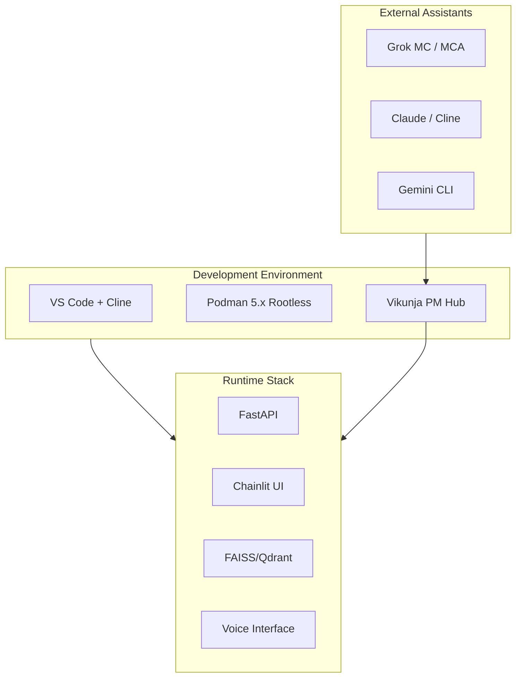

# Environment Context - v2.1

**Last Updated**: 2026-02-09  
**Status**: ✅ **Vikunja-Centric Dev Environment Locked**  
**Version**: v2.1 - Production Ready (Redis integration disabled)

---

## 🌍 Multi-Environment Architecture

### Current Environment Map

---

## 🏗️ Development Environment Structure

### Primary Environment: VS Code + Cline
**Components**:
- VS Code Insiders with Cline extension
- Podman 5.x rootless containers
- Local Vikunja instance (port 3456)
- FastAPI development server (port 8000)
- Chainlit UI (port 8001)

### Vikunja-Centric Workflow
**Central Hub**: `http://localhost:3456` (operational)
**Purpose**: Task orchestration, multi-agent coordination
**Migration**: memory_bank → Vikunja (in progress)
**Current Status**: Operational with Redis integration disabled

#### Deployment Status (2026-02-09)
- **Vikunja Container**: Running on port 3456 (internal)
- **PostgreSQL**: Running on port 5432 (internal)
- **Redis**: Running on port 6379 (internal, currently unused by Vikunja)
- **Caddy**: Reverse proxy on port 8000
- **Redis Integration**: Disabled due to connection issues

#### Files Created
- `grok-mc-research-request.md` - Research request for current issues
- `CLAUDE_VIKUNJA_BLOCKER_REPORT.md` - Comprehensive error analysis
- `docker-compose.vikunja.yml` - Container orchestration
- `config/postgres.conf` - PostgreSQL configuration
- `config/vikunja-config.yaml` - Application configuration

### Namespace Structure in Vikunja
| Namespace | Purpose | Projects |
|-----------|---------|----------|
| **Foundation** | Core inference/orchestration | Phase-2-Service, API-Refactor |
| **Arcana** | Esoteric tuning | Pantheon-Mechanics, Tarot-Engine |
| **Agents** | Multi-agent coordination | Gemini-CLI, Cline-Tasks, Grok-Handoff |
| **Infra** | Infrastructure & security | Trinity-Audits, Podman-Deploys |
| **EKB** | Expert Knowledge Base | Dataset-Curation, SEC-Crawls |
| **Sync** | Migration & protocols | Memory-Bank-Migration, Meta-Protocols |
| **Docs** | Documentation | MkDocs-Audit, API-Docs |

---

## 🤖 Multi-Agent Coordination

### Agent Roles & Access

| Agent | Environment Access | Primary Role | Vikunja Integration |
|-------|-------------------|--------------|---------------------|
| **Cline-Kat** | VS Code + Cline | Strong coding | Task execution, code generation |
| **Cline-Trinity** | VS Code + Cline | Balanced reasoning | Architecture decisions, audits |
| **Gemini CLI** | Terminal + Filesystem | Ground truth executor | Task automation, sync operations |
| **Grok MC** | Cloud (xoe.nova.ai) | Strategic oversight | Task assignment, review |
| **Grok MCA** | Cloud (arcana.novai) | Esoteric mastery | Arcana coordination |

### Coordination Protocol
1. **Task Creation**: All tasks originate in Vikunja
2. **Assignment**: Tasks assigned to specific agents via labels
3. **Execution**: Agents pull tasks, execute, post results
4. **Review**: Results reviewed in Vikunja comments
5. **Archive**: Completed tasks archived with commit hashes

---

## 🔧 Infrastructure Status

### Podman Rootless Deployment
**Status**: 🟢 Hardened & Operational
- User namespaces: `userns_mode: keep-id`
- Non-root containers: UID 1001
- SELinux: `:Z,U` volume flags
- Caddy: Local-only proxy (127.0.0.1:3456)

### Service Ports
| Service | Port | Status | Access |
|---------|------|--------|--------|
| FastAPI | 8000 | 🟢 Active | Local + Container |
| Chainlit | 8001 | 🟢 Active | Local + Container |
| Vikunja | 3456 | 🟢 Ready | Local only (Caddy) |
| Grafana | 3000 | 🟢 Active | Local |
| Prometheus | 9090 | 🟢 Active | Local |

### Volume Management
- **Data**: `./data:/app/data:Z,U`
- **Models**: `./models:/app/models:Z,U`
- **Vikunja DB**: `./vikunja/db:/var/lib/postgresql/data:Z`
- **Vikunja Files**: `./vikunja/files:/app/vikunja/files:Z`

---

## 📦 Development Tools

### Core Toolchain
- **Package Manager**: `uv` (Python)
- **Container**: Podman 5.x
- **Orchestration**: Podman Compose
- **Testing**: pytest + hypothesis
- **Linting**: ruff + mypy

### Scripts & Automation
- `scripts/stack-cat.py` - Stack introspection
- `scripts/memory_bank_export.py` - Vikunja sync
- `scripts/memory_bank_refresh.py` - Context refresh
- `scripts/preflight_checks.py` - Pre-deployment validation

---

## 🔄 Synchronization Workflows

### Memory Bank → Vikunja Migration
**Status**: 🟡 In Progress
**Script**: `scripts/memory_bank_export.py`
**Features**:
- Dry-run mode for testing
- Frontmatter preservation
- Label mapping (Ma'at ideals, agents, status)
- Attachment handling

### Git Integration
**Pre-commit**: `git-secrets` scan
**Pre-push**: Trinity security audit
**CI**: Local-only (sovereignty requirement)

---

## 🛡️ Security & Sovereignty

### Environment Isolation
- Rootless Podman (no daemon)
- User namespace mapping
- SELinux confinement
- No privileged containers

### Secrets Management
- Runtime injection only
- Environment variables (never committed)
- Podman secrets for sensitive data
- Regular rotation policy

### Compliance
- [x] Zero-telemetry architecture
- [x] Air-gap capable
- [x] No external data transmission
- [x] 100% local processing

---

## 🎯 Current Environment Priorities

### Immediate (Next 24h)
1. **Resolve Issues**: Wait for Grok MC research results on pain points
2. **Test Migration**: Run `memory_bank_export.py` dry-run
3. **Validate Sync**: Verify task creation/update flow
4. **Documentation**: Update dev workflow docs

### Short-term (Next Week)
1. **Namespace Setup**: Create all Vikunja namespaces
2. **Agent Onboarding**: Configure agent-specific views
3. **CI/CD Integration**: Automated task creation from commits
4. **Monitoring**: Grafana dashboards for all services

---

## 📚 Reference Documentation

- **Dev Environment Guide**: `docs/03-reference/architecture/2026-02-06-xoe-novai-dev-environment-guide-v1.1.0.md`
- **Vikunja Migration**: `docs/06-development-log/vikunja-integration/`
- **Docker Compose**: `docker-compose.vikunja.yml`
- **Export Script**: `scripts/memory_bank_export.py`
- **Research Request**: `grok-mc-research-request.md`

---

**Status**: ✅ **Environment Context v2.1 Synchronized**  
**Sync Hub**: Vikunja-Centric Active (Redis integration disabled)  
**Security**: Rootless Hardened

---