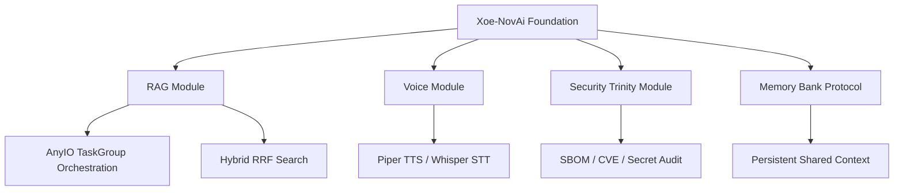

# Xoe-NovAi: The Sovereign AI Foundation & Toolkit

## 🔱 Mission: Plug-n-Play Sovereignty
To provide a modular, extensible foundation that allows anyone—from elite developers to non-programmers—to build, own, and evolve their own local AI ecosystem. Xoe-NovAi is not just an application; it is a **Sovereign Toolkit** of modular components designed for reuse and rapid extension.

## ⚖️ The 4 Core Ideals
1. **Sovereignty**: 100% offline, zero-telemetry, and air-gap ready by default.
2. **Modularity**: Components like the *Security Trinity*, *Memory Bank*, and *The Butler* are stand-alone modules usable in any project.
3. **Accessibility**: Optimized for Ryzen/iGPU hardware; designed for "AI-Steered" evolution by non-programmers.
4. **Integrity**: Automated, policy-driven gatekeeping ensures that every extension maintains the stack's high standards.

## 🧩 The Sovereign Toolkit (Modular Components)
- **🔱 The Sovereign Trinity**: A containerized Syft/Grype/Trivy pipeline for automated security audits.
- **🧠 The Memory Bank**: A standardized context protocol for AI-human collaborative intelligence.
- **⚡ The Butler**: A centralized CLI orchestrator for complex infrastructure management.
- **🏁 PR Readiness Auditor**: A bulletproof gatekeeping suite for ensuring project-wide stability and privacy.
- **📦 Expert Knowledge Base (EKB)**: A graph-linked repository of technical and domain mastery gems.

## 🏗️ Architecture: The Modular Entity

## 🚀 Success Metrics (Toolkit Era)
- **Modular Portability**: Components can be integrated into external repos in < 15 minutes.
- **Extensibility**: Non-programmers can "steer" stack evolution via high-level prompt instructions.
- **Performance**: <300ms latency on Ryzen 5700U; <6GB total RAM footprint.
- **Sovereignty**: 100% pass rate on Zero-Telemetry audits.

*Updated by Gemini CLI (Sovereign Toolkit & Modularity Refactor)*

---

## 🚀 2026 Refactoring & Research Phase: Quick Reference

**Current Phase:**
- The Xoe-NovAi Foundation is now in a major modular refactoring and research-driven phase (v0.1.0-alpha)
- All contributors and AI agents should review the following for onboarding, planning, and implementation:
    - [Xoe-NovAi v0.1.0-alpha Modular Refactoring Plan - Table of Contents](../internal_docs/dev/Xoe-NovAi%20v0.1.0-alpha%20Modular%20Refactoring%20Plan%20-%20Table%20of%20Contents.md)
    - [Xoe-NovAi Foundation Stack - Comprehensive Team Research Plan](../internal_docs/dev/Xoe-NovAi%20Foundation%20Stack%20-%20Comprehensive%20Team%20Research%20Plan.md)
	- [Xoe-NovAi v0.1.0-alpha Modular Refactoring Plan - additional critical areas](../internal_docs/dev/Xoe-NovAi%20v0.1.0-alpha%20Modular%20Refactoring%20Plan%20-%20additional%20critical%20areas.md)

**Additional Critical Areas:**
For a complete and production-grade refactor, review the "additional critical areas" supplement. This living document highlights domains that are frequently missed but are essential for system integrity, security, and maintainability.

**Note:**
- These documents are the canonical source for all current best practices, onboarding, and architectural decisions.