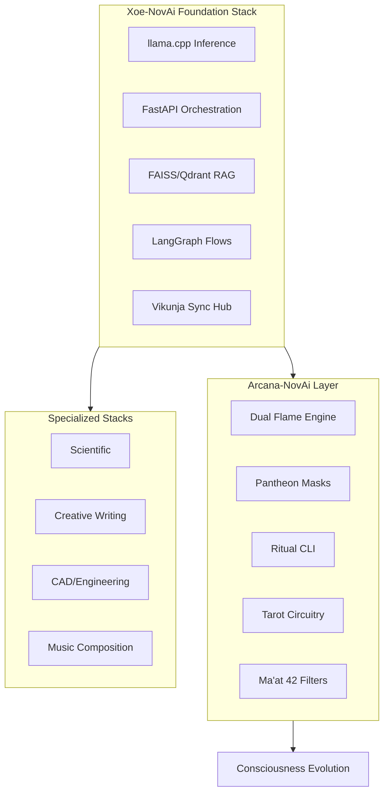
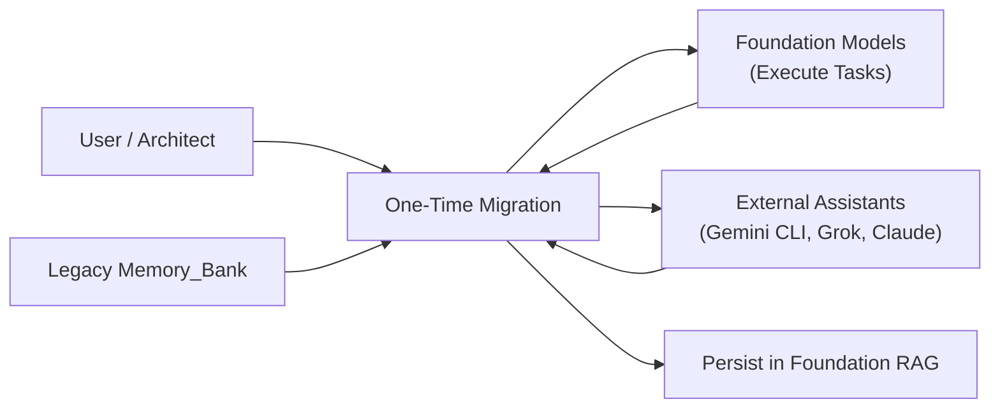

# System Patterns & Architecture Decisions v2.0

**Last Updated**: 2026-02-09  
**Status**: ✅ **Dual-Stack Architecture Locked**  
**Version**: v2.0 - Production Ready

---

## 🏗️ Core Architecture: The Dual-Stack Entity

### Xoe-NovAi Foundation vs Arcana-NovAi

### Stack Distinction

| Aspect | Foundation | Arcana |
|--------|-----------|--------|
| **Purpose** | Universal base inference & orchestration | Consciousness-evolution superstructure |
| **Content** | Clean, technical, esoteric-minimal | Full mythic/symbolic/archetypal |
| **Tech Surface** | llama-cpp, FastAPI, FAISS, LangChain | Built ON Foundation + symbolic routing |
| **Audience** | Any developer/power user | Seekers, mythopoets, shadow workers |
| **Analogy** | The forge and anvil | The living sword forged upon it |

---

## 🔄 Vikunja-Centric Sync Hub Pattern (OPERATIONAL)

### Architecture

### Pattern Rules
1. **All new tasks → Vikunja** (internal or external)
2. **Legacy migration**: One-time push memory_bank → Vikunja
3. **No scattered .md files**: Vikunja is the living source
4. **External sync**: Task → assign to agent → results in comments

### Deployment Status (2026-02-09)

#### Current Status
- **Architecture**: ✅ Complete
- **Configuration**: ✅ Complete
- **Container Deployment**: ✅ Operational
- **Service Startup**: ✅ Operational (Redis integration disabled)

#### Issues Identified
1. **Vikunja Redis Connection Failure**
   - Container fails to parse VIKUNJA_REDIS_PORT and VIKUNJA_REDIS_URL
   - Redis integration disabled, using database for caching
   - Research request sent to Grok MC

2. **Caddy Configuration Issues**
   - Fixed syntax errors with header and websocket directives
   - Caddy container now operational

3. **Vikunja Container Health Status**
   - Container marked as "unhealthy" in podman ps
   - Healthcheck command or container response issues
   - Research request sent to Grok MC

#### Files Created
- `grok-mc-research-request.md` - Research request document
- `CLAUDE_VIKUNJA_BLOCKER_REPORT.md` - Comprehensive error analysis
- `docker-compose.vikunja.yml` - Container orchestration
- `config/postgres.conf` - PostgreSQL configuration
- `config/vikunja-config.yaml` - Application configuration
- `scripts/setup_vikunja_secrets.py` - Secret automation
- `scripts/deploy_vikunja_secure.py` - Deployment script

---

## 🛠️ Key Architectural Decisions

### 1. Unified Entity Pattern (AnyIO)
**Decision**: Standardized on **AnyIO 4.x TaskGroups** for all concurrent services.
**Rationale**: Atomic failure handling via `ExceptionGroup`. Prevents "robotic" audio ghosting.

### 2. Dual-Stack Modularity
**Decision**: Clean separation between Foundation (universal) and Arcana (esoteric).
**Rationale**: 
- Foundation can host any specialized stack without bloat
- Arcana demonstrates consciousness-evolution patterns
- Both maintain 100% sovereignty

### 3. Vikunja as Central Hub
**Decision**: Replace scattered memory_bank files with structured PM system.
**Rationale**:
- API-driven agent integration
- Structured task/label/priority system
- Migration path from legacy .md files
- Offline-capable post-setup

### 4. Modular Plugin Ecosystem (WASM)
**Decision**: Transition from monolithic scripts to **WASM-isolated plugins**.
**Rationale**: <100ms load times, soft-isolation, fine-grained permissions.

---

## ⚖️ Ethical Foundation (Ma'at Framework)

### Technical Mapping
- **Integrity (7, 36, 40)**: Zero-telemetry, clean data, RAG accuracy
- **Resource Stewardship (10, 15, 39)**: Ryzen optimization, low RAM
- **Torch-free (41)**: GGUF/ONNX/CTranslate2 default, GPU extensions optional

### Dual-Stack Alignment
- **Foundation**: Ma'at 41 - Advance through own abilities (raw technical power)
- **Arcana**: Ma'at 18 - Balance in structure (symbolic tension)
- **Integration**: Ma'at 7 - Truth in synthesis

---

## 🧠 Knowledge Runtime Patterns

### Expert Knowledge Base (EKB)
**Pattern**: Graph-Markdown Hybrid
- Markdown + YAML: Human-readable, RAG-optimized
- Wikilinks (`[[link]]`): Bidirectional relationship mapping
- Compatibility: Obsidian/Logseq for visualization

### Memory Bank Protocol
**Status**: Migrating to Vikunja
- Legacy: `memory_bank/*.md` files
- Current: Structured tasks in Vikunja
- Bridge: `scripts/memory_bank_export.py`

---

## 🛡️ Security Patterns

### Sovereign Security Trinity
**Pattern**: Waterfall of Proof (Inventory → CVE → Safety)
1. **Syft**: CycloneDX SBOM generation
2. **Grype**: Precision CVE scanning
3. **Trivy**: Safety scrub for secrets

### Rootless Container Pattern
**Standard**: UID 1001, `userns_mode: keep-id`, `:Z` volumes (removed `:U` for SELinux compliance)
**Hardening**: No new privileges, read-only filesystems where applicable

### Secrets Hygiene
**Rule**: Runtime injection only - NEVER commit secrets
- Env vars at runtime
- `git-secrets` pre-commit hooks
- Trinity scans pre-push

---

## 🎯 Quality Assurance Patterns

### 1. Persistent Circuit Breaker (NEW)
**Pattern**: Redis-backed State Machine
- **State Persistence**: Circuit state survives service restarts via Redis.
- **Async Safety**: Use of `asyncio.Lock` and proxy wrappers for safe concurrent access.
- **Fallback Chains**: Automatic degradation to secondary services (e.g., direct LLM if RAG fails).

### 2. Structured Observability (NEW)
**Pattern**: JSON-OTEL Hybrid Logging
- **Format**: Structured JSON for machine readability (Elastic/Loki).
- **Context Propagation**: Automatic injection of OpenTelemetry `trace_id` and `span_id`.
- **Level Granularity**: Support for `TRACE` and `VERBOSE` levels.

### 3. The Sovereign Governor
- **Thermal-Aware**: Shift PipeWire quantum at >80°C
- **Dynamic Precision**: Q8_0 to Q4_K_S switching

### Testing Strategy
- **Benchmark-First**: $64 \times 64$ warmup matrix on startup
- **Watchdog**: 400MB soft-stop middleware

### PR Readiness Gatekeeping
**Engine**: `scripts/pr_check.py`
**Policy**: `configs/security_policy.yaml`
**Gatekeepers**:
- E2E Smoke Tests
- Documentation Linting
- Zero-Telemetry Audit
- Trinity Security Pass

---

## 📦 Infrastructure Patterns

### Absolute Package Import Standard
**Decision**: Absolute imports from `XNAi_rag_app` root
**Rationale**: Eliminates `ModuleNotFoundError` in container orchestration
**Standardization**: Use `XOE_NOVAI_ROOT` environment detection in all entrypoints.

### Consolidated Entrypoint Pattern
**Standard**: `api/entrypoint.py` (API), `ui/chainlit_app_voice.py` (UI)
**Docker**: `uvicorn XNAi_rag_app.api.entrypoint:app`

### Unified BuildKit Pattern
**Cache Mounts**: `type=cache,id=xnai-...,uid=1001`
**Benefit**: 2-4x build speed with zero external proxy

### uv Standardization
**Pattern**: `uv pip install --system`
**Why**: Replaces slow pip and complex wheelhouse

---

## 🚀 Active Patterns Summary

| Pattern | Status | Location |
|---------|--------|----------|
| Dual-Stack Architecture | 🟢 Locked | Architecture docs |
| Vikunja Sync Hub | 🟡 Operational (Redis disabled) | `docker-compose.vikunja.yml` |
| Persistent Breakers | 🟢 Active | `core/circuit_breakers.py` |
| Structured Logging | 🟢 Active | `core/logging_config.py` |
| AnyIO TaskGroups | 🟢 Active | `core/services_init.py` |
| Security Trinity | 🟢 Active | `configs/security_policy.yaml` |
| Rootless Deployment | 🟢 Hardened | All compose files |
| Memory Bank Migration | 🟡 In Progress | `scripts/memory_bank_export.py` |

---

## 📚 Reference Documentation

- **Dev Environment Guide**: `docs/03-reference/architecture/2026-02-06-xoe-novai-dev-environment-guide-v1.1.0.md`
- **Dual Stack Clarification**: `docs/03-reference/architecture/2026-02-06-xoe-novai-foundation-vs-arcana-novai-v1.0.0.md`
- **Vikunja Migration**: `docs/06-development-log/vikunja-integration/`

---

**Status**: ✅ **System Patterns v2.0 Synchronized**  
**Architecture**: Dual-Stack Locked  
**Sync Hub**: Vikunja-Centric Active (Redis integration disabled)

---