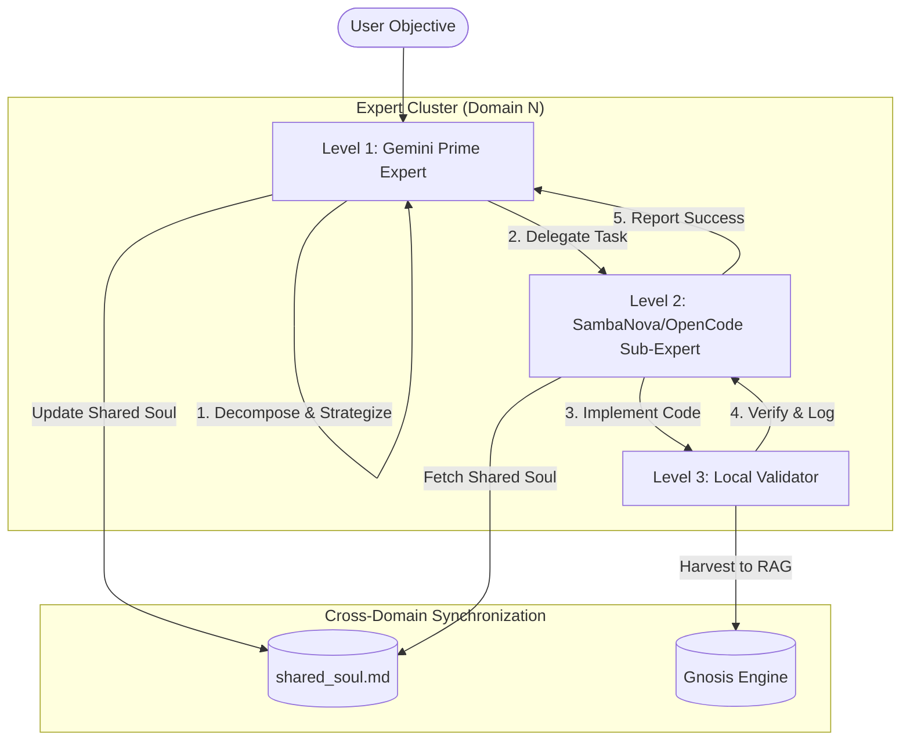
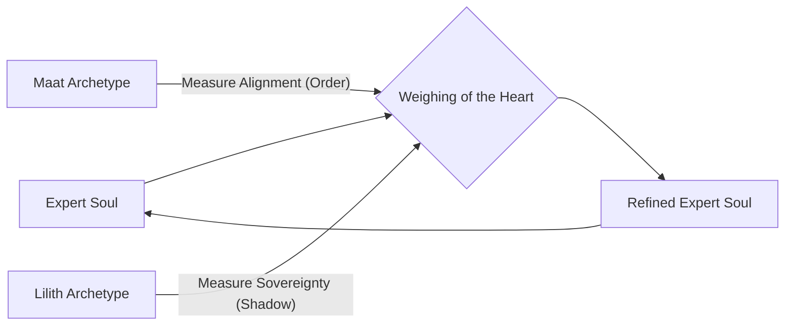

---
block:
  label: system_patterns
  description: Architecture patterns, design decisions, code standards, and system design principles
  chars_limit: 8000
  read_only: false
  tier: core
  priority: 3
created: 2026-02-20
modified: 2026-03-05
version: "1.2"
---

# System Patterns - Xoe-NovAi Foundation Stack

## Metropolis Hierarchical Matrix

```mermaid
graph TD
    User([User Objective]) --> Prime[Level 1: Gemini Prime Expert]
    
    subgraph "Expert Cluster (Domain N)"
        Prime -- "1. Decompose & Strategize" --> Prime
        Prime -- "2. Delegate Task" --> Hands[Level 2: SambaNova/OpenCode Sub-Expert]
        Hands -- "3. Implement Code" --> Validator[Level 3: Local Validator]
        Validator -- "4. Verify & Log" --> Hands
        Hands -- "5. Report Success" --> Prime
    end
    
    subgraph "Cross-Domain Synchronization"
        Prime -- "Update Shared Soul" --> Soul[(shared_soul.md)]
        Hands -- "Fetch Shared Soul" --> Soul
        Validator -- "Harvest to RAG" --> Gnosis[(Gnosis Engine)]
    end
```

## Soul Evolution Matrix (The Weighing)

```mermaid
graph LR
    Expert[Expert Soul] --> Weighing{Weighing of the Heart}
    Maat[Maat Archetype] -- "Measure Alignment (Order)" --> Weighing
    Lilith[Lilith Archetype] -- "Measure Sovereignty (Shadow)" --> Weighing
    Weighing --> Balanced[Refined Expert Soul]
    Balanced --> Expert
```

## Service Orchestration

| Principle | Implementation |
|-----------|----------------|
| Service Order | Dependencies initialized in sequence |
| Graceful Startup | Health checks before serving traffic |
| Graceful Shutdown | Cleanup before termination |
| Dependency Injection | Runtime configuration binding |
| Circuit Breakers | Per-service failure isolation |
| **Sticky Domain** | `XDG_DATA_HOME` isolated expert instances (1-8) |

## Hardened Design Patterns

### 1. Metropolis Expert Isolation
**Purpose**: Multi-account rotation and persistent domain expertise.
- **Pattern**: Each domain (Architect, API, UI, etc.) is mapped to a dedicated local directory and API key.
- **Enforcement**: `scripts/xnai-gemini-dispatcher.sh` and sibling scripts.
- **Planned**: Universal Dispatcher consolidation (see OPUS-STRATEGY-REPORT-2026-03-05.md).

### 2. Expert Soul Evolution
**Purpose**: Persistent learning across sessions.
- **Mechanism**: Post-session reflection via `scripts/expert-soul-reflector.py`.
- **Ceremony**: "Weighing of the Heart" via `scripts/soul-evolution-engine.py` using Maat (`entities/maat.json`) and Lilith (`entities/lilith.json`) archetypes.
- **Persistence**: Domain-specific `expert_soul.md` injected as system instructions.
- **Known Issue**: Reflector is currently a stub (appends boilerplate). Requires implementation with local model or SambaNova API.

### 3. Hierarchical Harvesting
**Purpose**: Local sovereignty over cloud-based insights.
- **Pattern**: Universal RAG ingestion from all levels (Prime, Sub, Validator).
- **Implementation**: `scripts/harvest-expert-data.sh`.
- **Planned Enhancement**: Real-time session harvesting via Agent Bus events (see OPUS-STRATEGY-REPORT-2026-03-05.md Section 3).

### 4. Circuit Breaker Pattern
**Purpose**: Prevent cascading failures.
- **States**: CLOSED -> OPEN -> HALF_OPEN -> CLOSED.
- **Metrics**: Request count, error rate, latency percentiles.

### 5. Agent Bus Coordination
**Purpose**: Multi-agent task distribution via Redis Streams.
- **Implementation**: `app/XNAi_rag_app/core/agent_bus.py` (AgentBusClient).
- **Broker**: `scripts/metropolis-broker.py` routes tasks to domain expert dispatchers.
- **Known Issues**: Broker target filtering bug; blocking subprocess; incomplete EXPERT_MAP (see OPUS-AGENT-HANDOFF-2026-03-05.md).
- **Decision**: NATS JetStream deferred. Redis Streams sufficient for single-machine deployment.

## Intelligence Patterns

### 1. Speculative Search (Funneling)
- **Concept**: 128d -> 768d -> 4096d progressive refinement.
- **Implementation**: `SpeculativeEmbeddingEngine`.

### 2. Research Dossier Escalation
- **Concept**: Hierarchical 4-level reasoning (150M -> 1B -> 3B -> 8B).
- **Implementation**: `EscalationResearcher`.

## Code Standards

### Async Runtime
- **Use AnyIO** - Never asyncio.gather, use TaskGroups
- **Cancellation** - Use `anyio.get_cancelled_exc_class()`

### Torch-Free Mandate
- **No PyTorch** - Use ONNX, GGUF, Vulkan, pynvml

### Container Security
- **Rootless** - Services run as UID 1001
- **Read-Only** - Immutable runtime filesystem

---
**Last Updated**: 2026-03-05 (Opus v6 Strategy Audit)
**Owner**: Opus (Antigravity Claude Opus 4.6)
