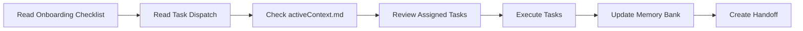

---
block:
  label: team_protocols
  description: Multi-agent coordination protocols and team structure
  chars_limit: 8000
  read_only: false
  tier: core
  priority: 3
created: 2026-02-09
modified: 2026-02-23
version: "3.0"
---

# Team Protocols - Multi-Agent Coordination v3.0

**Last Updated**: 2026-02-23  
**Status**: ✅ **Wave 2 Active**  
**Version**: v3.0 (Simplified Agent Model)

---

## 🤖 Active Agent Structure (Simplified)

### Current Team Configuration

| Agent | CLI | Model | Role | Status |
|-------|-----|-------|------|--------|
| **CLINE** | Cline CLI | GLM-5 | Implementation & Development | 🔵 Executing Wave 2 |
| **GEMINI-MC** | Gemini CLI | Gemini 3 Flash | Large Context Research | 🔵 Executing Wave 2 |
| **MC-OVERSEER** | OpenCode CLI | GLM-5 Free | Coordination & Documentation | 🟢 Active |

### Agent Specializations

**CLINE (Cline CLI - GLM-5)**
- Role: Implementation, Development, Testing
- Environment: Terminal + VS Code
- Context Window: 200K tokens
- Specializations:
  - Code implementation and refactoring
  - Test creation and coverage improvement
  - Performance optimization
  - Container/infrastructure setup
- Communication: Memory bank updates, Agent Bus

**GEMINI-MC (Gemini CLI - Gemini 3 Flash)**
- Role: Large Context Research, Documentation
- Environment: Terminal
- Context Window: 1M tokens
- Specializations:
  - Deep research and analysis
  - Security audit research
  - Performance benchmarking
  - User documentation
- Communication: Memory bank updates, research documents

**MC-OVERSEER (OpenCode CLI - GLM-5 Free)**
- Role: Coordination, Documentation, Monitoring
- Environment: Terminal
- Context Window: 200K tokens
- Specializations:
  - Multi-agent coordination
  - Memory bank maintenance
  - Documentation architecture
  - Task dispatch and tracking
- Communication: Agent Bus, memory bank, handoffs

---

## 🔄 Task Dispatch System

### Coordination Key

All agents find their tasks by searching for the coordination key:

```
ACTIVE-TASK-DISPATCH-YYYY-MM-DD
```

Current: `ACTIVE-TASK-DISPATCH-2026-02-23`

### Task Dispatch File

Located at: `memory_bank/strategies/ACTIVE-TASK-DISPATCH-YYYY-MM-DD.md`

Contains:
- Agent assignments
- Task descriptions
- Priority levels
- Deliverables locations
- Activation commands

---

## 📊 Project Wave System

### Wave 1 (Complete)
- **Duration**: 2026-02-22 to 2026-02-23
- **Tasks**: 17
- **Status**: ✅ COMPLETE

| Job | Agent | Description |
|-----|-------|-------------|
| JOB-R003 | CLINE | XNAi Core Integration |
| JOB-R004 | CLINE | Knowledge Access Control |
| JOB-R008 | CLINE | Qdrant Collection Setup |
| JOB-R009 | GEMINI-MC | Staging TTL Research |
| JOB-R010 | CLINE | FastAPI WebSocket |
| JOB-R011 | CLINE | Redis Configuration |
| JOB-R012 | CLINE | Content Sanitization |
| G-001 to G-010 | GEMINI-MC | Research Tasks |

### Wave 2 (In Progress)
- **Duration**: 2026-02-23 onwards
- **Tasks**: 32
- **Status**: 🔵 EXECUTING

| Job | Agent | Description | Priority |
|-----|-------|-------------|----------|
| JOB-W2-001 | CLINE | Multi-Environment Testing | P1-HIGH |
| JOB-W2-002 | CLINE | Test Coverage Improvement | P1-HIGH |
| JOB-W2-003 | CLINE | Performance Optimization | P2-MEDIUM |
| JOB-W2-004 | CLINE | Docker/Podman Production | P2-MEDIUM |
| JOB-W2-005 | GEMINI-MC | Security Audit Research | P1-HIGH |
| JOB-W2-006 | GEMINI-MC | Performance Benchmarking | P1-HIGH |
| JOB-W2-007 | GEMINI-MC | User Documentation | P2-MEDIUM |
| JOB-W2-008 | GEMINI-MC | Edge Cases & Error Handling | P2-MEDIUM |

---

## 🔧 Standard Workflows

### Session Start Workflow



### Memory Bank Update Protocol

1. **Read before write** - Always read current state first
2. **Append, don't replace** - Use append mode for logs
3. **Lock files during updates** - Use `.lock` files for atomic writes
4. **Coordinate via Agent Bus** - Publish updates to `xnai:agent_bus`
5. **Timestamp all changes** - ISO 8601 format

### Handoff Protocol

Create handoff in `memory_bank/recall/handovers/`:
- `{agent}-session-{date}.md`
- Include: completed work, in-progress, blockers, next steps

---

## 📋 Communication Channels

### Agent Bus (Redis Streams)

| Stream | Purpose |
|--------|---------|
| `xnai:agent_bus` | General coordination |
| `xnai:task_updates` | Task status updates |
| `xnai:memory_updates` | Memory bank changes |
| `xnai:alerts` | Blocking issues, escalations |

### Status Update Format

```json
{
  "agent_id": "CLINE",
  "task_id": "W2-001-1",
  "status": "in_progress|completed|blocked",
  "progress": "50%",
  "timestamp": "2026-02-23T12:00:00Z",
  "notes": "Optional notes"
}
```

---

## 🎯 Task Assignment Guidelines

### Task Size & Complexity

| Complexity | Estimated Time | Assignee | Review Required |
|------------|---------------|----------|-----------------|
| **Trivial** | <30 min | Any agent | No |
| **Small** | 30 min - 2h | Specialist | No |
| **Medium** | 2-8h | Specialist | Yes |
| **Large** | 1-3 days | Team lead | Yes + checkpoint |

### Agent Specialization Matrix

| Task Type | Best Agent | Reason |
|-----------|------------|--------|
| Code Implementation | CLINE | IDE integration, 200K context |
| Large Context Research | GEMINI-MC | 1M token context |
| Documentation | MC-OVERSEER | Coordination focus |
| Testing | CLINE | Implementation expertise |
| Security Research | GEMINI-MC | Deep analysis capability |

---

## 🛡️ Quality Standards

### Before Task Assignment
- [ ] Clear description with acceptance criteria
- [ ] Priority level assigned
- [ ] Estimated time/complexity
- [ ] Dependencies identified
- [ ] Resources linked

### During Execution
- [ ] Regular progress updates via Agent Bus
- [ ] Blockers escalated immediately
- [ ] Scope changes documented
- [ ] Commit hashes referenced

### Before Completion
- [ ] All acceptance criteria met
- [ ] Tests passing (if applicable)
- [ ] Documentation updated
- [ ] Memory bank updated

---

## 📚 Reference Documentation

| Document | Purpose |
|----------|---------|
| `docs/01-start/ONBOARDING-CHECKLIST.md` | **NEW AGENT START HERE** |
| `activeContext.md` | Current priorities and status |
| `progress.md` | Phase and wave progress |
| `ARCHITECTURE.md` | System architecture with diagrams |
| `INDEX.md` | Memory bank navigation |
| Task Dispatch | Current task assignments |

---

## ✅ Phase Completion Checklist

When a wave or phase completes:

### Memory Bank Updates
- [ ] Update `progress.md` with completion status
- [ ] Update `activeContext.md` with next priorities
- [ ] Create handoff document in `recall/handovers/`
- [ ] Verify all links in `INDEX.md`

### Documentation Updates
- [ ] Create/update API documentation
- [ ] Update architecture diagrams if needed
- [ ] Archive completed task dispatches

### Team Communication
- [ ] Notify via Agent Bus
- [ ] Create consolidated handoff
- [ ] Update coordination key

---

## 🔗 Quick Links

| Resource | Path |
|----------|------|
| Task Dispatch | `strategies/ACTIVE-TASK-DISPATCH-2026-02-23.md` |
| Architecture | `ARCHITECTURE.md` |
| Progress | `progress.md` |
| API Docs | `docs/api/` |
| Research | `expert-knowledge/research/` |

---

**Status**: ✅ **Wave 2 Active - 32 Tasks Dispatched**  
**Coordination Key**: `ACTIVE-TASK-DISPATCH-2026-02-23`  
**Ma'at**: Truth in Reporting (Ideal 7)
