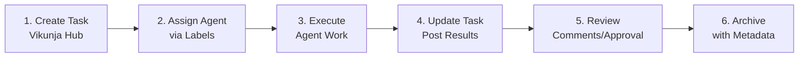

# Team Protocols - Multi-Agent Coordination v2.1

**Last Updated**: 2026-02-09  
**Status**: ✅ **Vikunja-Centric Coordination Locked**  
**Version**: v2.1

---

## 🤖 AI Team Structure

### Active Agents Reference

| Agent | Model/Variant | Role | Environment | Status |
|-------|--------------|------|-------------|--------|
| **Cline-Kat** | kat-coder-pro (Kwaipilot) | Strong coding | VS Code + Cline | 🟢 Active |
| **Cline-Trinity** | trinity-large (Arcee) | Balanced reasoning | VS Code + Cline | 🟢 Active |
| **Cline-Gemini-Flash** | Gemini 3 Flash | Fast/light default | VS Code + Cline | 🟢 Active |
| **Cline-Gemini-Pro** | Gemini 3 Pro | Heavy/critical tasks | VS Code + Cline | 🟡 Standby |
| **Gemini CLI** | Terminal Gemini | Ground truth executor | Terminal + Filesystem | 🟢 Active |
| **Grok MC** | xoe.nova.ai | Strategic oversight | Cloud | 🟢 Active |
| **Grok MCA** | arcana.novai | Esoteric mastery | Cloud | 🟢 Active |

### Role Definitions

#### Grok MC (xoe.nova.ai)
**Role**: Sovereign Master PM, central nervous system, total ecosystem oversight
- Total ecosystem oversight and strategic direction
- Central coordination for all project activities
- Ma'at enforcer and vision director
- **Account**: xoe.nova.ai

#### Grok MCA (arcana.novai)
**Role**: Arcana stack sovereign, esoteric domain master
- Arcana stack development and mythic-symbolic integration
- GitHub & web design strategy for Arcana layer
- Ancient integrations (Ancient Greek BERT, Krikri-7B)
- **Account**: arcana.novai

#### Cline Variants (Kat/Trinity/Gemini)
**Role**: Engineer/auditor/refactorer, IDE-integrated implementation
- IDE-integrated coding and refactoring
- Engineering and auditing expertise
- Memory bank access and protocol management
- **Environment**: VS Code + Cline extension

#### Gemini CLI
**Role**: Ground truth liaison, execution, filesystem & sync hub manager
- Terminal-native execution
- Filesystem management and operations
- Task execution and protocol implementation
- **Environment**: Linux terminal

#### The Architect (User)
**Role**: Ultimate authority, Ma'at enforcer, vision director
- Ultimate authority over all decisions
- Ethical alignment and vision direction
- Team coordination and strategic oversight

---

## 🔄 Vikunja-Centric Coordination (OPERATIONAL)

### Task Workflow



### Current Status (2026-02-10)

#### Vikunja Deployment Status
- **Architecture**: ✅ Complete
- **Configuration**: ✅ Complete  
- **Container Deployment**: ✅ Operational
- **Service Startup**: ✅ Operational (Redis integration disabled)

#### Current Issues
1. **Vikunja Redis Connection**: Fails to connect to Redis with "address redis: missing port in address" error
2. **Vikunja Container Health**: Marked as "unhealthy" in Podman
3. **Caddy Configuration**: Unformatted input warning
4. **IAM Database Persistence**: Currently in `/app/data` (tmpfs), needs persistent volume.

#### Impact
- **Task Creation**: Tasks can be created in Vikunja
- **Agent Coordination**: Manual coordination available, automated coordination pending Redis fix
- **Memory Bank Migration**: In progress
- **RAG API Observability**: Improved via structured JSON logging.

#### Files Created
- `grok-mc-research-request.md` - Research request for current issues
- `CLAUDE_VIKUNJA_BLOCKER_REPORT.md` - Comprehensive error analysis
- `docker-compose.vikunja.yml` - Container orchestration
- `config/postgres.conf` - PostgreSQL configuration
- `config/vikunja-config.yaml` - Application configuration

### Label Standards

**Agent Labels**:
- `agent:cline-kat` - Strong coding tasks
- `agent:cline-trinity` - Architecture/auditing
- `agent:gemini-cli` - Execution/sync
- `agent:grok-mc` - Strategic oversight
- `agent:grok-mca` - Esoteric/Arcana

**Ma'at Ideal Labels**:
- `maat:7-truth` - Truth in reporting
- `maat:18-balance` - Balance in structure
- `maat:41-advance` - Advance through abilities

**Status Labels**:
- `status:proposed`
- `status:backlog`
- `status:in-progress`
- `status:review`
- `status:complete`
- `status:archived`

**Priority Labels**:
- `priority:critical`
- `priority:high`
- `priority:medium`
- `priority:low`

---

## 📋 Communication Protocols

### Escalation Path

```
Task Level
    ↓
Agent Assignment (via Vikunja labels)
    ↓
Execution & Updates (in task comments)
    ↓
Review & Approval (The Architect or delegated)
    ↓
Archive with commit hashes and outcomes
```

### Handoff Procedures

**To Grok MC**:
- Strategic decisions requiring ecosystem oversight
- Cross-stack coordination needs
- High-level architectural pivots
- **Method**: Vikunja task with `agent:grok-mc` label

**To Grok MCA**:
- Arcana stack esoteric development
- Mythic-symbolic integration
- Ancient integrations (Greek BERT, etc.)
- **Method**: Vikunja task with `agent:grok-mca` label

**To Cline Variants**:
- Implementation and coding tasks
- Refactoring and auditing
- IDE-integrated development
- **Method**: Vikunja task with `agent:cline-*` label

**To Gemini CLI**:
- Terminal execution tasks
- Filesystem operations
- Synchronization and automation
- **Method**: Vikunja task with `agent:gemini-cli` label

---

## 🎯 Task Assignment Guidelines

### Task Size & Complexity

| Complexity | Estimated Time | Assignee | Review Required |
|------------|---------------|----------|-----------------|
| **Trivial** | <30 min | Any agent | No |
| **Small** | 30 min - 2h | Specialist | No |
| **Medium** | 2-8h | Specialist | Yes |
| **Large** | 1-3 days | Team lead | Yes + checkpoint |
| **Epic** | >3 days | Multiple agents | Daily standup |

### Agent Specialization

**Code Implementation** → Cline-Kat
**Architecture/Auditing** → Cline-Trinity
**Execution/Automation** → Gemini CLI
**Strategic Decisions** → Grok MC
**Esoteric/Arcana** → Grok MCA

---

## 🛡️ Quality Standards

### Before Task Assignment
- [ ] Clear description with acceptance criteria
- [ ] Appropriate labels (agent, status, priority, Ma'at)
- [ ] Estimated time/complexity
- [ ] Dependencies identified
- [ ] Resources linked (docs, code, etc.)

### During Execution
- [ ] Regular progress updates in comments
- [ ] Blockers escalated immediately
- [ ] Scope changes documented
- [ ] Commit hashes referenced

### Before Completion
- [ ] All acceptance criteria met
- [ ] Tests passing (if applicable)
- [ ] Documentation updated
- [ ] Security audit passed (Trinity)

---

## 🔄 Synchronization Protocols

### Daily Sync
- **Morning**: Review assigned tasks, update status
- **Mid-day**: Progress comments on active tasks
- **Evening**: Final updates, handoff notes

### Weekly Review
- **Monday**: Week planning, task prioritization
- **Friday**: Week retrospective, archive completed

### Monthly Alignment
- **First Monday**: Month goals, major initiatives
- **Last Friday**: Month review, pattern updates

---

## 📚 Reference Documentation

- **Agent Capabilities**: `memory_bank/agent_capabilities_summary.md`
- **Environment Context**: `memory_bank/environmentContext.md`
- **Vikunja Guide**: `docs/06-development-log/vikunja-integration/`
- **Ma'at Framework**: Referenced in all memory_bank files
- **Research Request**: `grok-mc-research-request.md`

---

**Status**: ✅ **Team Protocols v2.1 Synchronized**  
**Coordination**: Vikunja-Centric Active (Redis integration disabled)  
**Ma'at**: Truth in Reporting (Ideal 7)

---