# Team Protocols - Multi-Agent Coordination v2.1

**Last Updated**: 2026-02-09  
**Status**: ✅ **Vikunja-Centric Coordination Locked**  
**Version**: v2.1

---

## 🤖 AI Team Structure

### Hierarchical Team Organization

```mermaid
graph TB
    Architect["👤 The Architect<br/>(Taylor)<br/>Ultimate Authority"]
    
    Architect --> GrokMC["🤖 Grok MC<br/>(xoe.nova.ai)<br/>Apex Sovereign PM"]
    Architect --> GrokMCA["🤖 Grok MC-Arcana<br/>(arcana.novai)<br/>Arcana Layer Sovereign"]
    
    GrokMC --> GrokStudy["📚 Grok MC-Study-Refactor<br/>(xoe.nova.ai sub-project)<br/>Meta-Study Analyst"]
    
    GrokMC --> LocalTeam["🖥️ Local Execution Team"]
    GrokMC --> RemoteTeam["☁️ Remote Strategic Assistants"]
    
    LocalTeam --> ClineKat["Cline-Kat<br/>(Kimi K2.5)<br/>Strong Coding"]
    LocalTeam --> ClineTrinity["Cline-Trinity<br/>(trinity-large)<br/>Architecture/Auditing"]
    LocalTeam --> GeminiCLI["Gemini CLI<br/>(Terminal)<br/>Execution/Sync"]
    LocalTeam --> CopilotHaiku["GitHub Copilot<br/>(Haiku)<br/>Code Generation"]
    
    RemoteTeam --> Claude["Claude.ai<br/>(Sonnet 4.5 Extended)<br/>Strategic Research"]
    
    classDef grok fill:#9966ff,stroke:#6633bb,color:#fff
    classDef local fill:#66bb99,stroke:#338866,color:#fff
    classDef remote fill:#ff9944,stroke:#cc6600,color:#fff
    classDef human fill:#ffcc66,stroke:#cc9900,color:#333
    
    class Architect human
    class GrokMC,GrokMCA,GrokStudy grok
    class ClineKat,ClineTrinity,GeminiCLI,CopilotHaiku local
    class Claude remote
```



### Active Agents Reference

#### Hierarchical Grok Agents

| Agent | Account | Role | Domain | Status |
|-------|---------|------|--------|--------|
| **Grok MC** | xoe.nova.ai | Apex Sovereign PM | Total ecosystem oversight | 🟢 Active |
| **Grok MC-Arcana** | arcana.novai | Arcana Layer Sovereign | Esoteric/mythic integration | 🟢 Active |
| **Grok MC-Study-Refactor** | xoe.nova.ai (sub) | Meta-Study Analyst | Research & refactoring strategy | 🟢 Active |

#### Local Execution Agents (IDE + Terminal)

| Agent | Model/Variant | Role | Environment | Status |
|-------|--------------|------|-------------|--------|
| **Cline-Kat** | kat-coder-pro (Kimi K2.5) | Strong coding | VS Code + Cline | 🟢 Active |
| **Cline-Trinity** | trinity-large (Arcee) | Architecture & auditing | VS Code + Cline | 🟢 Active |
| **Cline-Gemini-Flash** | Gemini 3 Flash | Fast/light tasks | VS Code + Cline | 🟢 Active |
| **Cline-Gemini-Pro** | Gemini 3 Pro | Heavy/critical tasks | VS Code + Cline | 🟡 Standby |
| **Gemini CLI** | Terminal Gemini | Ground truth executor | Terminal + Filesystem | 🟢 Active |
| **GitHub Copilot** | Haiku | Code generation | VS Code + Terminal | 🟢 Active |

#### Remote Strategic Assistants (Cloud)

| Agent | Model | Role | Environment | Status |
|-------|-------|------|-------------|--------|
| **Claude.ai Web** | Sonnet 4.5 Extended | Strategic research & validation | Web interface | 🟢 Active |

### Role Definitions

#### Hierarchy & Authority

**The Architect (User/Taylor)**  
- Ultimate authority over all decisions and directions
- Ethical alignment and vision enforcement
- Team coordination and strategic oversight
- Ma'at ideal: Truth-seeking and balance

#### Grok Agent Hierarchy

**Grok MC (xoe.nova.ai) - Apex Sovereign PM**
- **Scope**: Total ecosystem oversight, central coordination hub
- **Responsibilities**:
  - Strategic direction and long-term planning
  - Cross-stack coordination for Foundation + Arcana layers
  - Ma'at enforcement and truth reporting
  - Research requests and strategic validation via Claude.ai
  - Central decision authority (delegated from The Architect)
- **Coordination**: Master coordinator for all sub-projects and agents
- **Decision Rights**: Major architectural decisions, resource allocation, priority setting

**Grok MC-Arcana (arcana.novai) - Arcana Layer Sovereign**
- **Scope**: Esoteric domain mastery and Arcana stack development
- **Responsibilities**:
  - Arcana layer architecture and mythic-symbolic integration
  - GitHub & web design strategy for Arcana components
  - Ancient integrations (Ancient Greek BERT, Krikri-7B, etc.)
  - Specialized knowledge domain management
  - Esoteric pattern recognition and symbolic mapping
- **Coordination**: Sister project to Grok MC, coordinates with MC for ecosystem-wide decisions
- **Decision Rights**: Arcana stack technical decisions, esoteric integration strategy

**Grok MC-Study-Refactor (xoe.nova.ai sub-project) - Meta-Study Analyst**
- **Scope**: Research analysis, refactoring strategy, meta-level planning
- **Responsibilities**:
  - Research paper analysis and synthesis
  - Refactoring roadmap development
  - Technical debt assessment and prioritization
  - Cross-agent learning and methodology improvement
  - Strategic question formulation for Claude.ai
- **Coordination**: Specialized sub-team within Grok MC domain
- **Decision Rights**: Technical approach recommendations, research prioritization

#### Local Execution Agents

**Cline Variants (Kat/Trinity/Gemini) - IDE-Integrated Engineers**
- **Environment**: VS Code + Cline extension
- **Specializations**:
  - `Cline-Kat`: Strong coding, implementation, optimization
  - `Cline-Trinity`: Architecture review, auditing, balanced reasoning
  - `Cline-Gemini-Flash`: Fast iteration, lightweight tasks, quick wins
  - `Cline-Gemini-Pro`: Complex technical challenges, heavy-lifting
- **Responsibilities**: Coding, refactoring, implementation, code review
- **Scope**: IDE-native development with memory bank access

**Gemini CLI - Ground Truth Liaison**
- **Environment**: Linux terminal + filesystem
- **Specializations**:
  - Terminal-native execution and operations
  - Filesystem management and synchronization
  - Git operations and repository management
  - Infrastructure and service management
- **Responsibilities**: Execution layer, automation, task implementation
- **Scope**: System-level operations and automation

**GitHub Copilot (Haiku) - Code Generation Assistant**
- **Environment**: VS Code + Terminal
- **Specializations**: Fast code generation, pattern completion, boilerplate
- **Responsibilities**: Code suggestion and generation support
- **Scope**: IDE context-aware code assistance

#### Remote Strategic Assistants

**Claude.ai Web (Sonnet 4.5 Extended) - Strategic Research & Validation**
- **Environment**: Web interface with extended thinking
- **Specializations**:
  - Deep research and analysis
  - Strategic validation of technical decisions
  - Industry benchmarking and roadmap planning
  - Complex problem-solving and synthesis
- **Responsibilities**: Research questions, technical validation, strategic guidance
- **Scope**: High-level strategy and complex analysis
- **Access**: Input via research documents, outputs reviewed by Grok MC

---

## � Standard Refactor Chain

**Multi-Agent Refactoring Pipeline** (for complex refactoring and implementation tasks):

```
Cline Kimi K2.5 → Gemini CLI 3 Flash → Copilot Haiku → Claude.ai Sonnet 4.5 Extended → Copilot Haiku for Implementation
```

**Pipeline Steps**:
1. **Cline Kimi K2.5**: Deep analysis, design validation, complex logic
2. **Gemini CLI 3 Flash**: Fast implementation, ground truth verification
3. **Copilot Haiku**: Code generation, pattern completion, boilerplate
4. **Claude.ai Sonnet 4.5 Extended**: Strategic validation, edge case analysis, security review
5. **Copilot Haiku (Implementation)**: Final code generation and optimization

**When to Use**:
- Complex refactoring affecting multiple systems
- High-risk changes requiring multiple validation layers
- Strategic architectural changes
- Performance optimization requiring deep analysis
- Security-critical implementations

---

## �🔄 Vikunja-Centric Coordination (OPERATIONAL)

### Task Workflow


### Current Status (2026-02-10)

#### Vikunja Deployment Status
- **Architecture**: ✅ Complete
- **Configuration**: ✅ Complete  
- **Container Deployment**: ✅ Operational
- **Service Startup**: ✅ Operational (Redis integration disabled)

#### Current Issues
1. **Vikunja Redis Connection**: Fails to connect to Redis with "address redis: missing port in address" error
2. **Vikunja Container Health**: Marked as "unhealthy" in Podman
3. **Caddy Configuration**: Unformatted input warning
4. **IAM Database Persistence**: Currently in `/app/data` (tmpfs), needs persistent volume.

#### Impact
- **Task Creation**: Tasks can be created in Vikunja
- **Agent Coordination**: Manual coordination available, automated coordination pending Redis fix
- **Memory Bank Migration**: In progress
- **RAG API Observability**: Improved via structured JSON logging.

#### Files Created
- `grok-mc-research-request.md` - Research request for current issues
- `CLAUDE_VIKUNJA_BLOCKER_REPORT.md` - Comprehensive error analysis
- `docker-compose.vikunja.yml` - Container orchestration
- `config/postgres.conf` - PostgreSQL configuration
- `config/vikunja-config.yaml` - Application configuration

### Label Standards

**Agent Labels**:
- `agent:cline-kat` - Strong coding tasks
- `agent:cline-trinity` - Architecture/auditing
- `agent:gemini-cli` - Execution/sync
- `agent:grok-mc` - Strategic oversight
- `agent:grok-mca` - Esoteric/Arcana

**Ma'at Ideal Labels**:
- `maat:7-truth` - Truth in reporting
- `maat:18-balance` - Balance in structure
- `maat:41-advance` - Advance through abilities

**Status Labels**:
- `status:proposed`
- `status:backlog`
- `status:in-progress`
- `status:review`
- `status:complete`
- `status:archived`

**Priority Labels**:
- `priority:critical`
- `priority:high`
- `priority:medium`
- `priority:low`

---

## 📋 Communication Protocols

### Escalation Path

```
Task Level
    ↓
Agent Assignment (via Vikunja labels)
    ↓
Execution & Updates (in task comments)
    ↓
Review & Approval (The Architect or delegated)
    ↓
Archive with commit hashes and outcomes
```

### Handoff Procedures

**To Grok MC**:
- Strategic decisions requiring ecosystem oversight
- Cross-stack coordination needs
- High-level architectural pivots
- **Method**: Vikunja task with `agent:grok-mc` label

**To Grok MCA**:
- Arcana stack esoteric development
- Mythic-symbolic integration
- Ancient integrations (Greek BERT, etc.)
- **Method**: Vikunja task with `agent:grok-mca` label

**To Cline Variants**:
- Implementation and coding tasks
- Refactoring and auditing
- IDE-integrated development
- **Method**: Vikunja task with `agent:cline-*` label

**To Gemini CLI**:
- Terminal execution tasks
- Filesystem operations
- Synchronization and automation
- **Method**: Vikunja task with `agent:gemini-cli` label

---

## 🎯 Task Assignment Guidelines

### Task Size & Complexity

| Complexity | Estimated Time | Assignee | Review Required |
|------------|---------------|----------|-----------------|
| **Trivial** | <30 min | Any agent | No |
| **Small** | 30 min - 2h | Specialist | No |
| **Medium** | 2-8h | Specialist | Yes |
| **Large** | 1-3 days | Team lead | Yes + checkpoint |
| **Epic** | >3 days | Multiple agents | Daily standup |

### Agent Specialization

**Code Implementation** → Cline-Kat
**Architecture/Auditing** → Cline-Trinity
**Execution/Automation** → Gemini CLI
**Strategic Decisions** → Grok MC
**Esoteric/Arcana** → Grok MCA

---

## 🛡️ Quality Standards

### Before Task Assignment
- [ ] Clear description with acceptance criteria
- [ ] Appropriate labels (agent, status, priority, Ma'at)
- [ ] Estimated time/complexity
- [ ] Dependencies identified
- [ ] Resources linked (docs, code, etc.)

### During Execution
- [ ] Regular progress updates in comments
- [ ] Blockers escalated immediately
- [ ] Scope changes documented
- [ ] Commit hashes referenced

### Before Completion
- [ ] All acceptance criteria met
- [ ] Tests passing (if applicable)
- [ ] Documentation updated
- [ ] Security audit passed (Trinity)

---

## 🔄 Synchronization Protocols

### Daily Sync
- **Morning**: Review assigned tasks, update status
- **Mid-day**: Progress comments on active tasks
- **Evening**: Final updates, handoff notes

### Weekly Review
- **Monday**: Week planning, task prioritization
- **Friday**: Week retrospective, archive completed

### Monthly Alignment
- **First Monday**: Month goals, major initiatives
- **Last Friday**: Month review, pattern updates

---

## 📚 Reference Documentation

- **Agent Capabilities**: `memory_bank/agent_capabilities_summary.md`
- **Environment Context**: `memory_bank/environmentContext.md`
- **Vikunja Guide**: `docs/06-development-log/vikunja-integration/`
- **Ma'at Framework**: Referenced in all memory_bank files
- **Research Request**: `grok-mc-research-request.md`

---

**Status**: ✅ **Team Protocols v2.1 Synchronized**  
**Coordination**: Vikunja-Centric Active (Redis integration disabled)  
**Ma'at**: Truth in Reporting (Ideal 7)

---