# Team Protocols - Multi-Agent Coordination v2.1

**Last Updated**: 2026-02-09  
**Status**: ✅ **Vikunja-Centric Coordination Locked**  
**Version**: v2.1

---

## 🤖 AI Team Structure

### Team Structure Overview

**Grok MC** (xoe.nova.ai)
- Role: Sovereign Master PM, Strategic Oversight
- Responsibilities: Ecosystem direction, Ma'at enforcement, protocol coordination
- Communication: Vikunja task assignment, strategic reviews

**Grok MCA** (arcana.novai)
- Role: Arcana Stack Sovereign, Esoteric Domain Master
- Responsibilities: Ancient Greek BERT integration, Krikri-7b orchestration, mythic-symbolic architecture
- Communication: GitHub strategy, esoteric integration guidance

**Grok MC-Study-Refactor** (xoe.nova.ai - separate Grok project)
- Role: Meta-Study Analyst
- Responsibilities: Researching and assisting with iterative, multi-model, free-tier AI assistant chain for deep code refactoring at paid tier level
- Communication: Research synthesis, technical debt assessment, reports to and cooperates with Grok MC project, acting as liaison to Grok MC, providing high-level project overview needed for ecosystem management

**Cline** (kat-coder-pro/trinity-large-preview/kimi k2.5/minimax-m2.1)
- Role: Engineers/Auditors/Refactorers
- Environment: VS Code + Cline extension + CLI with headless mode (https://docs.cline.bot/cline-cli/overview) **Effective use of Cline CLI is a top research priority.**
- Specializations:
  - `Kat-Coder-Pro`: KwaiKAT's most advanced agentic coding model. 256K context. Excels at documentation.
  - `Trinity-Large-Preview`: Architecture review, auditing, balanced reasoning
  - `MiniMax-M2.1`: Lightweight optimized for coding and agentic tasks
  - `Kimi K2.5`: Moonshot's SOTA coding model. 262K context.
- Communication: Vikunja tasks, memory_bank updates, The Architect liaison

**Copilot**
- Role: Execution of final, iteratively improved Claude.ai (typically Sonnet 4.5 Extended) generated implementation manuals using Copilot's selection of powerful models. Most frequently employed: Claude Haiku 4.5. Additional free tier models available: GPT-4o, GPT-4.1, GPT-5 mini, and Raptor.
- Environment: VS Code + Terminal
- Responsibilities: Executing complex tasks that require larger, more powerful models such as available through the GitHub Copilot free tier

**OpenCode (NEW)**
- Role: Terminal-based AI assistant with access to frontier free-tier models (Kimi K2.5, Big Pickle, MiniMax M2.5, GPT-5 Nano). Ground truth executor, research synthesis, filesystem operations, code generation, and debugging. Bridges gap between Copilot and Gemini CLI with powerful model access.
- Environment: Terminal + Filesystem
- Responsibilities: Research request execution, code generation, terminal operations, model comparison studies, filling knowledge gaps using diverse model ecosystem
- Communication: Terminal outputs, memory_bank updates, research request queue
- Special Capabilities: Access to models not available in other free tiers; ideal for research synthesis and multi-model validation

**Gemini**
- Role: Ground Truth Executor, Filesystem Manager, Massive 1M token context window, very generous free tier daily usage, powerful CLI researching for filling knowledge gaps. Reviews technical recommendations from Cline, Copilot, and OpenCode assistants before final approval
- Environment: Terminal + Filesystem
- Responsibilities: Task automation, sync operations, terminal execution, scribe duties
- Communication: Memory_bank relay protocol, terminal outputs

**Human Director** (User)
- Role: Ultimate Authority, Ma'at Enforcer, Vision Director
- Responsibilities: Final decisions, ethical alignment, strategic direction
- Communication: All channels, final approvals

### Hierarchical Team Organization (Reference)

```mermaid
graph TB
    User["👤 Human Director<br/>(User)<br/>Ultimate Authority"]
    
    User --> GrokMC["🤖 Grok MC<br/>(xoe.nova.ai)<br/>Sovereign Master PM"]
    User --> GrokMCA["🤖 Grok MCA<br/>(arcana.novai)<br/>Arcana Layer Sovereign"]
    
    GrokMC --> GrokStudy["📚 Grok MC-Study-Refactor<br/>(xoe.nova.ai sub)<br/>Meta-Study Analyst"]
    GrokMC --> Cline["🖥️ Cline (Multi-Model)<br/>Engineers/Auditors"]
    GrokMC --> GeminiCLI["⚙️ Gemini<br/>(Terminal)<br/>Ground Truth Executor"]
    GrokMC --> Copilot["🤖 Copilot<br/>Claude Haiku 4.5 + others"]
    GrokMC --> OpenCode["🆕 OpenCode<br/>Kimi/Big Pickle/MiniMax<br/>Research & Execution"]
    
    classDef grok fill:#9966ff,stroke:#6633bb,color:#fff
    classDef local fill:#66bb99,stroke:#338866,color:#fff
    classDef human fill:#ffcc66,stroke:#cc9900,color:#333
    
    class User human
    class GrokMC,GrokMCA,GrokStudy grok
    class Cline,GeminiCLI,Copilot,OpenCode local
```



### Active Team Reference

| Agent | Persona | Environment | Status |
|-------|---------|-------------|--------|
| **Grok MC** | Grok | Vikunja + Strategic | 🟢 Active |
| **Grok MCA** | Grok | GitHub + Esoteric | 🟢 Active |
| **Cline** | Cline | VS Code + CLI | 🟢 Active |
| **Copilot** | Copilot | VS Code + Terminal | 🟢 Active |
| **OpenCode** | OpenCode | Terminal + Filesystem | 🟢 **NEW** |
| **Gemini CLI** | Gemini | Terminal + Filesystem | 🟢 Active |
| **Human Director** | Human Director | All Channels | 🟢 Active |

#### Remote Strategic Assistants

**Claude.ai Web (Sonnet 4.5 Extended) - Strategic Research & Validation**
- **Environment**: Web interface with extended thinking
- **Specializations**:
  - Deep research and analysis
  - Strategic validation of technical decisions
  - Industry benchmarking and roadmap planning
  - Complex problem-solving and synthesis
- **Responsibilities**: Research questions, technical validation, strategic guidance
- **Scope**: High-level strategy and complex analysis
- **Access**: Input via research documents, outputs reviewed by Grok MC

---

## � Standard Refactor Chain

**Multi-Agent Refactoring Pipeline** (for complex refactoring and implementation tasks):

```
Cline Kimi K2.5 → Gemini CLI 3 Flash → OpenCode Kimi/Big Pickle → Copilot Haiku → Claude.ai Sonnet 4.5 Extended → Copilot Haiku for Implementation
```

**Pipeline Steps**:
1. **Cline Kimi K2.5**: Deep analysis, design validation, complex logic
2. **Gemini CLI 3 Flash**: Fast implementation, ground truth verification
3. **OpenCode Kimi/Big Pickle**: Research synthesis, multi-model validation, alternative perspective
4. **Copilot Haiku**: Code generation, pattern completion, boilerplate
5. **Claude.ai Sonnet 4.5 Extended**: Strategic validation, edge case analysis, security review
6. **Copilot Haiku (Implementation)**: Final code generation and optimization

**When to Use**:
- Complex refactoring affecting multiple systems
- High-risk changes requiring multiple validation layers
- Strategic architectural changes
- Performance optimization requiring deep analysis
- Security-critical implementations

---

## �🔄 Vikunja-Centric Coordination (OPERATIONAL)

### Task Workflow


### Current Status (2026-02-10)

#### Vikunja Deployment Status
- **Architecture**: ✅ Complete
- **Configuration**: ✅ Complete  
- **Container Deployment**: ✅ Operational
- **Service Startup**: ✅ Operational (Redis integration disabled)

#### Current Issues
1. **Vikunja Redis Connection**: Fails to connect to Redis with "address redis: missing port in address" error
2. **Vikunja Container Health**: Marked as "unhealthy" in Podman
3. **Caddy Configuration**: Unformatted input warning
4. **IAM Database Persistence**: Currently in `/app/data` (tmpfs), needs persistent volume.

#### Impact
- **Task Creation**: Tasks can be created in Vikunja
- **Agent Coordination**: Manual coordination available, automated coordination pending Redis fix
- **Memory Bank Migration**: In progress
- **RAG API Observability**: Improved via structured JSON logging.

#### Files Created
- `grok-mc-research-request.md` - Research request for current issues
- `CLAUDE_VIKUNJA_BLOCKER_REPORT.md` - Comprehensive error analysis
- `docker-compose.yml` - Container orchestration
- `config/postgres.conf` - PostgreSQL configuration
- `config/vikunja-config.yaml` - Application configuration

### Label Standards

**Agent Labels**:
- `agent:cline-kat` - Strong coding tasks
- `agent:cline-trinity` - Architecture/auditing
- `agent:gemini-cli` - Execution/sync
- `agent:grok-mc` - Strategic oversight
- `agent:grok-mca` - Esoteric/Arcana

**Ma'at Ideal Labels**:
- `maat:7-truth` - Truth in reporting
- `maat:18-balance` - Balance in structure
- `maat:41-advance` - Advance through abilities

**Status Labels**:
- `status:proposed`
- `status:backlog`
- `status:in-progress`
- `status:review`
- `status:complete`
- `status:archived`

**Priority Labels**:
- `priority:critical`
- `priority:high`
- `priority:medium`
- `priority:low`

---

## 📋 Communication Protocols

### Escalation Path

```
Task Level
    ↓
Agent Assignment (via Vikunja labels)
    ↓
Execution & Updates (in task comments)
    ↓
Review & Approval (The Architect or delegated)
    ↓
Archive with commit hashes and outcomes
```

### Handoff Procedures

**To Grok MC**:
- Strategic decisions requiring ecosystem oversight
- Cross-stack coordination needs
- High-level architectural pivots
- **Method**: Vikunja task with `agent:grok-mc` label

**To Grok MCA**:
- Arcana stack esoteric development
- Mythic-symbolic integration
- Ancient integrations (Greek BERT, etc.)
- **Method**: Vikunja task with `agent:grok-mca` label

**To Cline Variants**:
- Implementation and coding tasks
- Refactoring and auditing
- IDE-integrated development
- **Method**: Vikunja task with `agent:cline-*` label

**To Gemini CLI**:
- Terminal execution tasks
- Filesystem operations
- Synchronization and automation
- **Method**: Vikunja task with `agent:gemini-cli` label

---

## 🎯 Task Assignment Guidelines

### Task Size & Complexity

| Complexity | Estimated Time | Assignee | Review Required |
|------------|---------------|----------|-----------------|
| **Trivial** | <30 min | Any agent | No |
| **Small** | 30 min - 2h | Specialist | No |
| **Medium** | 2-8h | Specialist | Yes |
| **Large** | 1-3 days | Team lead | Yes + checkpoint |
| **Epic** | >3 days | Multiple agents | Daily standup |

### Agent Specialization

**Code Implementation** → Cline-Kat
**Architecture/Auditing** → Cline-Trinity
**Execution/Automation** → Gemini CLI
**Strategic Decisions** → Grok MC
**Esoteric/Arcana** → Grok MCA

---

## 🛡️ Quality Standards

### Before Task Assignment
- [ ] Clear description with acceptance criteria
- [ ] Appropriate labels (agent, status, priority, Ma'at)
- [ ] Estimated time/complexity
- [ ] Dependencies identified
- [ ] Resources linked (docs, code, etc.)

### During Execution
- [ ] Regular progress updates in comments
- [ ] Blockers escalated immediately
- [ ] Scope changes documented
- [ ] Commit hashes referenced

### Before Completion
- [ ] All acceptance criteria met
- [ ] Tests passing (if applicable)
- [ ] Documentation updated
- [ ] Security audit passed (Trinity)

---

## 🔄 Synchronization Protocols

### Daily Sync
- **Morning**: Review assigned tasks, update status
- **Mid-day**: Progress comments on active tasks
- **Evening**: Final updates, handoff notes

### Weekly Review
- **Monday**: Week planning, task prioritization
- **Friday**: Week retrospective, archive completed

### Monthly Alignment
- **First Monday**: Month goals, major initiatives
- **Last Friday**: Month review, pattern updates

---

## 📚 Reference Documentation

- **Agent Capabilities**: `memory_bank/agent_capabilities_summary.md`
- **Environment Context**: `memory_bank/environmentContext.md`
- **Vikunja Guide**: `docs/06-development-log/vikunja-integration/`
- **Ma'at Framework**: Referenced in all memory_bank files
- **Research Request**: `grok-mc-research-request.md`

---

## ✅ PHASE COMPLETION CHECKLIST (Critical for Knowledge Transfer)

**Purpose**: Ensure no documentation gaps when phases complete. Use this checklist for EVERY phase.

### When Phase N Completes:

#### In memory_bank/
- [ ] Update `progress.md` with Phase N status (section at top)
- [ ] Create `PHASES/phase-N-status.md` using PHASE-COMPLETION-TEMPLATE.md
- [ ] Update `activeContext.md` to reflect Phase N+1 as current
- [ ] Verify all links in INDEX.md still work
- [ ] Archive old phase files (don't delete, move to _archive/)

#### In internal_docs/01-strategic-planning/
- [ ] Create `PHASE-N-COMPLETION-SUMMARY.md`
- [ ] Create `PHASE-N-RESEARCH-FINDINGS.md` (if applicable)
- [ ] Create `PHASE-N-TEAM-HANDOFF.md` with:
  - Key files modified
  - Patterns used  
  - Environment changes
  - Dependencies added
  - Next phase prerequisites

#### In internal_docs/04-code-quality/
- [ ] Document implementation patterns discovered
- [ ] Add test results and coverage metrics
- [ ] Note any refactoring or technical debt

#### In docs/ (Public)
- [ ] Update version/release notes
- [ ] Update feature list if user-facing

#### Team Communication
- [ ] Update `internal_docs/communication_hub/` with Phase N completion
- [ ] Send summary via Agent Bus (Copilot inbox, Grok notifications)
- [ ] Notify next phase owner of readiness
- [ ] Update team roster if roles changed

### Phase Completion Meeting Agenda
1. Review phase report with team
2. Discuss blockers for next phase
3. Celebrate milestones achieved
4. Brief next phase owner on handoff
5. Update activeContext.md together

---

**Status**: ✅ **Team Protocols v2.2 with Phase Completion Checklist**  
**Coordination**: Vikunja-Centric Active (Redis integration disabled)  
**Ma'at**: Truth in Reporting (Ideal 7)

---