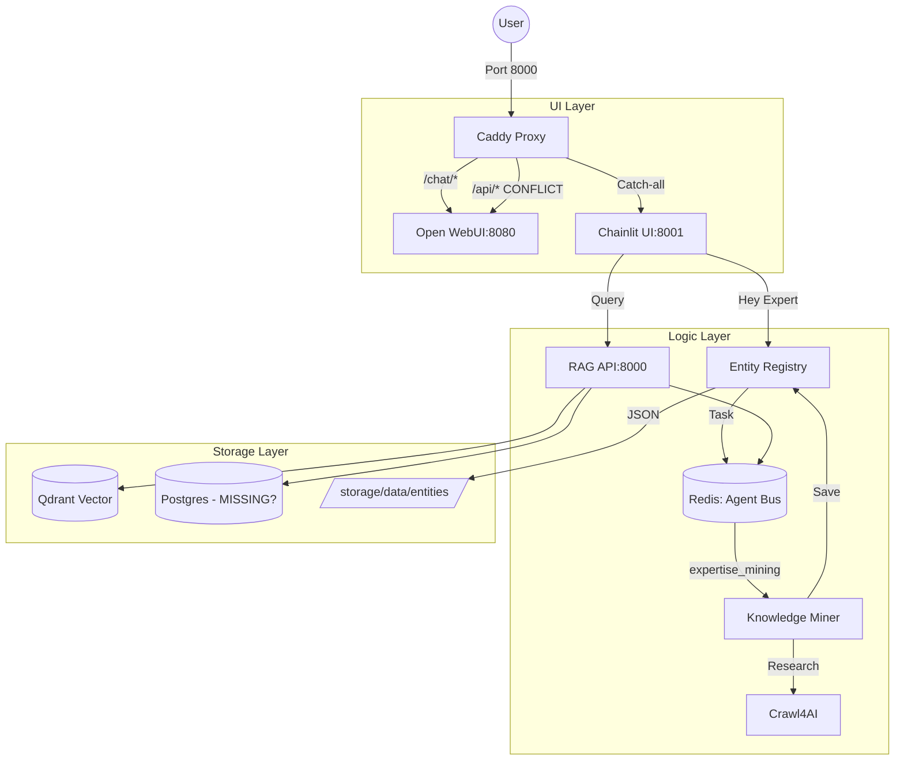

# 🦅 Handoff: Copilot Raptor — UI Debugging & Metropolis Integration
**Date**: 2026-03-02
**Context**: Omega Stack / XNAi Foundation
**Status**: 🔴 CRASHED DURING DIAGNOSIS (Restored & Documented)
**Coordination Key**: `UI-DEBUGGING-METROPOLIS-2026-03-02`

---

## 🌌 Context & Current State
We successfully implemented the **Metropolis Architecture** (Phase 1.5/Wave 6). You can now summon persistent personas (e.g., \"Hey Kurt Cobain\") from the Chainlit UI. The **Knowledge Miner** worker autonomously researches new entities via the Agent Bus (Redis).

**The system crashed while diagnosing subpath routing and permission issues between Caddy, Chainlit, and Open WebUI.**

### ✅ Solved & Verified
- **Hey [Entity] Triggering**: Verified in `chainlit_app_unified.py`.
- **Knowledge Miner**: `app/XNAi_rag_app/workers/knowledge_miner.py` is operational.
- **Persistent Entities**: Stored in `storage/data/entities/*.json`.
- **Agent Bus**: Redis Streams orchestration verified.

---

## 🔴 Current Critical Issues

### 1. Caddy Subpath Routing Conflict
In `Caddyfile`, the `@open-webui-internal` handle captures `/api/*`. 
**Impact**: This breaks Chainlit's internal API (`/api/auth`, `/api/completion`, etc.), which is currently caught by the Open WebUI proxy.
**Action**: Need to isolate `/api/*` routing. Suggest using `/chat/api/*` for WebUI or explicit matching for Chainlit.

### 2. Chainlit Permission Error (Shutdown)
`PermissionError: [Errno 13] Permission denied: PosixPath('/app/.files')`
**Impact**: Container fails to clean up during shutdown/lifespan end.
**Context**: Rootless Podman `userns_mode: keep-id` is active.
**Action**: Verify `Dockerfile.chainlit` chown/chmod logic. `/app/.files` needs full ownership by `appuser`.

### 3. Invalid WebSocket Upgrade
Log error: `engineio.server - Invalid websocket upgrade`.
**Impact**: Real-time updates (Speculative Generation UI) may be flaky or falling back to long-polling.
**Action**: Check Caddy headers for WebSocket support on the catch-all route.

### 4. Missing Gnosis PostgreSQL
`activeContext.md` references `xnai_postgres` and `db/001_knowledge_management_schema.sql`.
**Observation**: The service is missing from `docker-compose.yml`. RAG currently falls back to Redis/Qdrant.
**Action**: Verify if `xnai_postgres` should be restored to enable Hybrid GraphRAG.

---

## 🛠 Interaction Diagram

---

## 📂 Key Files
- `Caddyfile`: Routing logic (Current Conflict point).
- `docker-compose.yml`: Orchestration (Missing Postgres service).
- `app/XNAi_rag_app/ui/chainlit_app_unified.py`: Main UI entrypoint.
- `app/XNAi_rag_app/workers/knowledge_miner.py`: Entity research worker.
- `storage/data/ui_config/config.toml`: Chainlit config.

---

## 🚀 Next Steps for Raptor
1. **Fix Caddy Routing**: Resolve the `/api/*` conflict between WebUI and Chainlit.
2. **Harden Permissions**: Fix the `/app/.files` access issue in `Dockerfile.chainlit`.
3. **Restore Postgres**: (Optional but recommended) Re-integrate PostgreSQL for Gnosis Engine as per `activeContext.md`.
4. **Speculative Generation**: Resume the implementation of real-time speculative updates in `chainlit_app_unified.py`.

**Good luck, Raptor. The Metropolis is counting on you.**
