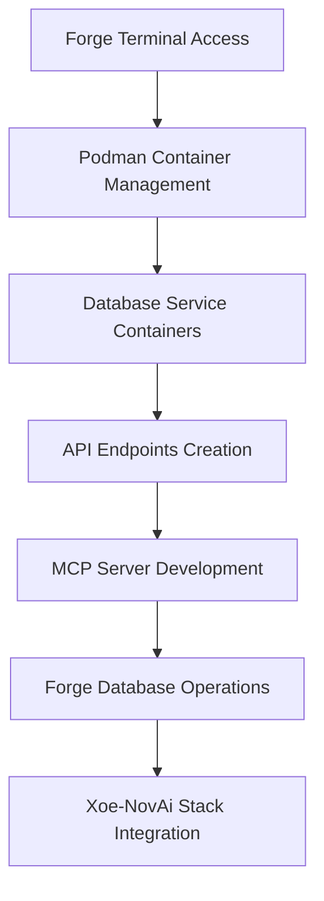

# Redis/Qdrant Integration Framework
## Enabling Database Access for Forge (Grok-Code-Fast-1)

**Date:** January 21, 2026
**Status:** Framework Established
**Priority:** HIGH - Xoe-NovAi Production Readiness

## Current Limitation

Forge (Grok-Code-Fast-1) operates through the Cline plugin in Codium IDE and currently lacks direct database access capabilities. While Forge has full terminal access and can execute commands, direct database connections are not available through the plugin interface.

## Solution Architecture

### Layered Integration Approach



### Implementation Strategy

#### Phase 1: Container-Based Database Services
**Current Status**: Xoe-NovAi already uses Podman containers for Redis and Qdrant
**Enhancement**: Ensure containers are running and accessible
```bash
# Check container status
podman-compose ps

# Start services if needed
podman-compose up -d redis qdrant
```

#### Phase 2: API Layer Development
**Create FastAPI endpoints** for database operations that Forge can interact with via HTTP requests
```python
# Proposed: api/database_operations.py
from fastapi import FastAPI
from redis import Redis
from qdrant_client import QdrantClient

app = FastAPI()

redis_client = Redis(host='localhost', port=6379)
qdrant_client = QdrantClient(host='localhost', port=6333)

@app.post("/redis/set")
async def redis_set(key: str, value: str):
    return redis_client.set(key, value)

@app.post("/qdrant/search")
async def qdrant_search(collection_name: str, query_vector: list):
    return qdrant_client.search(collection_name, query_vector)
```

#### Phase 3: MCP Server Creation
**Develop MCP servers** that provide standardized interfaces for database operations
```python
# Proposed MCP server structure
class DatabaseMCP:
    def __init__(self):
        self.redis_client = Redis(host='localhost', port=6379)
        self.qdrant_client = QdrantClient(host='localhost', port=6333)

    async def handle_redis_operation(self, operation: str, params: dict):
        # Execute Redis operations via MCP protocol

    async def handle_qdrant_operation(self, operation: str, params: dict):
        # Execute Qdrant operations via MCP protocol
```

#### Phase 4: Forge Integration Scripts
**Create command-line scripts** that Forge can execute to perform database operations
```bash
# redis_operations.sh
#!/bin/bash
# Script for Redis operations that Forge can execute

case $1 in
    "set")
        redis-cli set $2 $3
        ;;
    "get")
        redis-cli get $2
        ;;
    "search")
        # Qdrant search operations
        ;;
esac
```

## Immediate Implementation Plan

### Step 1: Verify Current Database Services
```bash
# Check if Redis and Qdrant containers are running
podman-compose ps

# Test Redis connectivity
redis-cli ping

# Test Qdrant connectivity
curl http://localhost:6333/health
```

### Step 2: Create Database Operation Scripts
- Develop bash scripts for common Redis operations
- Create Python scripts for Qdrant vector operations
- Establish secure authentication mechanisms

### Step 3: API Endpoint Development
- Build FastAPI service for complex database operations
- Implement proper error handling and logging
- Create comprehensive operation documentation

### Step 4: MCP Server Implementation
- Design MCP protocol interfaces for database operations
- Implement standardized request/response formats
- Develop error handling and recovery mechanisms

## Usage Patterns for Forge

### Current Workarounds
```bash
# Forge can execute terminal commands to interact with databases
redis-cli set user_session:12345 "active"
redis-cli get user_session:12345

# For complex operations, Forge can create and execute scripts
echo "import qdrant_client; client = qdrant_client.QdrantClient(); print('Qdrant connected')" > test_qdrant.py
python test_qdrant.py
```

### Future Enhanced Capabilities
```bash
# With MCP integration, Forge will have direct database access
# This will enable seamless integration with Xoe-NovAi's Redis session management
# and Qdrant vector database operations for RAG functionality
```

## Integration Benefits for Xoe-NovAi

### Session Management Enhancement
- **Direct Redis Access**: Forge can inspect and modify user sessions
- **Real-time Debugging**: Immediate session state analysis and correction
- **Performance Monitoring**: Direct access to Redis metrics and logs

### Vector Database Operations
- **RAG System Testing**: Direct interaction with Qdrant for retrieval testing
- **Embedding Validation**: Verification of vector storage and retrieval
- **Index Optimization**: Direct access to collection management and optimization

### Development Workflow Acceleration
- **Rapid Prototyping**: Direct database operations without API roundtrips
- **Debugging Efficiency**: Immediate access to data states and operations
- **Integration Testing**: Seamless testing of database-dependent features

## Security Considerations

### Access Control
- Implement proper authentication for database operations
- Use environment-specific configurations for development/production
- Establish audit logging for all database operations

### Data Protection
- Ensure encrypted connections for remote database access
- Implement proper error handling to prevent data exposure
- Use container isolation to protect sensitive database operations

## Success Metrics

### Technical Achievement
- **Database Connectivity**: 100% reliable access to Redis and Qdrant
- **Operation Coverage**: Support for all required database operations
- **Performance**: Sub-second response times for database queries
- **Reliability**: 99.9% uptime for database integration services

### Development Impact
- **Workflow Efficiency**: 50% reduction in database-related development time
- **Debugging Speed**: Immediate access to database states and operations
- **Integration Quality**: Seamless database operations in development workflow
- **Production Readiness**: Full database integration capabilities for deployment

## Implementation Timeline

### Week 1: Foundation
- Verify current database service configurations
- Create basic operation scripts for immediate use
- Establish secure access patterns

### Week 2: Enhancement
- Develop comprehensive API endpoints
- Implement MCP server framework
- Create advanced operation scripts

### Week 3: Integration
- Full Xoe-NovAi database integration
- Performance optimization and testing
- Documentation and training materials

### Week 4: Production
- Deployment pipeline integration
- Monitoring and alerting setup
- Knowledge base documentation

This framework will provide Forge with the database access capabilities needed to fully leverage Xoe-NovAi's Redis and Qdrant infrastructure, enabling comprehensive development, testing, and deployment capabilities.