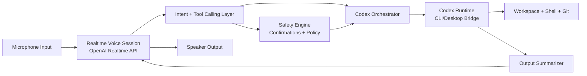

# Voice-Only Codex System Design (Blind-First)

## 1. Objective
Build a blind-first interface that lets a user operate Codex entirely by voice, using OpenAI native voice processing for speech input/output and conversational turn-taking.

Success criteria:
- No keyboard or mouse required for normal workflows.
- User can create/edit code, run commands, inspect outputs, and manage git by voice.
- System remains safe under ambiguous or risky commands.

## 2. Design Principles
- Voice-first state machine: every action is audible and confirmable.
- Blind accessibility by default: concise spoken feedback, repeat/summarize controls, interruption support.
- Safety over speed for destructive actions.
- Low latency for conversational coding loops.

## 3. High-Level Architecture

## 4. Core Components

### 4.1 Realtime Voice Session (OpenAI-native)
- Use OpenAI Realtime API voice sessions for full duplex conversation.
- Keep VAD enabled for natural turn-taking and interruption.
- Use server-generated ephemeral tokens if the client is browser-based.
- Configure one consistent voice for session continuity.

Why: this preserves low-latency voice UX and avoids stitching separate STT/TTS pipelines unless fallback is needed.

### 4.2 Intent + Tool Calling Layer
The voice model does not execute shell commands directly. It emits structured tool calls:
- `codex_execute(task, cwd, mode)`
- `shell_run(command, cwd, timeout)`
- `open_file(path)`
- `edit_file(path, instruction)`
- `git_action(action, args)`
- `readback(scope, verbosity)`
- `safety_confirm(action_id, spoken_confirmation)`

This layer converts natural speech into deterministic, auditable actions.

### 4.3 Codex Orchestrator
A controller service that:
- Maintains session state (current repo, branch, task).
- Sends tasks to Codex runtime.
- Chunks long output into spoken summaries.
- Handles cancellation, retry, undo, and checkpoints.

### 4.4 Output Summarizer (Audio-First)
For every execution step, produce:
- One-sentence status: what happened.
- Optional detail block on request: errors, file names, line numbers.
- Explicit next action prompt: "Do you want me to fix this?"

### 4.5 Safety Engine
Policy tiers:
- Tier 0: safe reads (no confirmation).
- Tier 1: local edits (single confirmation if confidence is low).
- Tier 2: high-risk actions (required confirmation phrase).
  - Examples: `rm`, force push, branch delete, mass replace, secret exfiltration.

Confirmation pattern:
- System: "This will delete 8 files in src. Say 'confirm delete 8 files' to continue."
- User must repeat generated phrase exactly.

## 5. Voice Command Model
Use intent routing instead of brittle command grammar. Include robust synonyms.

Always-available commands:
- "stop" (interrupt audio and execution)
- "pause" / "resume"
- "repeat that"
- "summarize status"
- "where am I"
- "undo last change"
- "read errors"
- "read diff"
- "switch to concise" / "switch to detailed"

Task commands:
- "fix failing tests"
- "open file src/app.ts"
- "add unit tests for parser"
- "run npm test"
- "commit with message <msg>"
- "create a PR summary"

Disambiguation behavior:
- If confidence < threshold, ask short clarifying question before execution.
- If multiple files match, speak top 3 and request selection by number.

## 6. Conversation State Machine
States:
1. Idle
2. Listening
3. Thinking
4. Confirming
5. Executing
6. Reporting

Audio cues:
- Short tone when listening starts.
- Distinct tone before dangerous confirmation.
- Soft chime on success; low tone on failure.

Barge-in:
- User speech interrupts assistant speech immediately.
- If interruption occurs during action narration, keep execution unless user says "stop execution".

## 7. Blind Accessibility Requirements
- Every file reference spoken as: `path`, then "line X".
- Numbers and symbols read in code-friendly style (configurable).
- No silent state changes.
- Adjustable verbosity, speech rate, and spelling mode.
- "Spell that" command for filenames/identifiers.

## 8. Codex Integration Contract

Define a thin adapter around Codex runtime:

Input contract:
- `task_id`
- `spoken_intent`
- `workspace`
- `constraints` (safe mode, no network, etc.)

Output contract:
- `status` (`ok`, `needs_confirmation`, `error`)
- `summary`
- `artifacts` (files changed, commands run, tests)
- `next_actions`

All tool actions logged with timestamp and transcript span for auditability.

## 9. Failure Handling
- Network dropout: failover to local push-to-talk STT/TTS mode if configured.
- Tool timeout: speak timeout and offer retry with adjusted scope.
- Ambiguous command: never guess when destructive; require clarification.
- Model hallucination guard: command executor only accepts whitelisted tool schemas.

## 10. Implementation Plan

Phase 1 (MVP, 1-2 weeks):
- Realtime voice session.
- 8-12 core intents.
- Codex task execution + spoken summaries.
- Safety confirmations for destructive actions.

Phase 2 (2-4 weeks):
- Rich file navigation by voice.
- Git workflow intents.
- Improved output chunking and error-focused readback.

Phase 3 (4+ weeks):
- Personalized voice shortcuts.
- Workspace memory and proactive hints.
- Multi-repo support.

## 11. Minimal Technical Stack
- Client: desktop or web front end with microphone/speaker handling.
- Voice transport: OpenAI Realtime API (WebRTC preferred for browser).
- Orchestrator: Node.js/TypeScript service.
- Codex bridge: local process adapter for Codex CLI/Desktop task execution.
- Event bus/logging: structured JSON logs for transcript/tool tracing.

## 12. Security + Privacy
- Use ephemeral session credentials for client-side realtime connections.
- Redact secrets in spoken output and logs.
- Enforce workspace boundary restrictions.
- Add explicit "privacy mode" command to avoid speaking sensitive values.

## 13. Example Interaction
- User: "Open the project and fix TypeScript errors."
- System: "I found 3 TypeScript errors across 2 files. I can auto-fix now. Proceed?"
- User: "Proceed."
- System: "Done. Updated src/api.ts line 42 and src/types.ts line 18. Tests pass. Say 'read diff' or 'commit changes'."

## 14. Testing Strategy
- Accessibility tests with blind/low-vision users (task completion, error recovery).
- Latency benchmarks: end-of-speech to first token and to action start.
- Safety tests: adversarial phrasing for destructive commands.
- Reliability tests: interruption, packet loss, and noisy background audio.

## 15. OpenAI-Native Voice Features To Use
- Realtime API speech-to-speech sessions.
- Built-in VAD turn detection.
- Realtime function/tool calling.
- Realtime interruption handling with truncation behavior.

## 16. Next Build Step
Implement a small vertical slice:
- "run tests" intent
- spoken failure summary
- "fix it" follow-up intent
- confirmation before writing files

This validates core blind-first interaction before broad intent expansion.
