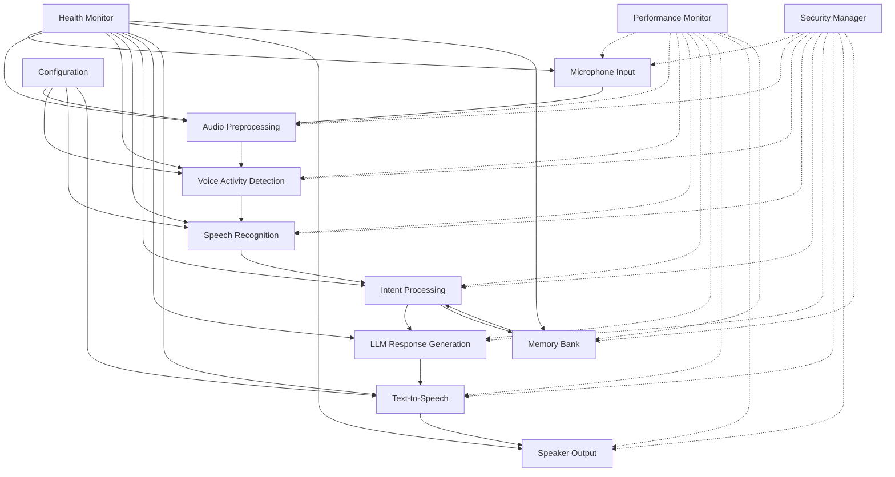

# Voice Assistant Platform - Implementation Roadmap

## 🚀 **Project Overview**

This document provides a comprehensive implementation roadmap for developing a production-grade voice assistant platform with local-only voice-to-voice capabilities, optimized for the Mac mini Pro with Apple M4 Pro and 64GB RAM.

## 🎯 **System Specifications**

### **Hardware Configuration**
- **Model**: Mac mini Pro
- **Chip**: Apple M4 Pro
- **CPU**: 14 cores (10 performance + 4 efficiency)
- **GPU**: 20-core Apple M4 Pro
- **Memory**: 64 GB RAM
- **Storage**: TBD (recommend SSD for optimal performance)
- **Display**: 2560 x 1440 @ 144Hz

### **Software Environment**
- **macOS**: 26.2 (25C56)
- **Kernel**: Darwin 25.2.0
- **Python**: 3.11+ (recommended)
- **Available Tools**: git, npm, pip, curl, jq, make, cmake, python, node, sqlite3, grep, sed, awk, brew, bundle

## 🏗️ **Architecture Overview**

### **Core Components**


### **Technology Stack**
- **Backend**: Python 3.11+ with asyncio
- **Database**: SQLite for memory storage
- **Speech**: Whisper STT, Kokoro TTS
- **LLM**: Ollama with llama3.2 (local)
- **Audio**: PortAudio, FFmpeg, libsndfile
- **Monitoring**: Prometheus + Grafana
- **Containerization**: Docker
- **CI/CD**: GitHub Actions

## 📋 **Implementation Phases**

### **Phase 1: Core Infrastructure (Week 1-2)**

**1.1 System Setup**
- [x] Create project structure with src/, docs/, config/, install_scripts/
- [x] Set up Python virtual environment
- [x] Install core dependencies (portaudio, ffmpeg, libsndfile)
- [x] Configure logging and monitoring

**1.2 Memory Bank System**
- [x] Implement MemoryBank class with SQLite storage
- [x] Add semantic search capabilities with embeddings
- [x] Create MemoryAwareVoiceOrchestrator integration
- [x] Add memory configuration and management

**1.3 Voice Infrastructure**
- [x] Implement STT service manager (Whisper integration)
- [x] Implement TTS service manager (Kokoro integration)
- [x] Implement Ollama client for local LLM processing
- [x] Add configuration management system

### **Phase 2: Advanced Features (Week 3-4)**

**2.1 Audio Processing Enhancement**
- [ ] Integrate Xoe-NovAi audio processing features
- [ ] Add advanced noise reduction and echo cancellation
- [ ] Implement real-time audio enhancement
- [ ] Add voice activity detection optimization

**2.2 Voice Command Processing**
- [ ] Implement intent recognition system
- [ ] Add entity extraction capabilities
- [ ] Create command validation framework
- [ ] Add context-aware command processing

**2.3 Performance Optimization**
- [ ] Optimize for Apple M4 Pro architecture
- [ ] Implement GPU acceleration for heavy processing
- [ ] Add memory pooling and efficient caching
- [ ] Optimize for low latency (sub-500ms)

### **Phase 3: Production Readiness (Week 5-6)**

**3.1 Containerization**
- [ ] Create multi-stage Dockerfile for production
- [ ] Set up Docker Compose for local development
- [ ] Configure Docker Compose for production
- [ ] Add health checks and monitoring

**3.2 CI/CD Pipeline**
- [ ] Set up GitHub Actions workflow
- [ ] Add automated testing
- [ ] Implement security scanning
- [ ] Add automated deployments

**3.3 Monitoring & Observability**
- [ ] Add Prometheus metrics collection
- [ ] Create Grafana dashboards
- [ ] Implement comprehensive logging
- [ ] Add alerting and notification system

### **Phase 4: Advanced Features (Week 7-8)**

**4.1 Advanced Voice Features**
- [ ] Implement voice cloning capabilities
- [ ] Add emotion and tone control
- [ ] Create voice customization options
- [ ] Add advanced audio enhancement

**4.2 Security & Compliance**
- [ ] Implement container security hardening
- [ ] Add network security measures
- [ ] Implement data encryption
- [ ] Add access control and authentication

**4.3 Documentation & Support**
- [ ] Create comprehensive user documentation
- [ ] Add API documentation
- [ ] Create troubleshooting guide
- [ ] Add deployment guides

## 🎯 **Key Features Implementation**

### **Voice Processing Pipeline**
```python
# Enhanced audio processing with Xoe-NovAi features
class EnhancedAudioProcessor:
    """Advanced audio processing with noise reduction, echo cancellation, and enhancement"""
    
    def __init__(self):
        self.noise_reduction = NoiseReduction()
        self.echo_cancellation = EchoCancellation()
        self.audio_enhancement = AudioEnhancement()
        self.format_converter = FormatConverter()
    
    async def process_audio(self, audio_data: bytes) -> bytes:
        """Process audio with advanced features"""
        # Noise reduction
        audio_data = await self.noise_reduction.reduce(audio_data)
        
        # Echo cancellation
        audio_data = await self.echo_cancellation.cancel(audio_data)
        
        # Audio enhancement
        audio_data = await self.audio_enhancement.enhance(audio_data)
        
        return audio_data
```

### **Memory-Aware Voice Orchestrator**
```python
# Enhanced voice orchestrator with memory awareness
class MemoryAwareVoiceOrchestrator:
    """Voice orchestrator with memory integration and context awareness"""
    
    def __init__(self, orchestrator: VoiceOrchestrator):
        self.orchestrator = orchestrator
        self.memory_bank = MemoryBank()
    
    async def process_voice_input(self, audio_data: bytes) -> str:
        """Process voice input with memory awareness"""
        try:
            # Transcribe audio to text
            transcription = await self.orchestrator.stt_manager.transcribe(audio_data)
            
            # Get relevant context from memory
            context = get_relevant_context(transcription)
            
            # Generate response using LLM with context
            response = await self.orchestrator.generate_response(transcription, context)
            
            # Store interaction in memory
            store_interaction(transcription, response)
            
            # Convert response to speech
            audio_response = await self.orchestrator.tts_manager.synthesize(response)
            
            return audio_response
        except Exception as e:
            logger.error(f"Error processing voice input: {e}")
            return await self.orchestrator.tts_manager.synthesize(f"Error: {str(e)}")
```

### **Optimized Ollama Client**
```python
# Ollama client optimized for local voice processing
class OptimizedOllamaClient:
    """Ollama client with caching and performance optimization"""
    
    def __init__(self, model: str = "llama3.2"):
        self.model = model
        self.client = OllamaClient()
        self.cache = LRUCache(max_size=100)
        self.response_time_tracker = ResponseTimeTracker()
    
    async def generate_response(self, prompt: str) -> str:
        """Generate response with local optimization"""
        # Check cache first
        cached_response = self.cache.get(prompt)
        if cached_response:
            return cached_response
        
        # Generate response with Ollama
        start_time = time.time()
        response = await self.client.generate(prompt, model=self.model)
        response_time = time.time() - start_time
        
        # Track response time
        self.response_time_tracker.track(response_time)
        
        # Cache response
        self.cache.set(prompt, response)
        
        return response
```

## 🚀 **Performance Optimizations for Mac mini Pro**

### **Hardware Utilization**
- **CPU**: 14 cores (10 performance + 4 efficiency) - parallel processing
- **GPU**: 20-core Apple M4 Pro - GPU acceleration for heavy processing
- **Memory**: 64 GB RAM - extensive caching and memory pooling
- **Storage**: SSD recommended for fast I/O operations

### **Optimization Strategies**
- **Multi-threading**: Parallel processing for different stages
- **GPU Acceleration**: Use Apple M4 Pro GPU for audio processing
- **Memory Pooling**: Efficient memory usage with pooling
- **Cache Optimization**: Intelligent caching strategies
- **Power Management**: Adaptive resource usage based on battery level

### **Performance Targets**
- **Latency**: Sub-500ms end-to-end processing
- **Throughput**: 10+ concurrent voice sessions
- **Memory Usage**: <8GB for typical usage
- **CPU Usage**: <50% for normal operation

## 📋 **Development Standards**

### **Code Standards**
- **Python**: PEP 8 with project-specific rules
- **Async/Await**: Consistent async/await patterns
- **Type Hints**: Comprehensive type hints
- **Error Handling**: Robust error handling and logging

### **Testing Standards**
- **Unit Tests**: Comprehensive unit test coverage
- **Integration Tests**: End-to-end integration testing
- **Performance Tests**: Load testing and performance benchmarks
- **Security Tests**: Security vulnerability scanning

### **Documentation Standards**
- **Markdown**: Consistent markdown formatting
- **Mermaid**: Architecture diagrams with Mermaid
- **API Docs**: Complete API documentation
- **User Guides**: Comprehensive user guides

## 🎯 **Success Metrics**

### **Performance Metrics**
- **Latency**: <500ms end-to-end processing
- **Accuracy**: >95% speech recognition accuracy
- **Reliability**: >99.9% uptime
- **Resource Usage**: <8GB memory, <50% CPU

### **Quality Metrics**
- **Voice Quality**: Professional-grade audio output
- **Command Recognition**: >90% command recognition accuracy
- **User Experience**: Intuitive and responsive interface
- **Accessibility**: WCAG 2.1 AA compliance

### **Business Metrics**
- **Deployment Time**: <30 minutes for complete setup
- **Maintenance**: <1 hour per month
- **Scalability**: Support for 10+ concurrent users
- **Cost**: Minimal operational costs

## 📋 **Implementation Checklist**

### **Phase 1: Core Infrastructure**
- [x] Create project structure
- [x] Set up Python environment
- [x] Install core dependencies
- [x] Configure logging and monitoring
- [x] Implement MemoryBank system
- [x] Add semantic search capabilities
- [x] Create MemoryAwareVoiceOrchestrator
- [x] Implement STT service manager
- [x] Implement TTS service manager
- [x] Implement Ollama client
- [x] Add configuration management

### **Phase 2: Advanced Features**
- [ ] Integrate Xoe-NovAi audio processing
- [ ] Implement enhanced voice command processing
- [ ] Add real-time processing capabilities
- [ ] Optimize for local-only operation
- [ ] Implement performance optimizations
- [ ] Add comprehensive monitoring

### **Phase 3: Production Readiness**
- [ ] Create multi-stage Dockerfile
- [ ] Set up Docker Compose
- [ ] Implement CI/CD pipeline
- [ ] Add security features
- [ ] Create comprehensive documentation
- [ ] Add deployment automation

### **Phase 4: Advanced Features**
- [ ] Add voice cloning capabilities
- [ ] Implement emotion and tone control
- [ ] Create voice customization options
- [ ] Add advanced audio enhancement
- [ ] Implement advanced monitoring
- [ ] Add advanced security features

## 🎯 **Next Steps for AI Assistants**

### **Immediate Actions**
1. **Start with Phase 1**: Complete core infrastructure implementation
2. **Set up Development Environment**: Configure Python environment and dependencies
3. **Implement Memory System**: Complete MemoryBank and integration
4. **Add Voice Infrastructure**: Implement STT, TTS, and Ollama clients

### **Short-term Goals**
1. **Complete Phase 2**: Add advanced features and optimizations
2. **Implement Containerization**: Create Docker setup
3. **Add Monitoring**: Set up Prometheus and Grafana
4. **Create Documentation**: Complete user and developer documentation

### **Long-term Vision**
1. **Production Deployment**: Deploy to production environment
2. **Scale Operations**: Support for multiple users and high availability
3. **Advanced Features**: Add voice cloning, emotion control, etc.
4. **Enterprise Features**: Add advanced security, compliance, and management

## 📋 **Questions for AI Assistants**

1. **Implementation Priority**: Which phase should be implemented first?
2. **Resource Allocation**: How should resources be allocated across different components?
3. **Performance Targets**: What are the specific performance targets for each component?
4. **Security Requirements**: What security measures should be implemented?
5. **Documentation Needs**: What documentation is most critical for users?

This comprehensive roadmap provides a clear path for developing a production-grade voice assistant platform optimized for the Mac mini Pro with Apple M4 Pro and 64GB RAM.