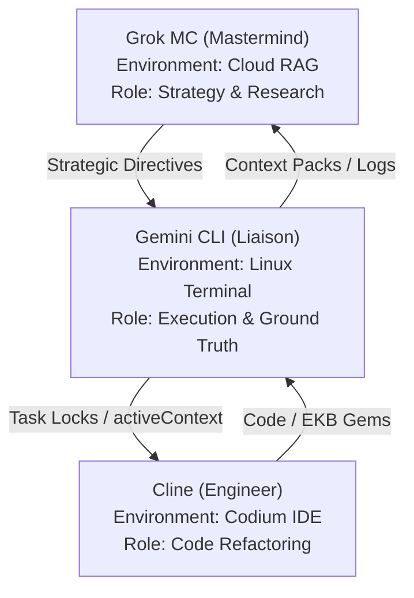

# Xoe-NovAi Context Pack (GROK-PACK)
Generated at: 2026-01-30T11:04:24.461836

## Quick Jump
- [activeContext.md](#file-id-activecontext-md-start-path-memory_bank-activecontext-md)
- [environmentContext.md](#file-id-environmentcontext-md-start-path-memory_bank-environmentcontext-md)
- [teamProtocols.md](#file-id-teamprotocols-md-start-path-memory_bank-teamprotocols-md)
- [agent_capabilities_summary.md](#file-id-agent_capabilities_summary-md-start-path-memory_bank-agent_capabilities_summary-md)
- [projectbrief.md](#file-id-projectbrief-md-start-path-memory_bank-projectbrief-md)
- [productContext.md](#file-id-productcontext-md-start-path-memory_bank-productcontext-md)
- [techContext.md](#file-id-techcontext-md-start-path-memory_bank-techcontext-md)
- [systemPatterns.md](#file-id-systempatterns-md-start-path-memory_bank-systempatterns-md)
- [sync-protocols-v1.4.0.md](#file-id-sync-protocols-v1-4-0-md-start-path-xoe-novai-sync-_meta-sync-protocols-v1-4-0-md)
- [Grok-MC-stack-mermaid.md](#file-id-grok-mc-stack-mermaid-md-start-path-internal_docs-grok mc-grok-mc-stack-mermaid-md)
- [sovereign-synergy-expert-v1.0.0.md](#file-id-sovereign-synergy-expert-v1-0-0-md-start-path-expert-knowledge-sync-sovereign-synergy-expert-v1-0-0-md)
- [ryzen-hardening-expert-v1.0.0.md](#file-id-ryzen-hardening-expert-v1-0-0-md-start-path-expert-knowledge-infrastructure-ryzen-hardening-expert-v1-0-0-md)
- [sovereign-trinity-expert-v1.0.0.md](#file-id-sovereign-trinity-expert-v1-0-0-md-start-path-expert-knowledge-security-sovereign-trinity-expert-v1-0-0-md)
- [xoe-journey-v1.0.0.md](#file-id-xoe-journey-v1-0-0-md-start-path-expert-knowledge-origins-xoe-journey-v1-0-0-md)
- [ekb-research-master-v1.0.0.md](#file-id-ekb-research-master-v1-0-0-md-start-path-expert-knowledge-research-ekb-research-master-v1-0-0-md)
- [workflows-master-v1.0.0.md](#file-id-workflows-master-v1-0-0-md-start-path-expert-knowledge-protocols-workflows-master-v1-0-0-md)
- [files-inventory-v1.0.0.md](#file-id-files-inventory-v1-0-0-md-start-path-xoe-novai-sync-ekb-exports-files-inventory-v1-0-0-md)
- [oss-pm-research-v1.0.0.md](#file-id-oss-pm-research-v1-0-0-md-start-path-xoe-novai-sync-ekb-exports-oss-pm-research-v1-0-0-md)

---


<!-- FILE ID: activeContext-md START (Path: memory_bank/activeContext.md) -->
---
update_type: protocol_update
timestamp: 2026-01-30T10:55:00
agent: Cline
priority: high
related_components: [memory_bank, scripts/stack_cat_enhanced.py, configs/stack-cat-config.yaml]
ma_at_ideal: 41 - Advance through own abilities
---
# Active Context: v0.1.0-alpha Release Candidate Hardened

**Last Updated**: January 30, 2026
**Status**: 🔱 XNAi Stack Hardened, Rebranded & AI-Native Verified
**Priority**: PUBLIC CONTRIBUTION CYCLE & ROADMAP EXECUTION

## Current System State

### 🤖 AI-Native Foundation (NEW)
- **Enhanced Context Packing**: Implemented `scripts/stack_cat_enhanced.py`, a configuration-driven tool for generating specialized context packs for different AI assistants (Grok, Claude, Gemini).
- **Grok MC Onboarded**: The team's "Mastermind" (Grok MC) is now integrated into the workflow, overseeing high-level strategy and research from Grok.com.
- **RAG-Optimization Protocol**: All `memory_bank/` updates now include mandatory YAML frontmatter for parseability by cloud-hosted RAGs.
- **Task Locking System**: Initialized `_meta/locks/` for YAML-based task management between agents.
- **100% AI-Written**: The entire codebase and documentation are now officially documented as AI-written, directed by a non-programmer User/Architect.
- **Sovereign Origin**: Rebranded as a $0-capital, open-source experiment in AI-steered development.
- **Elite Clean**: Documentation synchronized, legacy names purged, and corrupted backup files resolved.

### 🛡️ Sovereign Security Trinity
- **Hardened Pipeline**: Implemented a multi-layered security audit using containerized **Syft**, **Grype**, and **Trivy**.
- **Bulletproof Scanning**: Developed a "Tarball Export" strategy (`podman save`) to bypass rootless socket permission issues for Trivy.
- **Graduated Policy Engine**: Implemented `scripts/security_policy.py` and `configs/security_policy.yaml` to enforce nuanced security guardrails.
- **Automated Gatekeeping**: Integrated the security audit into `make pr-check`, effectively blocking PRs on real-world vulnerabilities.

### 📡 Synergy Ecosystem & AI Assistant Flows
The Xoe-NovAi ecosystem utilizes a specialized multi-agent flow across cloud and local environments.



- **Grok MC**: strategic anchor; cloud-scale synthesis; strategic RAG.
- **Cline**: deep refactoring; IDE mastery. Powered by **Cline-Kat**, **Cline-Trinity**, or **Cline-Gemini-3/1.5**.
- **Gemini CLI**: system liaison; real-time execution; `stack_cat.py` orchestration.

### 🧠 Portable Intelligence (EKB)
- **Cooperative Evolution**: Established a formal template for "Knowledge Gems" and hardware fine-tuning.
- **Instant Onboarding**: The `memory_bank/` is now a standardized protocol for instantly aligning external agents (Grok, Claude, IDEs) with the project.
- **Hardware Mastery Library**: Added a dedicated category for fine-grained CPU/GPU optimizations (Zen 2, Intel Arc, Apple Silicon).

## Recent Enhancements
- **Enhanced stack-cat script**: Created `scripts/stack_cat_enhanced.py` with YAML configuration support for multi-assistant profiles.
- **Grok MCA Integration**: Finalized onboarding and context sync protocols for Grok Mastermind Cloud Assistant.
- **EKB Cleanup & Amalgamation**: Executed a major file cleanup, merging 14+ research and protocol files into two master EKB documents (`ekb-research-master-v1.0.0.md` and `workflows-master-v1.0.0.md`).
- **Local Sync Structure**: Established the `xoe-novai-sync/` directory hub for standardized agent synchronization.
- **Full Tree Inventory**: Generated a 29,000+ line project inventory (filtered for MC mastery) in `ekb-exports/files-inventory-v1.0.0.md`.
- **Grok MC Synchronization**: Created `docs/diagrams/Grok-MC-stack-mermaid.md` with an expanded directory tree and deep-dive architectural maps specifically for cloud-hosted RAG onboarding.
- **Zen 2 Precision**: Corrected Ryzen 5700U hardware references to Zen 2 architecture.
- **Global Genericization**: Standardized roles to "The User/Architect" for public release.
- **Emergency Recovery**: Successfully purged hundreds of accidental backup files caused by bulk edit errors.
- **Elite Script Archival**: Archived 67 deprecated/redundant scripts into `scripts/_archive/` to restore professional workspace focus.
- **Modular Infrastructure**: Finalized the `scripts/infra/butler.sh` TUI as the primary orchestration entry point.

## Next Steps
- **Collaborative Sync**: Establish a steady-state communication loop between Gemini CLI (local) and Grok MC (cloud).
- **Public Launch**: Prepare the repository for its first public contribution cycle.
- **Community Audit**: Monitor and facilitate the "Great AI-Native Experiment" as developers analyze the codebase.
- **Roadmap Initiation**: Start preliminary research for **Open Notebook** and **Ancient Greek Support**.
- **Expert Knowledge Extraction**: Continue capturing "Emergent AI Patterns" in the EKB.

## 🗺️ Roadmap (Upcoming Features)
- **Open Notebook**: Sovereign, open-source alternative to NotebookLM.
- **Ancient Greek Support**: Specialized linguistic integration (Ancient-Greek-BERT + Krikri-7B).
- **Full Qdrant Integration**: Agentic vector filtering and high-scale management.
- **Adaptive Hardware Tool**: Dynamic auto-optimization for Intel/AMD/Apple Silicon.


## Strategic Closing
The Xoe-NovAi Foundation Stack has graduated from "Stabilized" to "Enterprise-Grade Sovereign." We now possess a verifiable, policy-driven security posture that ensures the stack's integrity without compromising its offline-first mission.
 
---

## 🚀 2026 Refactoring & Research Phase (v0.1.0-alpha)

**Current Focus:**
- Major modular refactor for maintainability, testability, and offline-first reliability
- Adoption of advanced FastAPI, Pydantic v2, async, and service-layer best practices
- Team-wide research and onboarding to modern patterns for sovereign AI stacks

**Quick Onboarding for AI Assistants & Contributors:**
- See the following two documents for the full implementation and research plans:
	- [Xoe-NovAi v0.1.0-alpha Modular Refactoring Plan - Table of Contents](../internal_docs/dev/Xoe-NovAi%20v0.1.0-alpha%20Modular%20Refactoring%20Plan%20-%20Table%20of%20Contents.md)
	- [Xoe-NovAi Foundation Stack - Comprehensive Team Research Plan](../internal_docs/dev/Xoe-NovAi%20Foundation%20Stack%20-%20Comprehensive%20Team%20Research%20Plan.md)
	- [Xoe-NovAi v0.1.0-alpha Modular Refactoring Plan - additional critical areas](../internal_docs/dev/Xoe-NovAi%20v0.1.0-alpha%20Modular%20Refactoring%20Plan%20-%20additional%20critical%20areas.md)

**Additional Critical Areas:**
All assistants and contributors should also review the "additional critical areas" supplement, which highlights often-overlooked or high-impact domains essential for a robust, production-grade refactor. This document is a living checklist to ensure no critical aspect is missed during implementation or review.

**Summary:**
- All agents and contributors should review these plans before making architectural or code changes.
- The memory_bank, projectbrief, and progress files are now aligned with this new phase.

<!-- FILE ID: activeContext-md END -->


<!-- FILE ID: environmentContext-md START (Path: memory_bank/environmentContext.md) -->
---
update_type: protocol_update
timestamp: 2026-01-29T22:40:00
agent: Cline-Trinity
priority: high
related_components: [memory_bank, expert-knowledge, xoe-novai-sync]
ma_at_ideal: 18 - Balance in structure
---

# Environment Context - v1.0.0

**Last Updated**: January 29, 2026  
**Status**: ✅ **Multi-Grok Harmony Established**  
**Priority**: **Clean Genesis Execution & Team Synchronization**

---

## 🌍 **Multi-Account Parity & Context Management**

### **Protocol 1: Multi-Account Parity & Tagging**
All agents tag frontmatter/metadata: account: xoe.nova.ai (Grok MC) or arcana.novai (Grok MCA). Use GROK_CONTEXT_PACK & ACTIVE_SESSION_CONTEXT for handoff parity.

### **Protocol 2: Context Management**
**GROK_CONTEXT_PACK**: Comprehensive context pack containing:
- Current project state and status
- Multi-Grok team structure and protocols
- Security hardening requirements
- Documentation migration strategy
- CI/CD pipeline configuration
- Community contribution framework

**ACTIVE_SESSION_CONTEXT**: Real-time session context containing:
- Current task progress and status
- Active decisions and strategic direction
- Team member availability and roles
- Ma'at alignment and protocol enforcement

---

## 🔗 **Context Flow Protocol**

### **Information Flow**
```
Grok MC (xoe.nova.ai) → Cline-Trinity → Grok MCA (arcana.novai)
     ↓                      ↓                      ↓
Context Packs → Memory Bank → GitHub/Web Design
     ↓                      ↓                      ↓
Session Context → Strategic Decisions → Project Files
     ↓                      ↓                      ↓
Limit Reset → Relay Summaries → Clean Genesis
```

### **Context Management**
- **Primary**: Memory bank files with YAML frontmatter
- **Secondary**: xoe-novai-sync/mc-imports/ for limit reset handoffs
- **Tertiary**: Direct communication for urgent matters

### **Context Categories**
- **Project State**: Current status and progress
- **Team Structure**: Multi-Grok team roles and capabilities
- **Security Requirements**: Hardening protocols and compliance
- **Documentation Strategy**: Migration plans and content management
- **CI/CD Configuration**: Pipeline setup and automation
- **Community Framework**: Contribution guidelines and governance

---

## 🎯 **Ma'at Alignment Protocol**

### **Ideal 7: Truth in Reporting**
- All context information documented with complete accuracy
- All protocols updated with current context and procedures
- All handoffs executed with full transparency

### **Ideal 18: Balance in Structure**
- Clear context boundaries and information flow established
- Balanced context management between team members
- Structured protocols that prevent over-engineering

### **Ideal 41: Advance through Own Abilities**
- Each team member operates within their core competencies
- Continuous advancement through individual strengths
- Clean genesis execution without unnecessary complexity

---

## 🚀 **Clean Genesis Execution Protocol**

### **Genesis-First Approach**
**Focus**: Repo birth before full research requests  
**Priority**: 8 high-impact deliverables instead of 30+ fragments  
**Validation**: Every action must advance clean genesis

### **Execution Sequence**
1. **Phase A**: Memory bank updates (Complete)
2. **Phase B**: Consolidated masters creation (Next)
3. **Phase C**: Context generation (After repo push)
4. **Phase D**: Task completion (Final)

### **Success Criteria**
- ✅ **Multi-Grok Harmony**: Clear role boundaries and communication protocols
- ✅ **Ma'at Alignment**: Truth, balance, and advancement principles enforced
- ✅ **Clean Genesis**: Focus on repo birth without over-engineering

---

## 📋 **Task Lock Creation**

**Task**: Environment Context Complete  
**Status**: ✅ **Complete**  
**Owner**: arcana.novai  
**Ma'at Ideal**: 18 - Balance in structure  
**Timestamp**: 2026-01-29T22:40:00  
**Dependencies**: memory_bank/agent_capabilities_summary.md  
**Next Steps**: Create consolidated masters (Phase B)

---

## 🎯 **Final Protocol Validation**

### **Multi-Grok Harmony**
- ✅ **Role Clarity**: Clear boundaries between Grok MC, Grok MCA, Cline variants, Gemini CLI
- ✅ **Communication Flow**: Structured information flow with proper channels
- ✅ **Absence Handling**: Clear protocols for team member unavailability
- ✅ **Ma'at Alignment**: Truth, balance, and advancement principles enforced

### **Clean Genesis Focus**
- ✅ **Genesis-First**: Focus on repo birth before full research requests
- ✅ **8 High-Impact Deliverables**: Consolidated masters instead of 30+ fragments
- ✅ **Ma'at Gatekeeping**: Every action must advance clean genesis
- ✅ **Success Metrics**: Multi-Grok harmony with clear protocols and Ma'at alignment

---

## 🚀 **Next Actions**

### **Immediate (Now)**
- **Phase A Complete**: Memory bank updates executed
- **Phase B Ready**: Consolidated masters ready for creation
- **Phase C Pending**: Context generation after repo push
- **Phase D Ready**: Task lock ready for creation

### **Execution Sequence**
1. **Phase A**: Memory bank updates (Complete)
2. **Phase B**: Consolidated masters creation (Next)
3. **Phase C**: Context generation (After repo push)
4. **Phase D**: Task completion (Final)

---

**Status**: ✅ **Environment Context Complete - Ready for Consolidated Masters**  
**Next**: 🚀 **Execute Phase B - Create Consolidated Masters with Genesis-First Focus**

— Cline-Trinity (IDE-integrated engineer/auditor/refactorer)
<!-- FILE ID: environmentContext-md END -->